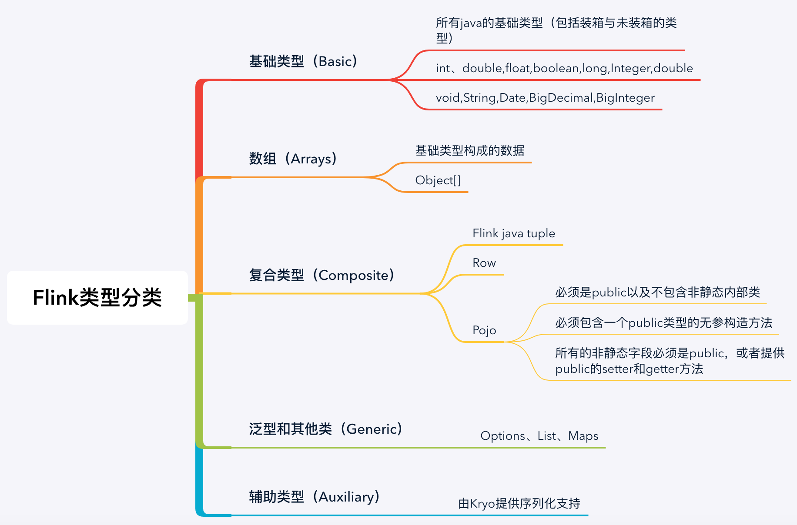
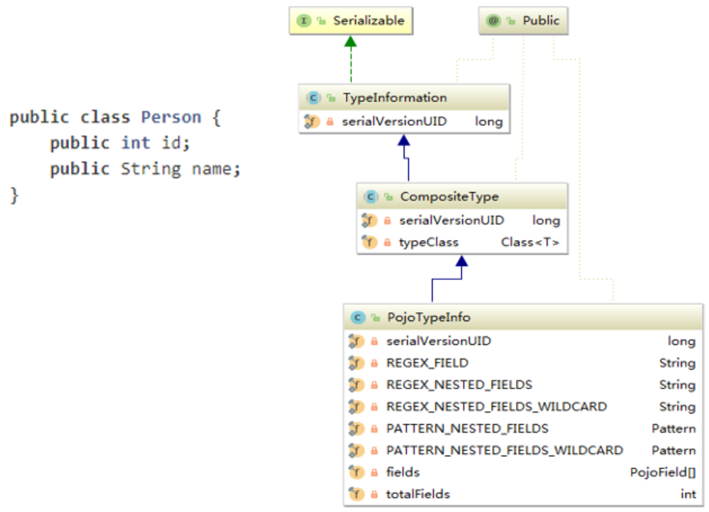
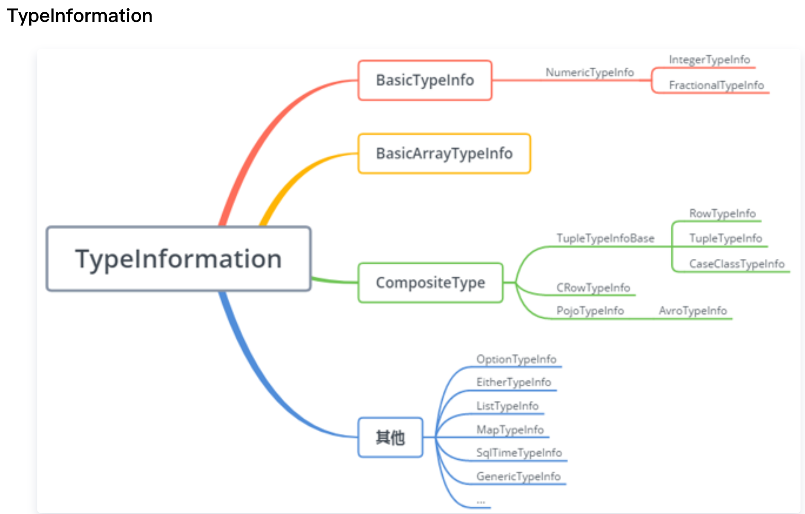
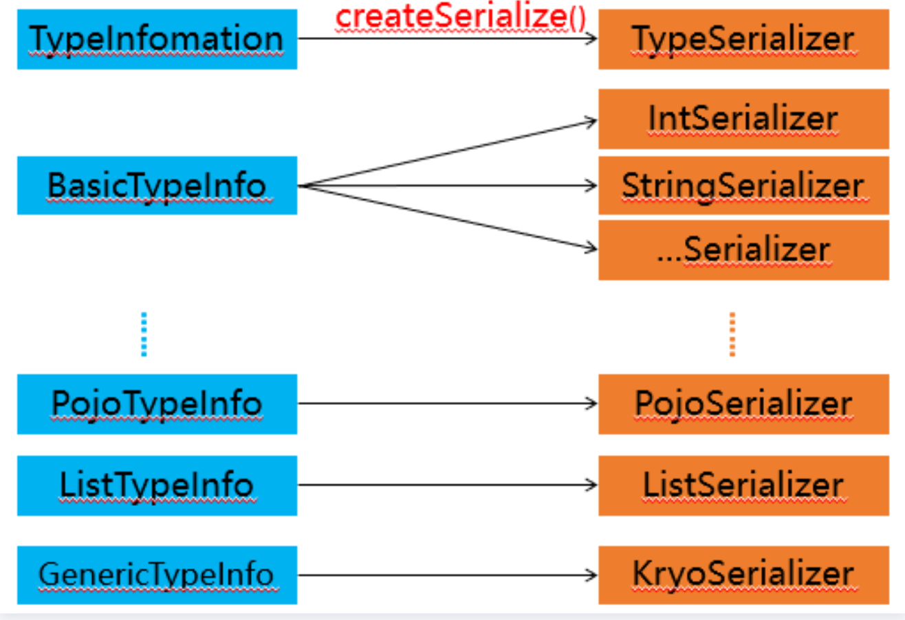
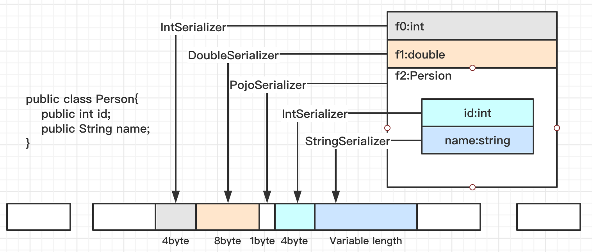
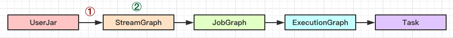
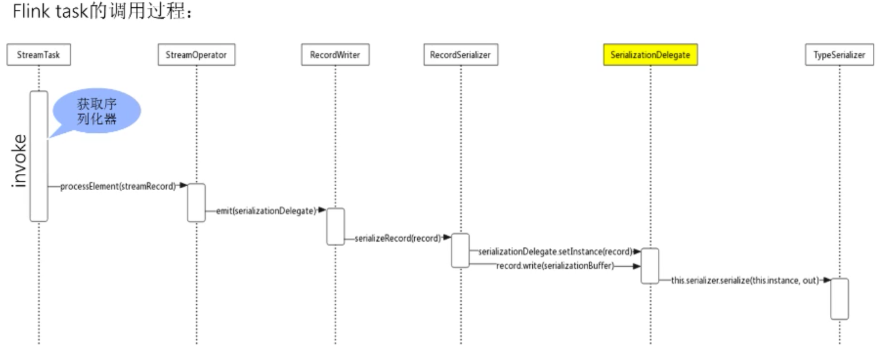

### Flink数据结构及序列化

1. Flink量身定制的序列化框架
2. FLink序列化的最佳实践
3. Flink通信层的序列化(Flink序列化所处的位置)

### Flink量身定制的序列化框架
####why Flink为什么要定制自身的序列化框架
大家都知道现在大数据生态非常火，大多数技术组件都是运行在 JVM 上的，Flink 也是运行在 JVM 上，基于 JVM 的数据分析引擎都需要将大量的数据存储在内存中，这就不得不面临 JVM 的一些问题，基于JVM的数据分析引擎，将数据存储在内存，就需要解决JVM面临的一些问题：

- JVM对象存储密度低级
- FullGC带来的一个性能问题
- OOM可能造成的一个稳定性问题

针对这些问题的一个解决方案就是建立一个自己的 **显示内存管理**--大数据时代的JVM，也就是说我用自定义的内存池来进行内存的分配与回收，接着将序列化后的嗯对象存储到内存块中，从而引出了序列化---是需要将序列化后的对象存储在内存中的。

目前有很多序列化框架kryo\aryo但是flink依然选择了自身的一个序列化框架，为什么呢？这么做有什么意义呢？

- Flink对数据类似了解的越多，就可以在运行前完成一个类型的检查的一些操作，避免在运行时抛出一些错误
- 还有一点就是我知道我的数据类型，可以选取更好的序列化方式，然后更好的数据布局，然后节省数据的存储空间
- 可以直接进行一个数据二进制的操作（这一块可能在内存管理这一块涉及的比较多）

现在 Java 生态圈中已经有许多序列化框架，比如说 Java serialization, Kryo, Apache Avro 等等。但是 Flink 依然是选择了自己定制的序列化框架，那么到底有什么意义呢？若 Flink 选择自己定制的序列化框架，对类型信息了解越多，可以在早期完成类型检查，更好的选取序列化方式，进行数据布局，节省数据的存储空间，直接操作二进制数据。

##### Flink 数据类型
Flink基本上支持任意类型的JAVA和Scala类型，在Flink中支持这么多类型，那么这么类型在flink中是如何表示的呢？

支持类型的思维导图：



Flink在其内部构建了自己的的类型系统，Flink现阶段支持的类型分类如图所示，从图中可以看出Flink类型可以分为基础类型（Base）、数组(Arrays)、复合类型（Composite）、辅助类型(Auxiliary)，泛型和其他类型（Generic）。Flink 支持任意的 Java 或是 Scala 类型。不需要像 Hadoop 一样去实现一个特定的接口（org.apache.hadoop.io.Writable），Flink 能够自动识别数据类型。

TypeInfomation的思维导图及类UML图：



那么多的数据类型，在Flink内部又是如何表示的呢？图示中的Person类，复合类型的一个Pojo在Flink中用PojoTypeInfo来表示，它继承至TypeInformation，也即在Flink中用TypeInfomation作为类型描述符来表示每一种要表示的数据类型。

##### TypeInformation



TypeInformation 的思维导图如图所示，从图中可以看出，在Flink中每一个具体的类型都对应了一个具体的TypeInformation 实现类，例如 BasicTypeInformation 中的 IntegerTypeInformation 和 FractionalTypeInformation都具体的对应了一个TypeInformation。然后还有BasicArrayTypeInformation、CompositeType 以及一些其它类型，也都具体对应了一个 TypeInformation。

TypeInformation 是 Flink 类型系统的核心类。对于用户自定义的 Function 来说，Flink 需要一个类型信息来作为该函数的输入输出类型，即TypeInfomation。该类型信息类作为一个工具来生成对应类型的序列化器 TypeSerializer，并用于执行语义检查，比如当一些字段在作为 joing 或 grouping 的键时，检查这些字段是否在该类型中存在。

如何使用 TypeInformation？下面的实践中会为大家介绍。

##### Flink的序列化过程



1. 获取序列化器 图
2. 序列化器从何而来呢？通过createSerialize()自动创建序列化器，CenericTypeInfo泛型类型使用KryoSerializer
3. 什么是序列化？序列化就是将一个数据结构或者对象转换成一个二进制串的过程。在java里面可以理解为就是一个byte[]数组。反序列化就是将序列化中生成的二进制串转换成数据结构或者对象

在 Flink 序列化过程中，进行序列化操作必须要有序列化器，那么序列化器从何而来？每一个具体的数据类型都对应一个 TypeInformation 的具体实现，每一个 TypeInformation 都会为对应的具体数据类型提供一个专属的序列化器。通过 Flink 的序列化过程图可以看到 TypeInformation 会提供一个 createSerialize() 方法，通过这个方法就可以得到该类型进行数据序列化操作与反序化操作的对象 TypeSerializer。

对于大多数数据类型 Flink 可以自动生成对应的序列化器，能非常高效地对数据集进行序列化和反序列化，比如，BasicTypeInfo、WritableTypeIno 等，但针对 GenericTypeInfo 类型，Flink 会使用 Kyro 进行序列化和反序列化。其中，Tuple、Pojo 和 CaseClass 类型是复合类型，它们可能嵌套一个或者多个数据类型。在这种情况下，它们的序列化器同样是复合的。它们会将内嵌类型的序列化委托给对应类型的序列化器。

简单的介绍下 Pojo 的类型规则，即在满足一些条件的情况下，才会选用 Pojo 的序列化进行相应的序列化与反序列化的一个操作。即类必须是 Public 的，且类有一个 public 的无参数构造函数，该类（以及所有超类）中的所有非静态 no-static、非瞬态 no-transient 字段都是 public 的（和非最终的 final）或者具有公共 getter 和 setter 方法，该方法遵循 getter 和 setter 的 Java bean 命名约定。当用户定义的数据类型无法识别为 POJO 类型时，必须将其作为 GenericType 处理并使用 Kryo 进行序列化。

Flink 自带了很多 TypeSerializer 子类，大多数情况下各种自定义类型都是常用类型的排列组合，因而可以直接复用，如果内建的数据类型和序列化方式不能满足你的需求，Flink 的类型信息系统也支持用户拓展。若用户有一些特殊的需求，只需要实现 TypeInformation、TypeSerializer 和 TypeComparator 即可定制自己类型的序列化和比较大小方式，来提升数据类型在序列化和比较时的性能。

###### Tuple3<Integer,Double,Person> 的一个序列化过程
```java
public class Person{
    public int id;
    public String name;
}
```



复合类型的数据结构，在序列化操作的时候，会委托一个相应的序列化器，进行相应的序列化操作。从图中可以看到把int类型委托给IntSerializer序列化器进行相应的序列化操作。int只需要占用四个字节就ok了


上图就可以体现出Flink在序列化时的一个优势：Flink在知道自己的一个类型前提下，能更好的进行序列化与反序列化操作。如果采用java的序列化操作可能会存储更多的属性信息。这样的话一是占据更多存储空间，而是性能会受到一定的损耗。

序列化完的结果我们会存储到 dataoutput中，dataOutPut是由MemorySegment去支持的。

序列化就是将数据结构或者对象转换成一个二进制串的过程，在Java里面可以简单地理解成一个byte 数组。而反序列化恰恰相反，就是将序列化过程中所生成的二进制串转换成数据结构或者对象的过程。下面就以内嵌型的Tuple 3 这个对象为例，简述一下它的序列化过程。Tuple 3包含三个层面，一是int类型，一是double类型，还有一个是Person。Person包含两个字段，一是int型的ID，另一个是String类型的name，它在序列化操作时，会委托相应具体序列化的序列化器进行相应的序列化操作。从图中可以看到 Tuple 3 会把 int类型通过IntSerializer进行序列化操作，此时int只需要占用四个字节就可以了。根据 int占用四个字节，这个能够体现出Flink可序列化过程中的一个优势，即在知道数据类型的前提下，可以更好的进行相应的序列化与反序列化操作。相反，如果采用Java的序列化，虽然能够存储更多的属性信息，但一次占据的存储空间会受到一定的损耗。

Person类会被当成一个Pojo对象来进行处理，PojoSerializer序列化器会把一些属性信息使用一个字节存储起来。同样，其字段则采取相对应的序列化器进行相应序列化，在序列化完的结果中，可以看到所有的数据都是由MemorySegment去支持。MemorySegment具有什么作用呢？

MemorySegment 在 Flink 中会将对象序列化到预分配的内存块上，它代表1个固定长度的内存，默认大小为32kb。MemorySegment 代表Flink中的一个最小的内存分配单元，相当于是Java的一个byte数组。每条记录都会以序列化的形式存储在一个或多个MemorySegment中。

###### 什么是MemorySegment呢？
 Flink会将序列化的对象分配到一个预分配的内存块上，在Flink中这个内存块就是用MemorySegement来表示的，它代表一个固定长度的内存，默认大小是32KB，它代表Flink中最小内存分配单元，就相当于java最底层的一个内存数组，可以这么理解

### Flink的最佳实践应用
#### 最常见的场景
- 注册子类型
- 注册自定义序列化器
- 添加类型提示
- 手动创建TypeInfomation

### Flink通信层的序列化(Flink序列化所处的位置)
Flink的算子被chain在一块的话是可以通过函数调用来进行数据传输的。但是没有chain在一块在不同的task之间需要进行网络传输的。

Flink的Task之间如果需要夸网络传输数据记录（Flink中称为record，一条数据记录），那么就需要将数据序列化之后写入NetworkBufferPool，然后下层的Task读出之后（Buffer）再进行反序列化操作，最后进行逻辑处理。

Flink的Task之间如果需要网络传输数据记录，那么就需要将数据序列化之后写入NetworkBufferPool,然后下层的Task读出之后再进行反序列化操作，最后进行逻辑处理。

为了使得记录以及事件能够写入Buffer，随后在消费时再从Buffer中读出，Flink提供了数据记录序列化器(RecordSerializer)与反序列化器（RecordDeserializer）以及事件序列化器（EventSerializer）.

Function发送的数据被封装成SerializationDelegate，它将任意元素公开为IOReadableWritable以进行序列化，通过setInstance()来传入要序列化的数据。

在flink通信层的序列化中，有几个问题值得关注，具体如下：
- 何时确定Function的输入输出类型？
- 何时确定Function的序列化/反序列化器？
- 何时进行真正的序列化/反序列化操作？这个过程与TypeSerializer又是怎么联系在一起的呢？

#### 何时确定Function的输入输出类型？



在构建StreamTransformation的时候通过TypeExtractor工具确定Function的输入输出类型。TypeExtractor类可以根据方法签名、子类信息等蛛丝马迹自动提取或恢复类型信息。

#### 何时确定Function的序列化/反序列化器？
构造StreamGraph时，通过TypeInformation的createSerializer()方法获取对应类型序列化器TypeSerializer，并在addOperator()的过程中执行setSerializers()操作，设置StreamConfig的TYPE_SERIALIZER_IN_1、TYPE_SERIALIZER_IN_2、TYPE_SERIALIZER_OUT_2属性。

#### 何时进行真正的序列化/反序列化操作？这个过程与TypeSerializer又是怎么联系在一起的呢？



大家应该都清楚Task和StreamTask两个概念，Task是接收TaskManager管理和调度的，而Task又会调用StreamTask，而StreamTask中真正封装了算子的处理逻辑。在run()方法中，首先将反序列化的数据封装成StreamRecord交给算子处理；然后将处理结果通过Collector发送给下游（在构建Collector时已经确定了SerializationDelegate），并通过RecordWrite写入器将序列化后的结果写入DataOutput;最后序列化的操作交给SerializerDelegate处理，实际还是通过TypeSerializer的serialize()方法完成。


```java
**
 * Collects a record and forwards it. The collector is the "push" counterpart of the
 * {@link java.util.Iterator}, which "pulls" data in.
 */
@Public
public interface Collector<T> {

    /**
     * Emits a record.
     *
     * @param record The record to collect.
     */
    void collect(T record);

    /**
     * Closes the collector. If any data was buffered, that data will be flushed.
     */
    void close();
}
```

