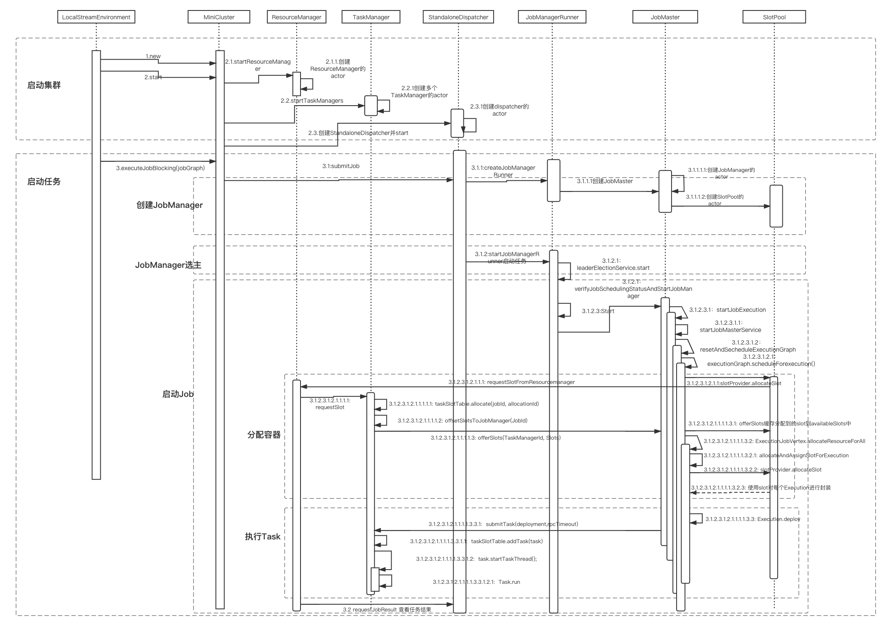
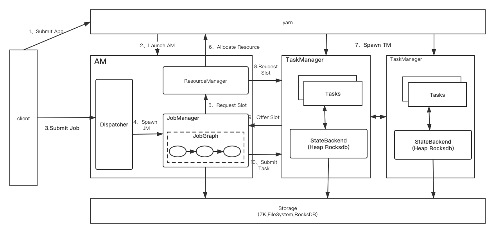
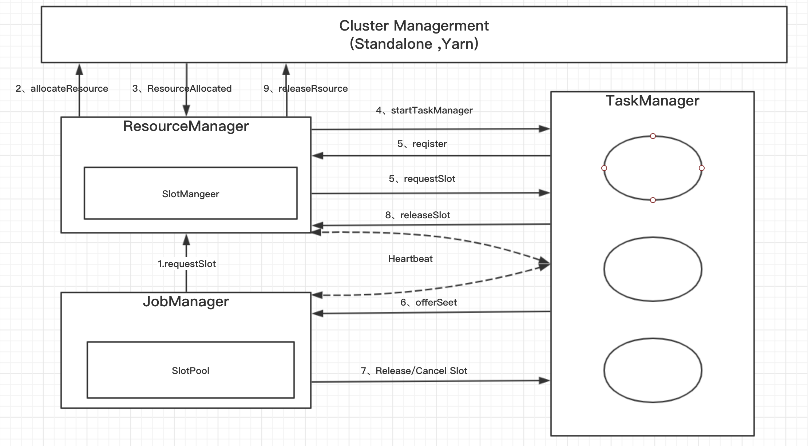

## Flink源码阅读：从hello, world wordCount开始

### 算子(operator)的注册（声明）
```java
DataStream<Tuple2<String, Integer>> counts =
            // split up the lines in pairs (2-tuples) containing: (word,1)
            text.flatMap(new Tokenizer())
            // group by the tuple field "0" and sum up tuple field "1"
            .keyBy(0).sum(1);

public static final class Tokenizer implements FlatMapFunction<String, Tuple2<String, Integer>> {
        @Override
        public void flatMap(String value, Collector<Tuple2<String, Integer>> out) {
            // normalize and split the line
            String[] tokens = value.toLowerCase().split("\\W+");

            // emit the pairs
            for (String token : tokens) {
                if (token.length() > 0) {
                    out.collect(new Tuple2<>(token, 1));
                }
            }
        }
    }
```

我们以flatMap为例，text.flatMap(new Tokenizer())这一句话跟踪进去是这样的：
```java
DataStream.java
public <R> SingleOutputStreamOperator<R> flatMap(FlatMapFunction<T, R> flatMapper) {
        TypeInformation<R> outType = TypeExtractor.getFlatMapReturnTypes(clean(flatMapper),
                getType(), Utils.getCallLocationName(), true);
        return transform("Flat Map", outType, new StreamFlatMap<>(clean(flatMapper)));
}
======> 其中
tansform的主要作用：是将resultTransform注册到environment中
SingleOutputStreamOperator<R> returnStream = new SingleOutputStreamOperator(environment, resultTransform);
getExecutionEnvironment().addOperator(resultTransform);

======>StreamExecutionEnvironment.java
protected final List<Transformation<?>> transformations = new ArrayList<>();
transformations.add(transformation);
```
When the stream program is to be executed this graph is translated to a StreamGraph using StreamGraphGenerator.即当一个Stream被执行后，会使用StreamGraphGenerator将当前Stream生产一个StreamGraph

里面完成了两件事，一是用反射拿到了FlatMap算子的输出类型，而是生成一个Operator。flink流式计算的核心概念，就是将数据从输入流一个个传递给Operator进行链式处理，最后交给输出流的的过程。对数据的每一次处理在逻辑上成为一个Operator，并且为了本地化处理的效率起见，operator之间也可以串成一个chain一起处理。

下面这张图表明了flink是如何看待用户的处理流程的:抽象化为一系列operator，以source 开始，以sink结尾，中间的operator做的操作叫做transform，并且可以把几个操作串在一起 执行。


### 程序的执行
程序执行即env.execute("hello world");

#### 1.3.1本地模式下的execute方法
env.execute()这行代码主要做了以下事情:

- 生成StreamGraph。代表程序的拓扑结构，是从用户代码直接生成的图。
- 生成JobGraph。这个图是要交给Flink去生成task的图。
- 生成一系列配置
- 将JobGraph和配置交给Flink集群去运行。如果不是本地运行的话，还会把jar文件通过网络发送给其他节点。
- 以本地模式运行的话，可以看到启动过程，如启动性能度量，web模块，JobManager、ResourceManager、taskManager等等。
- 启动任务。值得一提的是在启动任务之前，先启动了一个用户类加载，这个加载器可以用来做一些运行时动态加载类的工作。

#### 1.3.2远程模式（RemoteEnvironment）的execute方法

#### 1.3.3程序启动过程
上面提到，整个程序真正意义上开始执行，是在这里：
```java
env.execute("hello world");
```
远程模式和本地模式有一点不同，我们先按照本地模式来调试。

我们跟进源码：
```java
StreamExecutionEnvironment.java

public JobExecutionResult execute(String jobName) throws Exception {
        Preconditions.checkNotNull(jobName, "Streaming Job name should not be null.");
        return execute(getStreamGraph(jobName));
}
```
先生成StreamGraph，然后执行excute(StreamGraph)
```java
@Internal
public StreamGraph getStreamGraph(String jobName) {
    return getStreamGraphGenerator().setJobName(jobName).generate();
}
====>
private StreamGraphGenerator getStreamGraphGenerator() {
        if (transformations.size() <= 0) {
            throw new IllegalStateException("No operators defined in streaming topology. Cannot execute.");
        }
        return new StreamGraphGenerator(transformations, config, checkpointCfg)
            .setStateBackend(defaultStateBackend)
            .setChaining(isChainingEnabled)
            .setUserArtifacts(cacheFile)
            .setTimeCharacteristic(timeCharacteristic)
            .setDefaultBufferTimeout(bufferTimeout);
    }
=====>
    public StreamGraphGenerator setJobName(String jobName) {
        this.jobName = jobName;
        return this;
    }
=====>generate();
```

然后开始执行生成的StreamGraph，在本地调试模式下会启动一个miniCluster，然后开始执行代码
```java
//LocalStreamEnvironment.java
@Override
    public JobExecutionResult execute(StreamGraph streamGraph) throws Exception {
        JobGraph jobGraph = streamGraph.getJobGraph();
        //... JobGraph的图配置
        .......

        int numSlotsPerTaskManager = configuration.getInteger(TaskManagerOptions.NUM_TASK_SLOTS, jobGraph.getMaximumParallelism());

        //创建MiniClusterConfiguration ，并设置每一个TaskManager使用的slot数量setNumSlotsPerTaskManager
        MiniClusterConfiguration cfg = new MiniClusterConfiguration.Builder()
            .setConfiguration(configuration)
            .setNumSlotsPerTaskManager(numSlotsPerTaskManager)
            .build();

        MiniCluster miniCluster = new MiniCluster(cfg);
        try {
            //启动集群，包括JobMaster，进行leader选举等等
            miniCluster.start();
            //PORT：8081
            configuration.setInteger(RestOptions.PORT, miniCluster.getRestAddress().get().getPort());

            //提交任务到JobMaster
            return miniCluster.executeJobBlocking(jobGraph);
        }
        finally {
            transformations.clear();
            miniCluster.close();
        }

```
**整体代码分为以下几步：**

- 创建streamGraph
- 通过streamGraph 创建jobGraph
- 创建Configuration
- 创建MiniCLusterConfiguration,并设置每一个TaskManager使用的slot数量setNumSlotsperTaskManager
- 创建miniCluster
- 通过miniCluster.executeJobBlocking执行jobGraph
注：jobGraph是我们要利用miniCluster运行获取结果的Graph有向无环图。


然后在MiniCluster.java中查看执行的具体逻辑
```java
    @Override
    public JobExecutionResult executeJobBlocking(JobGraph job) throws JobExecutionException, InterruptedException {
    checkNotNull(job, "job is null");
    //在这里，最终在submitJob中把Job提交给JobMaster
    final CompletableFuture<JobSubmissionResult> submissionFuture = submitJob(job);
    final CompletableFuture<JobResult> jobResultFuture = submissionFuture.thenCompose(
            (JobSubmissionResult ignored) -> requestJobResult(job.getJobID()));
    final JobResult jobResult;
    //异步转同步
    jobResult = jobResultFuture.get();
    return jobResult.toJobExecutionResult(Thread.currentThread().getContextClassLoader());
}
```
正如在注释例写的，这一段代码核心逻辑是调用那个submitJob方法，那么我再接着看这个方法。
```java
//将作业提交给JobMaster
public CompletableFuture<JobSubmissionResult> submitJob(JobGraph jobGraph) {
    final CompletableFuture<DispatcherGateway> dispatcherGatewayFuture = getDispatcherGatewayFuture();

    // we have to allow queued scheduling in Flip-6 mode because we need to request slots from the ResourceManager
    jobGraph.setAllowQueuedScheduling(true);

    final CompletableFuture<InetSocketAddress> blobServerAddressFuture = createBlobServerAddress(dispatcherGatewayFuture);

    final CompletableFuture<Void> jarUploadFuture = uploadAndSetJobFiles(blobServerAddressFuture, jobGraph);

    //上传Jar包
    final CompletableFuture<Acknowledge> acknowledgeCompletableFuture = jarUploadFuture
            .thenCombine(
                dispatcherGatewayFuture,//这里执行真正的submit操作
                (Void ack, DispatcherGateway dispatcherGateway) -> dispatcherGateway.submitJob(jobGraph, rpcTimeout))
            .thenCompose(Function.identity());

    return acknowledgeCompletableFuture.thenApply(
            (Acknowledge ignored) -> new JobSubmissionResult(jobGraph.getJobID()));
}
```
上面中的dispatcherGateway.submitJob(jobGraph,rpcTimeout) 中 的Dispatcher是一个接收job，然后指派JobMaster去启动任务的类，我们可以看看它的类结构，有两个实现。在本地环境下启动的是MiniDispatcher，在集群上提交任务时，集群上启动的是StandaloneDispatcher.

那么这个Dispatcher又做了什么呢？ 它启动了一个JobManagerRunner，(这里我要吐槽Flink的 命名，这个东西应该叫做JobMasterRunner才对，flink里的JobMaster和JobManager不是 一个东西)，委托JobManagerRunner去启动该Job的JobMaster。我们看一下对应的代码：

```java
//Interface for self gateways.
public interface RpcServer{}

//在RpcEndpoint.java中
//Starts the rpc endpoint. This tells the underlying rpc server that the rpc endpoint is ready to process remote procedure calls.
//启动Rpc 端点，高速RPC基础服务端 rpc端点已经可用
public final void start() {
        rpcServer.start();
}

```
//上述RPC是使用Akka的actor实现的

##### MiniCluster所做的事情较多，具体步骤如下：
- 获取配置信息
- 初始化IO Format类
- 注册MetricsRegistry并实例化jobManagerMetricGroup
- 启动rpc服务
- 启动HA服务
- 启动resourceManager
- 启动TaskManagers
- 启动调度程序rest端口
- 在提交工作时启动JobManagers的分配器
- 获取ResourceManagerLeader、dispatcherLeaderRetrieve并启动

#### env.execute()的执行过程
简化描述下env.execute()的整个流程的处理过程：

- 创建获取对应的StreamExecutionEnvironment对象：LocalStreamEnvironment
- 调用StreamExecutionEnvironment对象的execute方法。
    + 获取StreamGraph
    + 获取jobGraph
    + 实例化miniCluster
    + miniCluster.executeJobBlocking指定要运行的jobGraph
- 启动miniCluster执行任务
    + 启动各个类所需服务(rpc、ha、resourceManager、TaskManager)

#### LocalFlinkMiniCluster集群的角色
- ResourceManager
    + 负责容器的分配
    + ResourceManager extends FencedAkkaRpcActor，使用FencedAkkaRpcActor实现，其rpcEndpoint为org.apache.flink.runtime.resourcemanager.ResourceManager
- JobMaster
    + 负责任务执行计划的调度和执行
    + 使用FencedAkkaRpcActor实现，其rpcEndpoint为org.apache.flink.runtime.jobmaster.JobMaster
    + JobMaster持有一个SlotPool的Actor,用来暂存TaskExecutor提供给JobMaster并接受的slot。
    + JobMaster的Scheduler组件从这个SlotPool中获取资源以调度job的task。
- Dispatcher
    + 主要职责是接收Client端提交过来的job并生成一个JobMaster去负责这个Job在集群资源管理器上执行。
    + 不是所有的部署方式都需要用到dispatcher，比如yarn-cluster的部署方式可能就不需要使用FencedAkkaRpcActor实现，其rpcEndpoint为org.apache.flink。runtime.dispatcher.StandaloneDispatcher
- TaskExecutor
    + TaskExecutor会与ResourceManager和JobMaster两者进行通信
    + 会向ResourceManager报告自身的可用资源；并维护本身Slot的状态
    + 根据slot的分配结果，接收JobMaster的命令在对应的slot上执行指定的task。
    + TaskExecutor还需要向以上两者定时上报心跳信息
    + 使用AkkaRpcActor实现，其rpcEndpoint为org.apache.flink.runtime.taskexecutor.TaskExecutor

### DataStream任务的主体流程



### Flink Runtime层的主要架构
Flink Runtime 层的主要架构如图 2 所示，它展示了一个 Flink 集群的基本结构。Flink Runtime 层的整个架构主要是在 FLIP-6 中实现的,整体来说，他采用了标准master-slave的结构，其中作者



### Flink中各个模块的交互关系


#### Flink 中HelloWorld的执行中Console分析


```java
LocalStreamEnvironment.java  - Running job on local embedded Flink mini cluster
MiniCluster.java (start())             - Starting Flink Mini Cluster
MiniCluster.java(start())              - Starting Metrics Registry
MetricRegistryImpl.java(createMetricRegistry(configuration))           - No metrics reporter configured, no metrics will be exposed/reported.
MiniCluster.java()              - Starting RPC Service(s)
Slf4jLogger                                  - Slf4jLogger started
AkkaRpcServiceUtils         - Trying to start actor system at :0
Slf4jLogger                                  - Slf4jLogger started
akka.remote.Remoting                                          - Starting remoting
akka.remote.Remoting                                          - Remoting started; listening on addresses :[akka.tcp://flink-metrics@127.0.0.1:55907]
AkkaRpcServiceUtils         - Actor system started at akka.tcp://flink-metrics@127.0.0.1:55907
AkkaRpcService              - Starting RPC endpoint for org.apache.flink.runtime.metrics.dump.MetricQueryService at akka://flink-metrics/user/MetricQueryService .
-->MiniCluster              - Starting high-availability services
-->BlobServer                      - Created BLOB server storage directory /var/folders/bn/x51cf0nn0sx0qh3l1z3bwkhm0000gn/T/blobStore-520ff33d-374f-4886-83a4-d6709d5f98a7
BlobServer                      - Started BLOB server at 0.0.0.0:55908 - max concurrent requests: 50 - max backlog: 1000
PermanentBlobCache              - Created BLOB cache storage directory /var/folders/bn/x51cf0nn0sx0qh3l1z3bwkhm0000gn/T/blobStore-e14a2b07-d9bb-4656-b4b3-f59b15b0d099
TransientBlobCache              - Created BLOB cache storage directory /var/folders/bn/x51cf0nn0sx0qh3l1z3bwkhm0000gn/T/blobStore-6f983676-990e-4654-9454-33f0c31c5465
--> MiniCluster              - Starting 1 TaskManger(s)
TaskManagerRunner       - Starting TaskManager with ResourceID: e6c4c772-d3c0-49df-b632-9dc73f269ef5
TaskManagerServices     - Temporary file directory '/var/folders/bn/x51cf0nn0sx0qh3l1z3bwkhm0000gn/T': total 233 GB, usable 65 GB (27.90% usable)
FileChannelManagerImpl       - FileChannelManager uses directory /var/folders/bn/x51cf0nn0sx0qh3l1z3bwkhm0000gn/T/flink-io-28eae481-66ae-454c-98ca-febf68f3d096 for spill files.
FileChannelManagerImpl       - FileChannelManager uses directory /var/folders/bn/x51cf0nn0sx0qh3l1z3bwkhm0000gn/T/flink-netty-shuffle-4c88d5b9-1718-4171-b1ad-6300d105aea6 for spill files.
NetworkBufferPool  - Allocated 404 MB for network buffer pool (number of memory segments: 12945, bytes per segment: 32768).
NettyShuffleEnvironment   - Starting the network environment and its components.
KvStateService          - Starting the kvState service and its components.
-->TaskManagerServices     - Limiting managed memory to 0.7 of the currently free heap space (2542 MB), memory will be allocated lazily.
-->TaskManagerConfiguration  - Messages have a max timeout of 10000 ms
AkkaRpcService              - Starting RPC endpoint for org.apache.flink.runtime.taskexecutor.TaskExecutor at akka://flink/user/taskmanager_0 .
-->JobLeaderService        - Start job leader service.
FileCache                  - User file cache uses directory /var/folders/bn/x51cf0nn0sx0qh3l1z3bwkhm0000gn/T/flink-dist-cache-b019a8d5-6e7a-48a0-946e-895400072db0
-->DispatcherRestEndpoint    - Starting rest endpoint.
WebMonitorUtils           - Log file environment variable 'log.file' is not set.
WebMonitorUtils           - JobManager log files are unavailable in the web dashboard. Log file location not found in environment variable 'log.file' or configuration key 'Key: 'web.log.path' , default: null (fallback keys: [{key=jobmanager.web.log.path, isDeprecated=true}])'.
DispatcherRestEndpoint    - Failed to load web based job submission extension. Probable reason: flink-runtime-web is not in the classpath.
DispatcherRestEndpoint    - Rest endpoint listening at localhost:55909
EmbeddedLeaderService  - Proposing leadership to contender org.apache.flink.runtime.dispatcher.DispatcherRestEndpoint@733c423e @ http://localhost:55909
DispatcherRestEndpoint    - http://localhost:55909 was granted leadership with leaderSessionID=2830278b-089f-4b09-b7bd-9b76cb9a61e4
EmbeddedLeaderService  - Received confirmation of leadership for leader http://localhost:55909 , session=2830278b-089f-4b09-b7bd-9b76cb9a61e4
AkkaRpcService              - Starting RPC endpoint for org.apache.flink.runtime.resourcemanager.StandaloneResourceManager at akka://flink/user/resourcemanager .
AkkaRpcService              - Starting RPC endpoint for org.apache.flink.runtime.dispatcher.StandaloneDispatcher at akka://flink/user/dispatcher .
EmbeddedLeaderService  - Proposing leadership to contender org.apache.flink.runtime.resourcemanager.StandaloneResourceManager@1982c492 @ akka://flink/user/resourcemanager
EmbeddedLeaderService  - Proposing leadership to contender org.apache.flink.runtime.dispatcher.StandaloneDispatcher@6b12abbc @ akka://flink/user/dispatcher
StandaloneDispatcher      - Dispatcher akka://flink/user/dispatcher was granted leadership with fencing token c1da612a-151f-4230-bd3c-ea546ace6e55
StandaloneResourceManager  - ResourceManager akka://flink/user/resourcemanager was granted leadership with fencing token a02b00a5ab1cc7039bc9fea525324e95

--->MiniCluster              - Flink Mini Cluster started successfully


StandaloneDispatcher      - Recovering all persisted jobs.
SlotManagerImpl  - Starting the SlotManager.
EmbeddedLeaderService  - Received confirmation of leadership for leader akka://flink/user/dispatcher , session=c1da612a-151f-4230-bd3c-ea546ace6e55
EmbeddedLeaderService  - Received confirmation of leadership for leader akka://flink/user/resourcemanager , session=9bc9fea5-2532-4e95-a02b-00a5ab1cc703


--->TaskExecutor            - Connecting to ResourceManager akka://flink/user/resourcemanager(a02b00a5ab1cc7039bc9fea525324e95).
-->TaskExecutor            - Resolved ResourceManager address, beginning registration
-->TaskExecutor            - Registration at ResourceManager attempt 1 (timeout=100ms)
-->StandaloneResourceManager  - Registering TaskManager with ResourceID e6c4c772-d3c0-49df-b632-9dc73f269ef5 (akka://flink/user/taskmanager_0) at ResourceManager
-->TaskExecutor            - Successful registration at resource manager akka://flink/user/resourcemanager under registration id 479f87a1847a6dae11ce372dd2836932.
StandaloneDispatcher      - Received JobGraph submission 0ef9c9ba4fd850d8b18814fc3d2a4653 (Streaming WordCount).
StandaloneDispatcher      - Submitting job 0ef9c9ba4fd850d8b18814fc3d2a4653 (Streaming WordCount).
AkkaRpcService              - Starting RPC endpoint for org.apache.flink.runtime.jobmaster.JobMaster at akka://flink/user/jobmanager_1 .
JobMaster                  - Initializing job Streaming WordCount (0ef9c9ba4fd850d8b18814fc3d2a4653).
JobMaster                  - Using restart strategy NoRestartStrategy for Streaming WordCount (0ef9c9ba4fd850d8b18814fc3d2a4653).
ExecutionGraph        - Job recovers via failover strategy: full graph restart
JobMaster                  - Running initialization on master for job Streaming WordCount (0ef9c9ba4fd850d8b18814fc3d2a4653).
JobMaster                  - Successfully ran initialization on master in 0 ms.
JobMaster                  - No state backend has been configured, using default (Memory / JobManager) MemoryStateBackend (data in heap memory / checkpoints to JobManager) (checkpoints: 'null', savepoints: 'null', asynchronous: TRUE, maxStateSize: 5242880)
org.apache.flink.runtime.highavailability.nonha.embedded.EmbeddedLeaderService  - Proposing leadership to contender org.apache.flink.runtime.jobmaster.JobManagerRunner@4ed3fa45 @ akka://flink/user/jobmanager_1
JobManagerRunner           - JobManager runner for job Streaming WordCount (0ef9c9ba4fd850d8b18814fc3d2a4653) was granted leadership with session id d96fcf45-de57-46ba-88d3-41c4d05db019 at akka://flink/user/jobmanager_1.
JobMaster                  - Starting execution of job Streaming WordCount (0ef9c9ba4fd850d8b18814fc3d2a4653) under job master id 88d341c4d05db019d96fcf45de5746ba.
ExecutionGraph        - Job Streaming WordCount (0ef9c9ba4fd850d8b18814fc3d2a4653) switched from state CREATED to RUNNING.
ExecutionGraph        - Source: Collection Source (1/1) (be2cdd197fb949e88e0ac9c49dae2d35) switched from CREATED to SCHEDULED.


14:18:55,507 INFO  org.apache.flink.runtime.jobmaster.slotpool.SlotPoolImpl      - Cannot serve slot request, no ResourceManager connected. Adding as pending request [SlotRequestId{4947c714a1cb2502b448c07350477ead}]
14:18:55,515 INFO  org.apache.flink.runtime.executiongraph.ExecutionGraph        - Flat Map (1/12) (8e745fa4c6e433418b5cba2720c5d36c) switched from CREATED to SCHEDULED.
14:18:55,516 INFO  org.apache.flink.runtime.executiongraph.ExecutionGraph        - Flat Map (2/12) (adf0ce0ea00e9bd966057e11499902a2) switched from CREATED to SCHEDULED.
14:18:55,516 INFO  org.apache.flink.runtime.executiongraph.ExecutionGraph        - Flat Map (3/12) (f3adc3eb893e568243e7ae8475e36311) switched from CREATED to SCHEDULED.
14:18:55,516 INFO  org.apache.flink.runtime.executiongraph.ExecutionGraph        - Flat Map (4/12) (ca13ef3509cfe2a2944a5784022b2da8) switched from CREATED to SCHEDULED.
14:18:55,516 INFO  org.apache.flink.runtime.executiongraph.ExecutionGraph        - Flat Map (5/12) (2d6b78c48fdfeab1bb6ad49ba8f70e8a) switched from CREATED to SCHEDULED.
14:18:55,517 INFO  org.apache.flink.runtime.executiongraph.ExecutionGraph        - Flat Map (6/12) (1412fcdc48f612bf26bdbd577cedd78d) switched from CREATED to SCHEDULED.
14:18:55,517 INFO  org.apache.flink.runtime.executiongraph.ExecutionGraph        - Flat Map (7/12) (6c6d139f7ecb16ebeab0e1c8234a02bc) switched from CREATED to SCHEDULED.
14:18:55,517 INFO  org.apache.flink.runtime.executiongraph.ExecutionGraph        - Flat Map (8/12) (9ac66994824439ed93005703774b04d6) switched from CREATED to SCHEDULED.
14:18:55,517 INFO  org.apache.flink.runtime.executiongraph.ExecutionGraph        - Flat Map (9/12) (a7b6682a97fe038d1ef093a16a8e6fcc) switched from CREATED to SCHEDULED.
14:18:55,517 INFO  org.apache.flink.runtime.executiongraph.ExecutionGraph        - Flat Map (10/12) (1dbc6e30ab004f293aff9c3fc97ae547) switched from CREATED to SCHEDULED.
14:18:55,517 INFO  org.apache.flink.runtime.executiongraph.ExecutionGraph        - Flat Map (11/12) (eb1b985ac375aa33a9df40008626d91f) switched from CREATED to SCHEDULED.
14:18:55,517 INFO  org.apache.flink.runtime.executiongraph.ExecutionGraph        - Flat Map (12/12) (7b3719c2608002b176ca65084f6523e5) switched from CREATED to SCHEDULED.
14:18:55,517 INFO  org.apache.flink.runtime.executiongraph.ExecutionGraph        - Keyed Aggregation -> Sink: Print to Std. Out (1/12) (576ccc45fc18a243952653ad0ec38890) switched from CREATED to SCHEDULED.
14:18:55,518 INFO  org.apache.flink.runtime.executiongraph.ExecutionGraph        - Keyed Aggregation -> Sink: Print to Std. Out (2/12) (a0f1245fdd84a5bcfb8764ff84e1655a) switched from CREATED to SCHEDULED.
14:18:55,518 INFO  org.apache.flink.runtime.jobmaster.slotpool.SlotPoolImpl      - Cannot serve slot request, no ResourceManager connected. Adding as pending request [SlotRequestId{29ceaf11f922ca9f4927fa060258e214}]
14:18:55,518 INFO  org.apache.flink.runtime.executiongraph.ExecutionGraph        - Keyed Aggregation -> Sink: Print to Std. Out (3/12) (18429e6962cf5efba9078a8ff0658825) switched from CREATED to SCHEDULED.
14:18:55,520 INFO  org.apache.flink.runtime.jobmaster.slotpool.SlotPoolImpl      - Cannot serve slot request, no ResourceManager connected. Adding as pending request [SlotRequestId{0ada5e42a6ed8ed8b968ecb7f81b3fa2}]
14:18:55,521 INFO  org.apache.flink.runtime.executiongraph.ExecutionGraph        - Keyed Aggregation -> Sink: Print to Std. Out (4/12) (d9ce6196fc898e01fca979940c7636f6) switched from CREATED to SCHEDULED.
14:18:55,521 INFO  org.apache.flink.runtime.jobmaster.slotpool.SlotPoolImpl      - Cannot serve slot request, no ResourceManager connected. Adding as pending request [SlotRequestId{ec4c82421441b46a0550efd2badb374b}]
14:18:55,521 INFO  org.apache.flink.runtime.executiongraph.ExecutionGraph        - Keyed Aggregation -> Sink: Print to Std. Out (5/12) (1c3667a2fc7599c4ab2b552fef14c6e7) switched from CREATED to SCHEDULED.
14:18:55,521 INFO  org.apache.flink.runtime.jobmaster.slotpool.SlotPoolImpl      - Cannot serve slot request, no ResourceManager connected. Adding as pending request [SlotRequestId{b975bdf5cb4a560f2e045027bb2c8ee6}]
14:18:55,521 INFO  org.apache.flink.runtime.executiongraph.ExecutionGraph        - Keyed Aggregation -> Sink: Print to Std. Out (6/12) (e7dffaaa887e02431ee338f728272e62) switched from CREATED to SCHEDULED.
14:18:55,522 INFO  org.apache.flink.runtime.jobmaster.slotpool.SlotPoolImpl      - Cannot serve slot request, no ResourceManager connected. Adding as pending request [SlotRequestId{4612c9261b0db858aba4c1d858218940}]
14:18:55,522 INFO  org.apache.flink.runtime.executiongraph.ExecutionGraph        - Keyed Aggregation -> Sink: Print to Std. Out (7/12) (c751ad5818d85fdad77b67b0ab4c068c) switched from CREATED to SCHEDULED.
14:18:55,522 INFO  org.apache.flink.runtime.jobmaster.slotpool.SlotPoolImpl      - Cannot serve slot request, no ResourceManager connected. Adding as pending request [SlotRequestId{c3062ee9df2865a7e770b297c8a1387b}]
14:18:55,522 INFO  org.apache.flink.runtime.executiongraph.ExecutionGraph        - Keyed Aggregation -> Sink: Print to Std. Out (8/12) (beb63142c38883d6c07c225d2f68affe) switched from CREATED to SCHEDULED.
14:18:55,522 INFO  org.apache.flink.runtime.jobmaster.slotpool.SlotPoolImpl      - Cannot serve slot request, no ResourceManager connected. Adding as pending request [SlotRequestId{483d8051007a496aaf3fca470bf801a5}]
14:18:55,522 INFO  org.apache.flink.runtime.executiongraph.ExecutionGraph        - Keyed Aggregation -> Sink: Print to Std. Out (9/12) (9e4baf944e9c8e4ce7ed6b7941a88eba) switched from CREATED to SCHEDULED.
14:18:55,522 INFO  org.apache.flink.runtime.jobmaster.slotpool.SlotPoolImpl      - Cannot serve slot request, no ResourceManager connected. Adding as pending request [SlotRequestId{285bc753d189a69a376945ae4a8f8d9c}]
14:18:55,522 INFO  org.apache.flink.runtime.executiongraph.ExecutionGraph        - Keyed Aggregation -> Sink: Print to Std. Out (10/12) (45dd87ebfeb40d26d23b3a7ff99f915c) switched from CREATED to SCHEDULED.
14:18:55,523 INFO  org.apache.flink.runtime.jobmaster.slotpool.SlotPoolImpl      - Cannot serve slot request, no ResourceManager connected. Adding as pending request [SlotRequestId{355945fb30d905731e4117959cf6a322}]
14:18:55,523 INFO  org.apache.flink.runtime.executiongraph.ExecutionGraph        - Keyed Aggregation -> Sink: Print to Std. Out (11/12) (18e0998415f1787ef22ae3b328b1778f) switched from CREATED to SCHEDULED.
14:18:55,523 INFO  org.apache.flink.runtime.jobmaster.slotpool.SlotPoolImpl      - Cannot serve slot request, no ResourceManager connected. Adding as pending request [SlotRequestId{200acdce0da274769c84fc105bb8a63c}]
14:18:55,523 INFO  org.apache.flink.runtime.executiongraph.ExecutionGraph        - Keyed Aggregation -> Sink: Print to Std. Out (12/12) (81a87a964996a02ea358b81bdb028bc2) switched from CREATED to SCHEDULED.
14:18:55,523 INFO  org.apache.flink.runtime.jobmaster.slotpool.SlotPoolImpl      - Cannot serve slot request, no ResourceManager connected. Adding as pending request [SlotRequestId{77b13b7f4b9bb89c428aea017b37b8d0}]
14:18:55,525 INFO  org.apache.flink.runtime.highavailability.nonha.embedded.EmbeddedLeaderService  - Received confirmation of leadership for leader akka://flink/user/jobmanager_1 , session=d96fcf45-de57-46ba-88d3-41c4d05db019
14:18:55,525 INFO  org.apache.flink.runtime.jobmaster.JobMaster                  - Connecting to ResourceManager akka://flink/user/resourcemanager(a02b00a5ab1cc7039bc9fea525324e95)
14:18:55,527 INFO  org.apache.flink.runtime.jobmaster.JobMaster                  - Resolved ResourceManager address, beginning registration
14:18:55,527 INFO  org.apache.flink.runtime.jobmaster.JobMaster                  - Registration at ResourceManager attempt 1 (timeout=100ms)
14:18:55,529 INFO  org.apache.flink.runtime.resourcemanager.StandaloneResourceManager  - Registering job manager 88d341c4d05db019d96fcf45de5746ba@akka://flink/user/jobmanager_1 for job 0ef9c9ba4fd850d8b18814fc3d2a4653.
14:18:55,534 INFO  org.apache.flink.runtime.resourcemanager.StandaloneResourceManager  - Registered job manager 88d341c4d05db019d96fcf45de5746ba@akka://flink/user/jobmanager_1 for job 0ef9c9ba4fd850d8b18814fc3d2a4653.
14:18:55,548 INFO  org.apache.flink.runtime.jobmaster.JobMaster                  - JobManager successfully registered at ResourceManager, leader id: a02b00a5ab1cc7039bc9fea525324e95.
14:18:55,549 INFO  org.apache.flink.runtime.jobmaster.slotpool.SlotPoolImpl      - Requesting new slot [SlotRequestId{4947c714a1cb2502b448c07350477ead}] and profile ResourceProfile{cpuCores=-1.0, heapMemoryInMB=-1, directMemoryInMB=-1, nativeMemoryInMB=-1, networkMemoryInMB=-1, managedMemoryInMB=-1} from resource manager.
14:18:55,550 INFO  org.apache.flink.runtime.resourcemanager.StandaloneResourceManager  - Request slot with profile ResourceProfile{cpuCores=-1.0, heapMemoryInMB=-1, directMemoryInMB=-1, nativeMemoryInMB=-1, networkMemoryInMB=-1, managedMemoryInMB=-1} for job 0ef9c9ba4fd850d8b18814fc3d2a4653 with allocation id 4c4b6bac50eee2a2a76b85f3863f4adf.
14:18:55,550 INFO  org.apache.flink.runtime.jobmaster.slotpool.SlotPoolImpl      - Requesting new slot [SlotRequestId{29ceaf11f922ca9f4927fa060258e214}] and profile ResourceProfile{cpuCores=-1.0, heapMemoryInMB=-1, directMemoryInMB=-1, nativeMemoryInMB=-1, networkMemoryInMB=-1, managedMemoryInMB=-1} from resource manager.
14:18:55,550 INFO  org.apache.flink.runtime.jobmaster.slotpool.SlotPoolImpl      - Requesting new slot [SlotRequestId{0ada5e42a6ed8ed8b968ecb7f81b3fa2}] and profile ResourceProfile{cpuCores=-1.0, heapMemoryInMB=-1, directMemoryInMB=-1, nativeMemoryInMB=-1, networkMemoryInMB=-1, managedMemoryInMB=-1} from resource manager.
14:18:55,551 INFO  org.apache.flink.runtime.jobmaster.slotpool.SlotPoolImpl      - Requesting new slot [SlotRequestId{ec4c82421441b46a0550efd2badb374b}] and profile ResourceProfile{cpuCores=-1.0, heapMemoryInMB=-1, directMemoryInMB=-1, nativeMemoryInMB=-1, networkMemoryInMB=-1, managedMemoryInMB=-1} from resource manager.
14:18:55,551 INFO  org.apache.flink.runtime.jobmaster.slotpool.SlotPoolImpl      - Requesting new slot [SlotRequestId{b975bdf5cb4a560f2e045027bb2c8ee6}] and profile ResourceProfile{cpuCores=-1.0, heapMemoryInMB=-1, directMemoryInMB=-1, nativeMemoryInMB=-1, networkMemoryInMB=-1, managedMemoryInMB=-1} from resource manager.
14:18:55,551 INFO  org.apache.flink.runtime.jobmaster.slotpool.SlotPoolImpl      - Requesting new slot [SlotRequestId{4612c9261b0db858aba4c1d858218940}] and profile ResourceProfile{cpuCores=-1.0, heapMemoryInMB=-1, directMemoryInMB=-1, nativeMemoryInMB=-1, networkMemoryInMB=-1, managedMemoryInMB=-1} from resource manager.
14:18:55,551 INFO  org.apache.flink.runtime.taskexecutor.TaskExecutor            - Receive slot request 4c4b6bac50eee2a2a76b85f3863f4adf for job 0ef9c9ba4fd850d8b18814fc3d2a4653 from resource manager with leader id a02b00a5ab1cc7039bc9fea525324e95.
14:18:55,551 INFO  org.apache.flink.runtime.jobmaster.slotpool.SlotPoolImpl      - Requesting new slot [SlotRequestId{c3062ee9df2865a7e770b297c8a1387b}] and profile ResourceProfile{cpuCores=-1.0, heapMemoryInMB=-1, directMemoryInMB=-1, nativeMemoryInMB=-1, networkMemoryInMB=-1, managedMemoryInMB=-1} from resource manager.
14:18:55,551 INFO  org.apache.flink.runtime.jobmaster.slotpool.SlotPoolImpl      - Requesting new slot [SlotRequestId{483d8051007a496aaf3fca470bf801a5}] and profile ResourceProfile{cpuCores=-1.0, heapMemoryInMB=-1, directMemoryInMB=-1, nativeMemoryInMB=-1, networkMemoryInMB=-1, managedMemoryInMB=-1} from resource manager.
14:18:55,552 INFO  org.apache.flink.runtime.jobmaster.slotpool.SlotPoolImpl      - Requesting new slot [SlotRequestId{285bc753d189a69a376945ae4a8f8d9c}] and profile ResourceProfile{cpuCores=-1.0, heapMemoryInMB=-1, directMemoryInMB=-1, nativeMemoryInMB=-1, networkMemoryInMB=-1, managedMemoryInMB=-1} from resource manager.
14:18:55,552 INFO  org.apache.flink.runtime.jobmaster.slotpool.SlotPoolImpl      - Requesting new slot [SlotRequestId{355945fb30d905731e4117959cf6a322}] and profile ResourceProfile{cpuCores=-1.0, heapMemoryInMB=-1, directMemoryInMB=-1, nativeMemoryInMB=-1, networkMemoryInMB=-1, managedMemoryInMB=-1} from resource manager.
14:18:55,552 INFO  org.apache.flink.runtime.resourcemanager.StandaloneResourceManager  - Request slot with profile ResourceProfile{cpuCores=-1.0, heapMemoryInMB=-1, directMemoryInMB=-1, nativeMemoryInMB=-1, networkMemoryInMB=-1, managedMemoryInMB=-1} for job 0ef9c9ba4fd850d8b18814fc3d2a4653 with allocation id d68be2d56fd448dc61068eeb9d0bb87f.
14:18:55,552 INFO  org.apache.flink.runtime.jobmaster.slotpool.SlotPoolImpl      - Requesting new slot [SlotRequestId{200acdce0da274769c84fc105bb8a63c}] and profile ResourceProfile{cpuCores=-1.0, heapMemoryInMB=-1, directMemoryInMB=-1, nativeMemoryInMB=-1, networkMemoryInMB=-1, managedMemoryInMB=-1} from resource manager.
14:18:55,552 INFO  org.apache.flink.runtime.taskexecutor.TaskExecutor            - Allocated slot for 4c4b6bac50eee2a2a76b85f3863f4adf.
14:18:55,552 INFO  org.apache.flink.runtime.taskexecutor.JobLeaderService        - Add job 0ef9c9ba4fd850d8b18814fc3d2a4653 for job leader monitoring.
14:18:55,552 INFO  org.apache.flink.runtime.jobmaster.slotpool.SlotPoolImpl      - Requesting new slot [SlotRequestId{77b13b7f4b9bb89c428aea017b37b8d0}] and profile ResourceProfile{cpuCores=-1.0, heapMemoryInMB=-1, directMemoryInMB=-1, nativeMemoryInMB=-1, networkMemoryInMB=-1, managedMemoryInMB=-1} from resource manager.
14:18:55,552 INFO  org.apache.flink.runtime.resourcemanager.StandaloneResourceManager  - Request slot with profile ResourceProfile{cpuCores=-1.0, heapMemoryInMB=-1, directMemoryInMB=-1, nativeMemoryInMB=-1, networkMemoryInMB=-1, managedMemoryInMB=-1} for job 0ef9c9ba4fd850d8b18814fc3d2a4653 with allocation id e48f4ad59d9983aa0faa223c41f89732.
14:18:55,553 INFO  org.apache.flink.runtime.resourcemanager.StandaloneResourceManager  - Request slot with profile ResourceProfile{cpuCores=-1.0, heapMemoryInMB=-1, directMemoryInMB=-1, nativeMemoryInMB=-1, networkMemoryInMB=-1, managedMemoryInMB=-1} for job 0ef9c9ba4fd850d8b18814fc3d2a4653 with allocation id ec31f3162f9d22bb262a6301d33b2f2c.
14:18:55,553 INFO  org.apache.flink.runtime.resourcemanager.StandaloneResourceManager  - Request slot with profile ResourceProfile{cpuCores=-1.0, heapMemoryInMB=-1, directMemoryInMB=-1, nativeMemoryInMB=-1, networkMemoryInMB=-1, managedMemoryInMB=-1} for job 0ef9c9ba4fd850d8b18814fc3d2a4653 with allocation id 9d2ef6dc36a730e0400bc105399395bf.
14:18:55,554 INFO  org.apache.flink.runtime.resourcemanager.StandaloneResourceManager  - Request slot with profile ResourceProfile{cpuCores=-1.0, heapMemoryInMB=-1, directMemoryInMB=-1, nativeMemoryInMB=-1, networkMemoryInMB=-1, managedMemoryInMB=-1} for job 0ef9c9ba4fd850d8b18814fc3d2a4653 with allocation id 46a774f0b8a93cde3ba532f877e8945a.
14:18:55,554 INFO  org.apache.flink.runtime.resourcemanager.StandaloneResourceManager  - Request slot with profile ResourceProfile{cpuCores=-1.0, heapMemoryInMB=-1, directMemoryInMB=-1, nativeMemoryInMB=-1, networkMemoryInMB=-1, managedMemoryInMB=-1} for job 0ef9c9ba4fd850d8b18814fc3d2a4653 with allocation id 8ef31d82da359b8649b550ff2d468ab1.
14:18:55,554 INFO  org.apache.flink.runtime.taskexecutor.TaskExecutor            - Receive slot request d68be2d56fd448dc61068eeb9d0bb87f for job 0ef9c9ba4fd850d8b18814fc3d2a4653 from resource manager with leader id a02b00a5ab1cc7039bc9fea525324e95.
14:18:55,554 INFO  org.apache.flink.runtime.resourcemanager.StandaloneResourceManager  - Request slot with profile ResourceProfile{cpuCores=-1.0, heapMemoryInMB=-1, directMemoryInMB=-1, nativeMemoryInMB=-1, networkMemoryInMB=-1, managedMemoryInMB=-1} for job 0ef9c9ba4fd850d8b18814fc3d2a4653 with allocation id 6c513a4a8860370335d01372d9adc03d.
14:18:55,554 INFO  org.apache.flink.runtime.taskexecutor.TaskExecutor            - Allocated slot for d68be2d56fd448dc61068eeb9d0bb87f.
14:18:55,554 INFO  org.apache.flink.runtime.taskexecutor.JobLeaderService        - Add job 0ef9c9ba4fd850d8b18814fc3d2a4653 for job leader monitoring.
14:18:55,554 INFO  org.apache.flink.runtime.resourcemanager.StandaloneResourceManager  - Request slot with profile ResourceProfile{cpuCores=-1.0, heapMemoryInMB=-1, directMemoryInMB=-1, nativeMemoryInMB=-1, networkMemoryInMB=-1, managedMemoryInMB=-1} for job 0ef9c9ba4fd850d8b18814fc3d2a4653 with allocation id 7cdf94f1dc0c7f72d52339e1ebefd8e7.
14:18:55,554 INFO  org.apache.flink.runtime.taskexecutor.TaskExecutor            - Receive slot request e48f4ad59d9983aa0faa223c41f89732 for job 0ef9c9ba4fd850d8b18814fc3d2a4653 from resource manager with leader id a02b00a5ab1cc7039bc9fea525324e95.
14:18:55,554 INFO  org.apache.flink.runtime.taskexecutor.TaskExecutor            - Allocated slot for e48f4ad59d9983aa0faa223c41f89732.
14:18:55,555 INFO  org.apache.flink.runtime.taskexecutor.JobLeaderService        - Add job 0ef9c9ba4fd850d8b18814fc3d2a4653 for job leader monitoring.
14:18:55,555 INFO  org.apache.flink.runtime.resourcemanager.StandaloneResourceManager  - Request slot with profile ResourceProfile{cpuCores=-1.0, heapMemoryInMB=-1, directMemoryInMB=-1, nativeMemoryInMB=-1, networkMemoryInMB=-1, managedMemoryInMB=-1} for job 0ef9c9ba4fd850d8b18814fc3d2a4653 with allocation id 92aedfafc3d150b7d46b9e5896a360ff.
14:18:55,555 INFO  org.apache.flink.runtime.taskexecutor.JobLeaderService        - Try to register at job manager akka://flink/user/jobmanager_1 with leader id d96fcf45-de57-46ba-88d3-41c4d05db019.
14:18:55,555 INFO  org.apache.flink.runtime.taskexecutor.TaskExecutor            - Receive slot request ec31f3162f9d22bb262a6301d33b2f2c for job 0ef9c9ba4fd850d8b18814fc3d2a4653 from resource manager with leader id a02b00a5ab1cc7039bc9fea525324e95.
14:18:55,555 INFO  org.apache.flink.runtime.resourcemanager.StandaloneResourceManager  - Request slot with profile ResourceProfile{cpuCores=-1.0, heapMemoryInMB=-1, directMemoryInMB=-1, nativeMemoryInMB=-1, networkMemoryInMB=-1, managedMemoryInMB=-1} for job 0ef9c9ba4fd850d8b18814fc3d2a4653 with allocation id cc228435ead4e18e5ad5f8e3cf2fa472.
14:18:55,555 INFO  org.apache.flink.runtime.taskexecutor.TaskExecutor            - Allocated slot for ec31f3162f9d22bb262a6301d33b2f2c.
14:18:55,555 INFO  org.apache.flink.runtime.taskexecutor.JobLeaderService        - Add job 0ef9c9ba4fd850d8b18814fc3d2a4653 for job leader monitoring.
14:18:55,555 INFO  org.apache.flink.runtime.resourcemanager.StandaloneResourceManager  - Request slot with profile ResourceProfile{cpuCores=-1.0, heapMemoryInMB=-1, directMemoryInMB=-1, nativeMemoryInMB=-1, networkMemoryInMB=-1, managedMemoryInMB=-1} for job 0ef9c9ba4fd850d8b18814fc3d2a4653 with allocation id 4b43fcce0e900fe03a29d754cb62453c.
14:18:55,555 INFO  org.apache.flink.runtime.taskexecutor.JobLeaderService        - Try to register at job manager akka://flink/user/jobmanager_1 with leader id d96fcf45-de57-46ba-88d3-41c4d05db019.
14:18:55,555 INFO  org.apache.flink.runtime.taskexecutor.TaskExecutor            - Receive slot request 9d2ef6dc36a730e0400bc105399395bf for job 0ef9c9ba4fd850d8b18814fc3d2a4653 from resource manager with leader id a02b00a5ab1cc7039bc9fea525324e95.
14:18:55,555 INFO  org.apache.flink.runtime.taskexecutor.TaskExecutor            - Allocated slot for 9d2ef6dc36a730e0400bc105399395bf.
14:18:55,555 INFO  org.apache.flink.runtime.taskexecutor.JobLeaderService        - Add job 0ef9c9ba4fd850d8b18814fc3d2a4653 for job leader monitoring.
14:18:55,556 INFO  org.apache.flink.runtime.taskexecutor.JobLeaderService        - Resolved JobManager address, beginning registration
14:18:55,556 INFO  org.apache.flink.runtime.taskexecutor.TaskExecutor            - Receive slot request 46a774f0b8a93cde3ba532f877e8945a for job 0ef9c9ba4fd850d8b18814fc3d2a4653 from resource manager with leader id a02b00a5ab1cc7039bc9fea525324e95.
14:18:55,556 INFO  org.apache.flink.runtime.taskexecutor.JobLeaderService        - Try to register at job manager akka://flink/user/jobmanager_1 with leader id d96fcf45-de57-46ba-88d3-41c4d05db019.
14:18:55,556 INFO  org.apache.flink.runtime.taskexecutor.TaskExecutor            - Allocated slot for 46a774f0b8a93cde3ba532f877e8945a.
14:18:55,556 INFO  org.apache.flink.runtime.taskexecutor.JobLeaderService        - Add job 0ef9c9ba4fd850d8b18814fc3d2a4653 for job leader monitoring.
14:18:55,556 INFO  org.apache.flink.runtime.taskexecutor.JobLeaderService        - Resolved JobManager address, beginning registration
14:18:55,556 INFO  org.apache.flink.runtime.taskexecutor.JobLeaderService        - Try to register at job manager akka://flink/user/jobmanager_1 with leader id d96fcf45-de57-46ba-88d3-41c4d05db019.
14:18:55,556 INFO  org.apache.flink.runtime.taskexecutor.TaskExecutor            - Receive slot request 8ef31d82da359b8649b550ff2d468ab1 for job 0ef9c9ba4fd850d8b18814fc3d2a4653 from resource manager with leader id a02b00a5ab1cc7039bc9fea525324e95.
14:18:55,556 INFO  org.apache.flink.runtime.taskexecutor.TaskExecutor            - Allocated slot for 8ef31d82da359b8649b550ff2d468ab1.
14:18:55,556 INFO  org.apache.flink.runtime.taskexecutor.JobLeaderService        - Resolved JobManager address, beginning registration
14:18:55,556 INFO  org.apache.flink.runtime.taskexecutor.JobLeaderService        - Add job 0ef9c9ba4fd850d8b18814fc3d2a4653 for job leader monitoring.
14:18:55,556 INFO  org.apache.flink.runtime.taskexecutor.JobLeaderService        - Try to register at job manager akka://flink/user/jobmanager_1 with leader id d96fcf45-de57-46ba-88d3-41c4d05db019.
14:18:55,556 INFO  org.apache.flink.runtime.taskexecutor.TaskExecutor            - Receive slot request 6c513a4a8860370335d01372d9adc03d for job 0ef9c9ba4fd850d8b18814fc3d2a4653 from resource manager with leader id a02b00a5ab1cc7039bc9fea525324e95.
14:18:55,556 INFO  org.apache.flink.runtime.taskexecutor.JobLeaderService        - Resolved JobManager address, beginning registration
14:18:55,557 INFO  org.apache.flink.runtime.taskexecutor.TaskExecutor            - Allocated slot for 6c513a4a8860370335d01372d9adc03d.
14:18:55,557 INFO  org.apache.flink.runtime.taskexecutor.JobLeaderService        - Add job 0ef9c9ba4fd850d8b18814fc3d2a4653 for job leader monitoring.
14:18:55,557 INFO  org.apache.flink.runtime.taskexecutor.JobLeaderService        - Try to register at job manager akka://flink/user/jobmanager_1 with leader id d96fcf45-de57-46ba-88d3-41c4d05db019.
14:18:55,557 INFO  org.apache.flink.runtime.taskexecutor.TaskExecutor            - Receive slot request 7cdf94f1dc0c7f72d52339e1ebefd8e7 for job 0ef9c9ba4fd850d8b18814fc3d2a4653 from resource manager with leader id a02b00a5ab1cc7039bc9fea525324e95.
14:18:55,557 INFO  org.apache.flink.runtime.taskexecutor.JobLeaderService        - Resolved JobManager address, beginning registration
14:18:55,557 INFO  org.apache.flink.runtime.taskexecutor.TaskExecutor            - Allocated slot for 7cdf94f1dc0c7f72d52339e1ebefd8e7.
14:18:55,557 INFO  org.apache.flink.runtime.taskexecutor.JobLeaderService        - Add job 0ef9c9ba4fd850d8b18814fc3d2a4653 for job leader monitoring.
14:18:55,557 INFO  org.apache.flink.runtime.taskexecutor.JobLeaderService        - Try to register at job manager akka://flink/user/jobmanager_1 with leader id d96fcf45-de57-46ba-88d3-41c4d05db019.
14:18:55,557 INFO  org.apache.flink.runtime.taskexecutor.JobLeaderService        - Resolved JobManager address, beginning registration
14:18:55,557 INFO  org.apache.flink.runtime.taskexecutor.TaskExecutor            - Receive slot request 92aedfafc3d150b7d46b9e5896a360ff for job 0ef9c9ba4fd850d8b18814fc3d2a4653 from resource manager with leader id a02b00a5ab1cc7039bc9fea525324e95.
14:18:55,557 INFO  org.apache.flink.runtime.taskexecutor.TaskExecutor            - Allocated slot for 92aedfafc3d150b7d46b9e5896a360ff.
14:18:55,557 INFO  org.apache.flink.runtime.taskexecutor.JobLeaderService        - Add job 0ef9c9ba4fd850d8b18814fc3d2a4653 for job leader monitoring.
14:18:55,558 INFO  org.apache.flink.runtime.taskexecutor.JobLeaderService        - Try to register at job manager akka://flink/user/jobmanager_1 with leader id d96fcf45-de57-46ba-88d3-41c4d05db019.
14:18:55,558 INFO  org.apache.flink.runtime.taskexecutor.TaskExecutor            - Receive slot request cc228435ead4e18e5ad5f8e3cf2fa472 for job 0ef9c9ba4fd850d8b18814fc3d2a4653 from resource manager with leader id a02b00a5ab1cc7039bc9fea525324e95.
14:18:55,558 INFO  org.apache.flink.runtime.taskexecutor.TaskExecutor            - Allocated slot for cc228435ead4e18e5ad5f8e3cf2fa472.
14:18:55,558 INFO  org.apache.flink.runtime.taskexecutor.JobLeaderService        - Add job 0ef9c9ba4fd850d8b18814fc3d2a4653 for job leader monitoring.
14:18:55,558 INFO  org.apache.flink.runtime.taskexecutor.JobLeaderService        - Resolved JobManager address, beginning registration
14:18:55,558 INFO  org.apache.flink.runtime.taskexecutor.JobLeaderService        - Try to register at job manager akka://flink/user/jobmanager_1 with leader id d96fcf45-de57-46ba-88d3-41c4d05db019.
14:18:55,558 INFO  org.apache.flink.runtime.taskexecutor.TaskExecutor            - Receive slot request 4b43fcce0e900fe03a29d754cb62453c for job 0ef9c9ba4fd850d8b18814fc3d2a4653 from resource manager with leader id a02b00a5ab1cc7039bc9fea525324e95.
14:18:55,558 INFO  org.apache.flink.runtime.taskexecutor.TaskExecutor            - Allocated slot for 4b43fcce0e900fe03a29d754cb62453c.
14:18:55,558 INFO  org.apache.flink.runtime.taskexecutor.JobLeaderService        - Add job 0ef9c9ba4fd850d8b18814fc3d2a4653 for job leader monitoring.
14:18:55,558 INFO  org.apache.flink.runtime.taskexecutor.JobLeaderService        - Resolved JobManager address, beginning registration
14:18:55,558 INFO  org.apache.flink.runtime.taskexecutor.JobLeaderService        - Try to register at job manager akka://flink/user/jobmanager_1 with leader id d96fcf45-de57-46ba-88d3-41c4d05db019.
14:18:55,559 INFO  org.apache.flink.runtime.taskexecutor.JobLeaderService        - Resolved JobManager address, beginning registration
14:18:55,559 INFO  org.apache.flink.runtime.taskexecutor.JobLeaderService        - Resolved JobManager address, beginning registration
14:18:55,559 INFO  org.apache.flink.runtime.taskexecutor.JobLeaderService        - Registration at JobManager attempt 1 (timeout=100ms)
14:18:55,561 INFO  org.apache.flink.runtime.taskexecutor.JobLeaderService        - Successful registration at job manager akka://flink/user/jobmanager_1 for job 0ef9c9ba4fd850d8b18814fc3d2a4653.
14:18:55,562 INFO  org.apache.flink.runtime.taskexecutor.TaskExecutor            - Establish JobManager connection for job 0ef9c9ba4fd850d8b18814fc3d2a4653.
14:18:55,568 INFO  org.apache.flink.runtime.taskexecutor.TaskExecutor            - Offer reserved slots to the leader of job 0ef9c9ba4fd850d8b18814fc3d2a4653.
14:18:55,580 INFO  org.apache.flink.runtime.executiongraph.ExecutionGraph        - Source: Collection Source (1/1) (be2cdd197fb949e88e0ac9c49dae2d35) switched from SCHEDULED to DEPLOYING.
14:18:55,581 INFO  org.apache.flink.runtime.executiongraph.ExecutionGraph        - Deploying Source: Collection Source (1/1) (attempt #0) to e6c4c772-d3c0-49df-b632-9dc73f269ef5 @ localhost (dataPort=-1)
14:18:55,585 INFO  org.apache.flink.runtime.executiongraph.ExecutionGraph        - Flat Map (1/12) (8e745fa4c6e433418b5cba2720c5d36c) switched from SCHEDULED to DEPLOYING.
14:18:55,585 INFO  org.apache.flink.runtime.executiongraph.ExecutionGraph        - Deploying Flat Map (1/12) (attempt #0) to e6c4c772-d3c0-49df-b632-9dc73f269ef5 @ localhost (dataPort=-1)
14:18:55,586 INFO  org.apache.flink.runtime.executiongraph.ExecutionGraph        - Flat Map (2/12) (adf0ce0ea00e9bd966057e11499902a2) switched from SCHEDULED to DEPLOYING.
14:18:55,586 INFO  org.apache.flink.runtime.executiongraph.ExecutionGraph        - Deploying Flat Map (2/12) (attempt #0) to e6c4c772-d3c0-49df-b632-9dc73f269ef5 @ localhost (dataPort=-1)
14:18:55,587 INFO  org.apache.flink.runtime.executiongraph.ExecutionGraph        - Flat Map (3/12) (f3adc3eb893e568243e7ae8475e36311) switched from SCHEDULED to DEPLOYING.
14:18:55,587 INFO  org.apache.flink.runtime.executiongraph.ExecutionGraph        - Deploying Flat Map (3/12) (attempt #0) to e6c4c772-d3c0-49df-b632-9dc73f269ef5 @ localhost (dataPort=-1)
14:18:55,587 INFO  org.apache.flink.runtime.executiongraph.ExecutionGraph        - Flat Map (4/12) (ca13ef3509cfe2a2944a5784022b2da8) switched from SCHEDULED to DEPLOYING.
14:18:55,587 INFO  org.apache.flink.runtime.executiongraph.ExecutionGraph        - Deploying Flat Map (4/12) (attempt #0) to e6c4c772-d3c0-49df-b632-9dc73f269ef5 @ localhost (dataPort=-1)
14:18:55,587 INFO  org.apache.flink.runtime.executiongraph.ExecutionGraph        - Flat Map (5/12) (2d6b78c48fdfeab1bb6ad49ba8f70e8a) switched from SCHEDULED to DEPLOYING.
14:18:55,587 INFO  org.apache.flink.runtime.executiongraph.ExecutionGraph        - Deploying Flat Map (5/12) (attempt #0) to e6c4c772-d3c0-49df-b632-9dc73f269ef5 @ localhost (dataPort=-1)
14:18:55,588 INFO  org.apache.flink.runtime.executiongraph.ExecutionGraph        - Flat Map (6/12) (1412fcdc48f612bf26bdbd577cedd78d) switched from SCHEDULED to DEPLOYING.
14:18:55,588 INFO  org.apache.flink.runtime.executiongraph.ExecutionGraph        - Deploying Flat Map (6/12) (attempt #0) to e6c4c772-d3c0-49df-b632-9dc73f269ef5 @ localhost (dataPort=-1)
14:18:55,588 INFO  org.apache.flink.runtime.executiongraph.ExecutionGraph        - Flat Map (7/12) (6c6d139f7ecb16ebeab0e1c8234a02bc) switched from SCHEDULED to DEPLOYING.
14:18:55,588 INFO  org.apache.flink.runtime.executiongraph.ExecutionGraph        - Deploying Flat Map (7/12) (attempt #0) to e6c4c772-d3c0-49df-b632-9dc73f269ef5 @ localhost (dataPort=-1)
14:18:55,588 INFO  org.apache.flink.runtime.executiongraph.ExecutionGraph        - Flat Map (8/12) (9ac66994824439ed93005703774b04d6) switched from SCHEDULED to DEPLOYING.
14:18:55,588 INFO  org.apache.flink.runtime.executiongraph.ExecutionGraph        - Deploying Flat Map (8/12) (attempt #0) to e6c4c772-d3c0-49df-b632-9dc73f269ef5 @ localhost (dataPort=-1)
14:18:55,589 INFO  org.apache.flink.runtime.executiongraph.ExecutionGraph        - Flat Map (9/12) (a7b6682a97fe038d1ef093a16a8e6fcc) switched from SCHEDULED to DEPLOYING.
14:18:55,589 INFO  org.apache.flink.runtime.executiongraph.ExecutionGraph        - Deploying Flat Map (9/12) (attempt #0) to e6c4c772-d3c0-49df-b632-9dc73f269ef5 @ localhost (dataPort=-1)
14:18:55,589 INFO  org.apache.flink.runtime.executiongraph.ExecutionGraph        - Flat Map (10/12) (1dbc6e30ab004f293aff9c3fc97ae547) switched from SCHEDULED to DEPLOYING.
14:18:55,589 INFO  org.apache.flink.runtime.executiongraph.ExecutionGraph        - Deploying Flat Map (10/12) (attempt #0) to e6c4c772-d3c0-49df-b632-9dc73f269ef5 @ localhost (dataPort=-1)
14:18:55,589 INFO  org.apache.flink.runtime.executiongraph.ExecutionGraph        - Flat Map (11/12) (eb1b985ac375aa33a9df40008626d91f) switched from SCHEDULED to DEPLOYING.
14:18:55,589 INFO  org.apache.flink.runtime.executiongraph.ExecutionGraph        - Deploying Flat Map (11/12) (attempt #0) to e6c4c772-d3c0-49df-b632-9dc73f269ef5 @ localhost (dataPort=-1)
14:18:55,589 INFO  org.apache.flink.runtime.executiongraph.ExecutionGraph        - Flat Map (12/12) (7b3719c2608002b176ca65084f6523e5) switched from SCHEDULED to DEPLOYING.
14:18:55,589 INFO  org.apache.flink.runtime.executiongraph.ExecutionGraph        - Deploying Flat Map (12/12) (attempt #0) to e6c4c772-d3c0-49df-b632-9dc73f269ef5 @ localhost (dataPort=-1)
14:18:55,589 INFO  org.apache.flink.runtime.executiongraph.ExecutionGraph        - Keyed Aggregation -> Sink: Print to Std. Out (1/12) (576ccc45fc18a243952653ad0ec38890) switched from SCHEDULED to DEPLOYING.
14:18:55,590 INFO  org.apache.flink.runtime.executiongraph.ExecutionGraph        - Deploying Keyed Aggregation -> Sink: Print to Std. Out (1/12) (attempt #0) to e6c4c772-d3c0-49df-b632-9dc73f269ef5 @ localhost (dataPort=-1)
14:18:55,590 INFO  org.apache.flink.runtime.executiongraph.ExecutionGraph        - Keyed Aggregation -> Sink: Print to Std. Out (2/12) (a0f1245fdd84a5bcfb8764ff84e1655a) switched from SCHEDULED to DEPLOYING.
14:18:55,590 INFO  org.apache.flink.runtime.executiongraph.ExecutionGraph        - Deploying Keyed Aggregation -> Sink: Print to Std. Out (2/12) (attempt #0) to e6c4c772-d3c0-49df-b632-9dc73f269ef5 @ localhost (dataPort=-1)
14:18:55,590 INFO  org.apache.flink.runtime.executiongraph.ExecutionGraph        - Keyed Aggregation -> Sink: Print to Std. Out (3/12) (18429e6962cf5efba9078a8ff0658825) switched from SCHEDULED to DEPLOYING.
14:18:55,590 INFO  org.apache.flink.runtime.executiongraph.ExecutionGraph        - Deploying Keyed Aggregation -> Sink: Print to Std. Out (3/12) (attempt #0) to e6c4c772-d3c0-49df-b632-9dc73f269ef5 @ localhost (dataPort=-1)
14:18:55,591 INFO  org.apache.flink.runtime.executiongraph.ExecutionGraph        - Keyed Aggregation -> Sink: Print to Std. Out (4/12) (d9ce6196fc898e01fca979940c7636f6) switched from SCHEDULED to DEPLOYING.
14:18:55,591 INFO  org.apache.flink.runtime.executiongraph.ExecutionGraph        - Deploying Keyed Aggregation -> Sink: Print to Std. Out (4/12) (attempt #0) to e6c4c772-d3c0-49df-b632-9dc73f269ef5 @ localhost (dataPort=-1)
14:18:55,591 INFO  org.apache.flink.runtime.executiongraph.ExecutionGraph        - Keyed Aggregation -> Sink: Print to Std. Out (5/12) (1c3667a2fc7599c4ab2b552fef14c6e7) switched from SCHEDULED to DEPLOYING.
14:18:55,591 INFO  org.apache.flink.runtime.executiongraph.ExecutionGraph        - Deploying Keyed Aggregation -> Sink: Print to Std. Out (5/12) (attempt #0) to e6c4c772-d3c0-49df-b632-9dc73f269ef5 @ localhost (dataPort=-1)
14:18:55,591 INFO  org.apache.flink.runtime.executiongraph.ExecutionGraph        - Keyed Aggregation -> Sink: Print to Std. Out (6/12) (e7dffaaa887e02431ee338f728272e62) switched from SCHEDULED to DEPLOYING.
14:18:55,591 INFO  org.apache.flink.runtime.executiongraph.ExecutionGraph        - Deploying Keyed Aggregation -> Sink: Print to Std. Out (6/12) (attempt #0) to e6c4c772-d3c0-49df-b632-9dc73f269ef5 @ localhost (dataPort=-1)
14:18:55,591 INFO  org.apache.flink.runtime.executiongraph.ExecutionGraph        - Keyed Aggregation -> Sink: Print to Std. Out (7/12) (c751ad5818d85fdad77b67b0ab4c068c) switched from SCHEDULED to DEPLOYING.
14:18:55,591 INFO  org.apache.flink.runtime.executiongraph.ExecutionGraph        - Deploying Keyed Aggregation -> Sink: Print to Std. Out (7/12) (attempt #0) to e6c4c772-d3c0-49df-b632-9dc73f269ef5 @ localhost (dataPort=-1)
14:18:55,591 INFO  org.apache.flink.runtime.executiongraph.ExecutionGraph        - Keyed Aggregation -> Sink: Print to Std. Out (8/12) (beb63142c38883d6c07c225d2f68affe) switched from SCHEDULED to DEPLOYING.
14:18:55,591 INFO  org.apache.flink.runtime.executiongraph.ExecutionGraph        - Deploying Keyed Aggregation -> Sink: Print to Std. Out (8/12) (attempt #0) to e6c4c772-d3c0-49df-b632-9dc73f269ef5 @ localhost (dataPort=-1)
14:18:55,591 INFO  org.apache.flink.runtime.executiongraph.ExecutionGraph        - Keyed Aggregation -> Sink: Print to Std. Out (9/12) (9e4baf944e9c8e4ce7ed6b7941a88eba) switched from SCHEDULED to DEPLOYING.
14:18:55,592 INFO  org.apache.flink.runtime.executiongraph.ExecutionGraph        - Deploying Keyed Aggregation -> Sink: Print to Std. Out (9/12) (attempt #0) to e6c4c772-d3c0-49df-b632-9dc73f269ef5 @ localhost (dataPort=-1)
14:18:55,592 INFO  org.apache.flink.runtime.executiongraph.ExecutionGraph        - Keyed Aggregation -> Sink: Print to Std. Out (10/12) (45dd87ebfeb40d26d23b3a7ff99f915c) switched from SCHEDULED to DEPLOYING.
14:18:55,592 INFO  org.apache.flink.runtime.executiongraph.ExecutionGraph        - Deploying Keyed Aggregation -> Sink: Print to Std. Out (10/12) (attempt #0) to e6c4c772-d3c0-49df-b632-9dc73f269ef5 @ localhost (dataPort=-1)
14:18:55,592 INFO  org.apache.flink.runtime.executiongraph.ExecutionGraph        - Keyed Aggregation -> Sink: Print to Std. Out (11/12) (18e0998415f1787ef22ae3b328b1778f) switched from SCHEDULED to DEPLOYING.
14:18:55,592 INFO  org.apache.flink.runtime.executiongraph.ExecutionGraph        - Deploying Keyed Aggregation -> Sink: Print to Std. Out (11/12) (attempt #0) to e6c4c772-d3c0-49df-b632-9dc73f269ef5 @ localhost (dataPort=-1)
14:18:55,592 INFO  org.apache.flink.runtime.executiongraph.ExecutionGraph        - Keyed Aggregation -> Sink: Print to Std. Out (12/12) (81a87a964996a02ea358b81bdb028bc2) switched from SCHEDULED to DEPLOYING.
14:18:55,592 INFO  org.apache.flink.runtime.executiongraph.ExecutionGraph        - Deploying Keyed Aggregation -> Sink: Print to Std. Out (12/12) (attempt #0) to e6c4c772-d3c0-49df-b632-9dc73f269ef5 @ localhost (dataPort=-1)
14:18:55,618 INFO  org.apache.flink.runtime.taskexecutor.TaskExecutor            - Received task Source: Collection Source (1/1). pianpianboy
14:18:55,619 INFO  org.apache.flink.runtime.taskmanager.Task                     - Source: Collection Source (1/1) (be2cdd197fb949e88e0ac9c49dae2d35) switched from CREATED to DEPLOYING.
14:18:55,619 INFO  org.apache.flink.runtime.taskmanager.Task                     - Creating FileSystem stream leak safety net for task Source: Collection Source (1/1) (be2cdd197fb949e88e0ac9c49dae2d35) [DEPLOYING]
14:18:55,627 INFO  org.apache.flink.runtime.taskmanager.Task                     - Loading JAR files for task Source: Collection Source (1/1) (be2cdd197fb949e88e0ac9c49dae2d35) [DEPLOYING].
14:18:55,628 INFO  org.apache.flink.runtime.taskmanager.Task                     - Registering task at network: Source: Collection Source (1/1) (be2cdd197fb949e88e0ac9c49dae2d35) [DEPLOYING].
14:18:55,630 INFO  org.apache.flink.runtime.taskexecutor.TaskExecutor            - Received task Flat Map (1/12). pianpianboy
14:18:55,630 INFO  org.apache.flink.runtime.taskmanager.Task                     - Flat Map (1/12) (8e745fa4c6e433418b5cba2720c5d36c) switched from CREATED to DEPLOYING.
14:18:55,630 INFO  org.apache.flink.runtime.taskmanager.Task                     - Creating FileSystem stream leak safety net for task Flat Map (1/12) (8e745fa4c6e433418b5cba2720c5d36c) [DEPLOYING]
14:18:55,631 INFO  org.apache.flink.runtime.taskmanager.Task                     - Loading JAR files for task Flat Map (1/12) (8e745fa4c6e433418b5cba2720c5d36c) [DEPLOYING].
14:18:55,632 INFO  org.apache.flink.runtime.taskmanager.Task                     - Registering task at network: Flat Map (1/12) (8e745fa4c6e433418b5cba2720c5d36c) [DEPLOYING].
14:18:55,632 INFO  org.apache.flink.runtime.taskexecutor.TaskExecutor            - Received task Flat Map (2/12). pianpianboy
14:18:55,633 INFO  org.apache.flink.runtime.taskmanager.Task                     - Flat Map (2/12) (adf0ce0ea00e9bd966057e11499902a2) switched from CREATED to DEPLOYING.
14:18:55,633 INFO  org.apache.flink.runtime.taskmanager.Task                     - Creating FileSystem stream leak safety net for task Flat Map (2/12) (adf0ce0ea00e9bd966057e11499902a2) [DEPLOYING]
14:18:55,633 INFO  org.apache.flink.runtime.taskmanager.Task                     - Loading JAR files for task Flat Map (2/12) (adf0ce0ea00e9bd966057e11499902a2) [DEPLOYING].
14:18:55,634 INFO  org.apache.flink.runtime.taskmanager.Task                     - Registering task at network: Flat Map (2/12) (adf0ce0ea00e9bd966057e11499902a2) [DEPLOYING].
14:18:55,635 INFO  org.apache.flink.runtime.taskexecutor.TaskExecutor            - Received task Flat Map (3/12). pianpianboy
14:18:55,635 INFO  org.apache.flink.runtime.taskmanager.Task                     - Flat Map (3/12) (f3adc3eb893e568243e7ae8475e36311) switched from CREATED to DEPLOYING.
14:18:55,635 INFO  org.apache.flink.runtime.taskmanager.Task                     - Creating FileSystem stream leak safety net for task Flat Map (3/12) (f3adc3eb893e568243e7ae8475e36311) [DEPLOYING]
14:18:55,635 INFO  org.apache.flink.runtime.taskmanager.Task                     - Loading JAR files for task Flat Map (3/12) (f3adc3eb893e568243e7ae8475e36311) [DEPLOYING].
14:18:55,636 INFO  org.apache.flink.runtime.taskmanager.Task                     - Registering task at network: Flat Map (3/12) (f3adc3eb893e568243e7ae8475e36311) [DEPLOYING].
14:18:55,637 INFO  org.apache.flink.runtime.taskexecutor.TaskExecutor            - Received task Flat Map (4/12). pianpianboy
14:18:55,637 INFO  org.apache.flink.runtime.taskmanager.Task                     - Flat Map (4/12) (ca13ef3509cfe2a2944a5784022b2da8) switched from CREATED to DEPLOYING.
14:18:55,637 INFO  org.apache.flink.runtime.taskmanager.Task                     - Creating FileSystem stream leak safety net for task Flat Map (4/12) (ca13ef3509cfe2a2944a5784022b2da8) [DEPLOYING]
14:18:55,637 INFO  org.apache.flink.runtime.taskmanager.Task                     - Loading JAR files for task Flat Map (4/12) (ca13ef3509cfe2a2944a5784022b2da8) [DEPLOYING].
14:18:55,638 INFO  org.apache.flink.runtime.taskmanager.Task                     - Registering task at network: Flat Map (4/12) (ca13ef3509cfe2a2944a5784022b2da8) [DEPLOYING].
14:18:55,638 INFO  org.apache.flink.runtime.taskexecutor.TaskExecutor            - Received task Flat Map (5/12). pianpianboy
14:18:55,639 INFO  org.apache.flink.runtime.taskmanager.Task                     - Flat Map (5/12) (2d6b78c48fdfeab1bb6ad49ba8f70e8a) switched from CREATED to DEPLOYING.
14:18:55,639 INFO  org.apache.flink.runtime.taskmanager.Task                     - Creating FileSystem stream leak safety net for task Flat Map (5/12) (2d6b78c48fdfeab1bb6ad49ba8f70e8a) [DEPLOYING]
14:18:55,639 INFO  org.apache.flink.runtime.taskmanager.Task                     - Loading JAR files for task Flat Map (5/12) (2d6b78c48fdfeab1bb6ad49ba8f70e8a) [DEPLOYING].
14:18:55,640 INFO  org.apache.flink.runtime.taskmanager.Task                     - Registering task at network: Flat Map (5/12) (2d6b78c48fdfeab1bb6ad49ba8f70e8a) [DEPLOYING].
14:18:55,641 INFO  org.apache.flink.runtime.taskexecutor.TaskExecutor            - Received task Flat Map (6/12). pianpianboy
14:18:55,641 INFO  org.apache.flink.runtime.taskmanager.Task                     - Flat Map (6/12) (1412fcdc48f612bf26bdbd577cedd78d) switched from CREATED to DEPLOYING.
14:18:55,641 INFO  org.apache.flink.runtime.taskmanager.Task                     - Creating FileSystem stream leak safety net for task Flat Map (6/12) (1412fcdc48f612bf26bdbd577cedd78d) [DEPLOYING]
14:18:55,641 INFO  org.apache.flink.runtime.taskmanager.Task                     - Loading JAR files for task Flat Map (6/12) (1412fcdc48f612bf26bdbd577cedd78d) [DEPLOYING].
14:18:55,642 INFO  org.apache.flink.runtime.taskmanager.Task                     - Registering task at network: Flat Map (6/12) (1412fcdc48f612bf26bdbd577cedd78d) [DEPLOYING].
14:18:55,643 INFO  org.apache.flink.runtime.taskexecutor.TaskExecutor            - Received task Flat Map (7/12). pianpianboy
14:18:55,643 INFO  org.apache.flink.runtime.taskmanager.Task                     - Flat Map (7/12) (6c6d139f7ecb16ebeab0e1c8234a02bc) switched from CREATED to DEPLOYING.
14:18:55,643 INFO  org.apache.flink.runtime.taskmanager.Task                     - Creating FileSystem stream leak safety net for task Flat Map (7/12) (6c6d139f7ecb16ebeab0e1c8234a02bc) [DEPLOYING]
14:18:55,643 INFO  org.apache.flink.runtime.taskmanager.Task                     - Loading JAR files for task Flat Map (7/12) (6c6d139f7ecb16ebeab0e1c8234a02bc) [DEPLOYING].
14:18:55,644 INFO  org.apache.flink.runtime.taskmanager.Task                     - Registering task at network: Flat Map (7/12) (6c6d139f7ecb16ebeab0e1c8234a02bc) [DEPLOYING].
14:18:55,645 INFO  org.apache.flink.runtime.taskexecutor.TaskExecutor            - Received task Flat Map (8/12). pianpianboy
14:18:55,645 INFO  org.apache.flink.runtime.taskmanager.Task                     - Flat Map (8/12) (9ac66994824439ed93005703774b04d6) switched from CREATED to DEPLOYING.
14:18:55,645 INFO  org.apache.flink.runtime.taskmanager.Task                     - Creating FileSystem stream leak safety net for task Flat Map (8/12) (9ac66994824439ed93005703774b04d6) [DEPLOYING]
14:18:55,645 INFO  org.apache.flink.runtime.taskmanager.Task                     - Loading JAR files for task Flat Map (8/12) (9ac66994824439ed93005703774b04d6) [DEPLOYING].
14:18:55,646 INFO  org.apache.flink.runtime.taskmanager.Task                     - Registering task at network: Flat Map (8/12) (9ac66994824439ed93005703774b04d6) [DEPLOYING].
14:18:55,647 INFO  org.apache.flink.runtime.taskexecutor.TaskExecutor            - Received task Flat Map (9/12). pianpianboy
14:18:55,647 INFO  org.apache.flink.runtime.taskmanager.Task                     - Flat Map (9/12) (a7b6682a97fe038d1ef093a16a8e6fcc) switched from CREATED to DEPLOYING.
14:18:55,648 INFO  org.apache.flink.runtime.taskmanager.Task                     - Creating FileSystem stream leak safety net for task Flat Map (9/12) (a7b6682a97fe038d1ef093a16a8e6fcc) [DEPLOYING]
14:18:55,648 INFO  org.apache.flink.runtime.taskmanager.Task                     - Loading JAR files for task Flat Map (9/12) (a7b6682a97fe038d1ef093a16a8e6fcc) [DEPLOYING].
14:18:55,649 INFO  org.apache.flink.runtime.taskmanager.Task                     - Registering task at network: Flat Map (9/12) (a7b6682a97fe038d1ef093a16a8e6fcc) [DEPLOYING].
14:18:55,650 INFO  org.apache.flink.runtime.taskexecutor.TaskExecutor            - Received task Flat Map (10/12). pianpianboy
14:18:55,650 INFO  org.apache.flink.runtime.taskmanager.Task                     - Flat Map (10/12) (1dbc6e30ab004f293aff9c3fc97ae547) switched from CREATED to DEPLOYING.
14:18:55,650 INFO  org.apache.flink.runtime.taskmanager.Task                     - Creating FileSystem stream leak safety net for task Flat Map (10/12) (1dbc6e30ab004f293aff9c3fc97ae547) [DEPLOYING]
14:18:55,650 INFO  org.apache.flink.runtime.taskmanager.Task                     - Loading JAR files for task Flat Map (10/12) (1dbc6e30ab004f293aff9c3fc97ae547) [DEPLOYING].
14:18:55,651 INFO  org.apache.flink.runtime.taskmanager.Task                     - Registering task at network: Flat Map (10/12) (1dbc6e30ab004f293aff9c3fc97ae547) [DEPLOYING].
14:18:55,652 INFO  org.apache.flink.runtime.taskexecutor.TaskExecutor            - Received task Flat Map (11/12). pianpianboy
14:18:55,652 INFO  org.apache.flink.runtime.taskmanager.Task                     - Flat Map (11/12) (eb1b985ac375aa33a9df40008626d91f) switched from CREATED to DEPLOYING.
14:18:55,652 INFO  org.apache.flink.runtime.taskmanager.Task                     - Creating FileSystem stream leak safety net for task Flat Map (11/12) (eb1b985ac375aa33a9df40008626d91f) [DEPLOYING]
14:18:55,653 INFO  org.apache.flink.runtime.taskmanager.Task                     - Loading JAR files for task Flat Map (11/12) (eb1b985ac375aa33a9df40008626d91f) [DEPLOYING].
14:18:55,653 INFO  org.apache.flink.runtime.taskmanager.Task                     - Registering task at network: Flat Map (11/12) (eb1b985ac375aa33a9df40008626d91f) [DEPLOYING].
14:18:55,655 INFO  org.apache.flink.runtime.taskexecutor.TaskExecutor            - Received task Flat Map (12/12). pianpianboy
14:18:55,655 INFO  org.apache.flink.runtime.taskmanager.Task                     - Flat Map (12/12) (7b3719c2608002b176ca65084f6523e5) switched from CREATED to DEPLOYING.
14:18:55,655 INFO  org.apache.flink.runtime.taskmanager.Task                     - Creating FileSystem stream leak safety net for task Flat Map (12/12) (7b3719c2608002b176ca65084f6523e5) [DEPLOYING]
14:18:55,655 INFO  org.apache.flink.runtime.taskmanager.Task                     - Loading JAR files for task Flat Map (12/12) (7b3719c2608002b176ca65084f6523e5) [DEPLOYING].
14:18:55,656 INFO  org.apache.flink.runtime.taskmanager.Task                     - Registering task at network: Flat Map (12/12) (7b3719c2608002b176ca65084f6523e5) [DEPLOYING].
14:18:55,657 INFO  org.apache.flink.runtime.taskexecutor.TaskExecutor            - Received task Keyed Aggregation -> Sink: Print to Std. Out (1/12). pianpianboy
14:18:55,657 INFO  org.apache.flink.runtime.taskmanager.Task                     - Keyed Aggregation -> Sink: Print to Std. Out (1/12) (576ccc45fc18a243952653ad0ec38890) switched from CREATED to DEPLOYING.
14:18:55,658 INFO  org.apache.flink.runtime.taskmanager.Task                     - Creating FileSystem stream leak safety net for task Keyed Aggregation -> Sink: Print to Std. Out (1/12) (576ccc45fc18a243952653ad0ec38890) [DEPLOYING]
14:18:55,658 INFO  org.apache.flink.runtime.taskmanager.Task                     - Loading JAR files for task Keyed Aggregation -> Sink: Print to Std. Out (1/12) (576ccc45fc18a243952653ad0ec38890) [DEPLOYING].
14:18:55,659 INFO  org.apache.flink.runtime.taskmanager.Task                     - Registering task at network: Keyed Aggregation -> Sink: Print to Std. Out (1/12) (576ccc45fc18a243952653ad0ec38890) [DEPLOYING].
14:18:55,659 INFO  org.apache.flink.runtime.taskexecutor.TaskExecutor            - Received task Keyed Aggregation -> Sink: Print to Std. Out (2/12). pianpianboy
14:18:55,659 INFO  org.apache.flink.runtime.taskmanager.Task                     - Keyed Aggregation -> Sink: Print to Std. Out (2/12) (a0f1245fdd84a5bcfb8764ff84e1655a) switched from CREATED to DEPLOYING.
14:18:55,659 INFO  org.apache.flink.runtime.taskmanager.Task                     - Creating FileSystem stream leak safety net for task Keyed Aggregation -> Sink: Print to Std. Out (2/12) (a0f1245fdd84a5bcfb8764ff84e1655a) [DEPLOYING]
14:18:55,659 INFO  org.apache.flink.runtime.taskmanager.Task                     - Loading JAR files for task Keyed Aggregation -> Sink: Print to Std. Out (2/12) (a0f1245fdd84a5bcfb8764ff84e1655a) [DEPLOYING].
14:18:55,660 INFO  org.apache.flink.runtime.taskmanager.Task                     - Registering task at network: Keyed Aggregation -> Sink: Print to Std. Out (2/12) (a0f1245fdd84a5bcfb8764ff84e1655a) [DEPLOYING].
14:18:55,662 INFO  org.apache.flink.runtime.taskexecutor.TaskExecutor            - Received task Keyed Aggregation -> Sink: Print to Std. Out (3/12). pianpianboy
14:18:55,662 INFO  org.apache.flink.runtime.taskmanager.Task                     - Keyed Aggregation -> Sink: Print to Std. Out (3/12) (18429e6962cf5efba9078a8ff0658825) switched from CREATED to DEPLOYING.
14:18:55,662 INFO  org.apache.flink.runtime.taskmanager.Task                     - Creating FileSystem stream leak safety net for task Keyed Aggregation -> Sink: Print to Std. Out (3/12) (18429e6962cf5efba9078a8ff0658825) [DEPLOYING]
14:18:55,662 INFO  org.apache.flink.runtime.taskmanager.Task                     - Loading JAR files for task Keyed Aggregation -> Sink: Print to Std. Out (3/12) (18429e6962cf5efba9078a8ff0658825) [DEPLOYING].
14:18:55,663 INFO  org.apache.flink.runtime.taskmanager.Task                     - Registering task at network: Keyed Aggregation -> Sink: Print to Std. Out (3/12) (18429e6962cf5efba9078a8ff0658825) [DEPLOYING].
14:18:55,664 INFO  org.apache.flink.runtime.taskexecutor.TaskExecutor            - Received task Keyed Aggregation -> Sink: Print to Std. Out (4/12). pianpianboy
14:18:55,664 INFO  org.apache.flink.runtime.taskmanager.Task                     - Keyed Aggregation -> Sink: Print to Std. Out (4/12) (d9ce6196fc898e01fca979940c7636f6) switched from CREATED to DEPLOYING.
14:18:55,664 INFO  org.apache.flink.runtime.taskmanager.Task                     - Creating FileSystem stream leak safety net for task Keyed Aggregation -> Sink: Print to Std. Out (4/12) (d9ce6196fc898e01fca979940c7636f6) [DEPLOYING]
14:18:55,664 INFO  org.apache.flink.runtime.taskmanager.Task                     - Loading JAR files for task Keyed Aggregation -> Sink: Print to Std. Out (4/12) (d9ce6196fc898e01fca979940c7636f6) [DEPLOYING].
14:18:55,665 INFO  org.apache.flink.runtime.taskmanager.Task                     - Registering task at network: Keyed Aggregation -> Sink: Print to Std. Out (4/12) (d9ce6196fc898e01fca979940c7636f6) [DEPLOYING].
14:18:55,665 INFO  org.apache.flink.runtime.taskexecutor.TaskExecutor            - Received task Keyed Aggregation -> Sink: Print to Std. Out (5/12). pianpianboy
14:18:55,665 INFO  org.apache.flink.runtime.taskmanager.Task                     - Keyed Aggregation -> Sink: Print to Std. Out (5/12) (1c3667a2fc7599c4ab2b552fef14c6e7) switched from CREATED to DEPLOYING.
14:18:55,666 INFO  org.apache.flink.runtime.taskmanager.Task                     - Creating FileSystem stream leak safety net for task Keyed Aggregation -> Sink: Print to Std. Out (5/12) (1c3667a2fc7599c4ab2b552fef14c6e7) [DEPLOYING]
14:18:55,666 INFO  org.apache.flink.runtime.taskmanager.Task                     - Loading JAR files for task Keyed Aggregation -> Sink: Print to Std. Out (5/12) (1c3667a2fc7599c4ab2b552fef14c6e7) [DEPLOYING].
14:18:55,666 INFO  org.apache.flink.runtime.taskmanager.Task                     - Registering task at network: Keyed Aggregation -> Sink: Print to Std. Out (5/12) (1c3667a2fc7599c4ab2b552fef14c6e7) [DEPLOYING].
14:18:55,667 INFO  org.apache.flink.runtime.taskexecutor.TaskExecutor            - Received task Keyed Aggregation -> Sink: Print to Std. Out (6/12). pianpianboy
14:18:55,667 INFO  org.apache.flink.runtime.taskmanager.Task                     - Keyed Aggregation -> Sink: Print to Std. Out (6/12) (e7dffaaa887e02431ee338f728272e62) switched from CREATED to DEPLOYING.
14:18:55,667 INFO  org.apache.flink.runtime.taskmanager.Task                     - Creating FileSystem stream leak safety net for task Keyed Aggregation -> Sink: Print to Std. Out (6/12) (e7dffaaa887e02431ee338f728272e62) [DEPLOYING]
14:18:55,668 INFO  org.apache.flink.runtime.taskmanager.Task                     - Loading JAR files for task Keyed Aggregation -> Sink: Print to Std. Out (6/12) (e7dffaaa887e02431ee338f728272e62) [DEPLOYING].
14:18:55,668 INFO  org.apache.flink.runtime.taskmanager.Task                     - Registering task at network: Keyed Aggregation -> Sink: Print to Std. Out (6/12) (e7dffaaa887e02431ee338f728272e62) [DEPLOYING].
14:18:55,669 INFO  org.apache.flink.runtime.taskexecutor.TaskExecutor            - Received task Keyed Aggregation -> Sink: Print to Std. Out (7/12). pianpianboy
14:18:55,670 INFO  org.apache.flink.runtime.taskmanager.Task                     - Keyed Aggregation -> Sink: Print to Std. Out (7/12) (c751ad5818d85fdad77b67b0ab4c068c) switched from CREATED to DEPLOYING.
14:18:55,670 INFO  org.apache.flink.runtime.taskmanager.Task                     - Creating FileSystem stream leak safety net for task Keyed Aggregation -> Sink: Print to Std. Out (7/12) (c751ad5818d85fdad77b67b0ab4c068c) [DEPLOYING]
14:18:55,670 INFO  org.apache.flink.runtime.taskmanager.Task                     - Loading JAR files for task Keyed Aggregation -> Sink: Print to Std. Out (7/12) (c751ad5818d85fdad77b67b0ab4c068c) [DEPLOYING].
14:18:55,671 INFO  org.apache.flink.runtime.taskmanager.Task                     - Registering task at network: Keyed Aggregation -> Sink: Print to Std. Out (7/12) (c751ad5818d85fdad77b67b0ab4c068c) [DEPLOYING].
14:18:55,672 INFO  org.apache.flink.runtime.taskexecutor.TaskExecutor            - Received task Keyed Aggregation -> Sink: Print to Std. Out (8/12). pianpianboy
14:18:55,672 INFO  org.apache.flink.runtime.taskmanager.Task                     - Keyed Aggregation -> Sink: Print to Std. Out (8/12) (beb63142c38883d6c07c225d2f68affe) switched from CREATED to DEPLOYING.
14:18:55,672 INFO  org.apache.flink.runtime.taskmanager.Task                     - Creating FileSystem stream leak safety net for task Keyed Aggregation -> Sink: Print to Std. Out (8/12) (beb63142c38883d6c07c225d2f68affe) [DEPLOYING]
14:18:55,672 INFO  org.apache.flink.runtime.taskmanager.Task                     - Loading JAR files for task Keyed Aggregation -> Sink: Print to Std. Out (8/12) (beb63142c38883d6c07c225d2f68affe) [DEPLOYING].
14:18:55,673 INFO  org.apache.flink.runtime.taskmanager.Task                     - Registering task at network: Keyed Aggregation -> Sink: Print to Std. Out (8/12) (beb63142c38883d6c07c225d2f68affe) [DEPLOYING].
14:18:55,673 INFO  org.apache.flink.runtime.taskexecutor.TaskExecutor            - Received task Keyed Aggregation -> Sink: Print to Std. Out (9/12). pianpianboy
14:18:55,674 INFO  org.apache.flink.runtime.taskmanager.Task                     - Keyed Aggregation -> Sink: Print to Std. Out (9/12) (9e4baf944e9c8e4ce7ed6b7941a88eba) switched from CREATED to DEPLOYING.
14:18:55,674 INFO  org.apache.flink.runtime.taskmanager.Task                     - Creating FileSystem stream leak safety net for task Keyed Aggregation -> Sink: Print to Std. Out (9/12) (9e4baf944e9c8e4ce7ed6b7941a88eba) [DEPLOYING]
14:18:55,674 INFO  org.apache.flink.runtime.taskmanager.Task                     - Loading JAR files for task Keyed Aggregation -> Sink: Print to Std. Out (9/12) (9e4baf944e9c8e4ce7ed6b7941a88eba) [DEPLOYING].
14:18:55,674 INFO  org.apache.flink.runtime.taskmanager.Task                     - Flat Map (5/12) (2d6b78c48fdfeab1bb6ad49ba8f70e8a) switched from DEPLOYING to RUNNING.
14:18:55,674 INFO  org.apache.flink.runtime.taskmanager.Task                     - Flat Map (6/12) (1412fcdc48f612bf26bdbd577cedd78d) switched from DEPLOYING to RUNNING.
14:18:55,674 INFO  org.apache.flink.runtime.taskmanager.Task                     - Flat Map (4/12) (ca13ef3509cfe2a2944a5784022b2da8) switched from DEPLOYING to RUNNING.
14:18:55,674 INFO  org.apache.flink.runtime.taskmanager.Task                     - Keyed Aggregation -> Sink: Print to Std. Out (7/12) (c751ad5818d85fdad77b67b0ab4c068c) switched from DEPLOYING to RUNNING.
14:18:55,674 INFO  org.apache.flink.runtime.taskmanager.Task                     - Keyed Aggregation -> Sink: Print to Std. Out (4/12) (d9ce6196fc898e01fca979940c7636f6) switched from DEPLOYING to RUNNING.
14:18:55,675 INFO  org.apache.flink.runtime.taskmanager.Task                     - Flat Map (2/12) (adf0ce0ea00e9bd966057e11499902a2) switched from DEPLOYING to RUNNING.
14:18:55,674 INFO  org.apache.flink.runtime.taskmanager.Task                     - Flat Map (10/12) (1dbc6e30ab004f293aff9c3fc97ae547) switched from DEPLOYING to RUNNING.
14:18:55,675 INFO  org.apache.flink.runtime.taskmanager.Task                     - Keyed Aggregation -> Sink: Print to Std. Out (5/12) (1c3667a2fc7599c4ab2b552fef14c6e7) switched from DEPLOYING to RUNNING.
14:18:55,674 INFO  org.apache.flink.runtime.taskmanager.Task                     - Flat Map (8/12) (9ac66994824439ed93005703774b04d6) switched from DEPLOYING to RUNNING.
14:18:55,675 INFO  org.apache.flink.runtime.taskmanager.Task                     - Flat Map (3/12) (f3adc3eb893e568243e7ae8475e36311) switched from DEPLOYING to RUNNING.
14:18:55,675 INFO  org.apache.flink.runtime.taskmanager.Task                     - Keyed Aggregation -> Sink: Print to Std. Out (8/12) (beb63142c38883d6c07c225d2f68affe) switched from DEPLOYING to RUNNING.
14:18:55,675 INFO  org.apache.flink.runtime.taskmanager.Task                     - Flat Map (7/12) (6c6d139f7ecb16ebeab0e1c8234a02bc) switched from DEPLOYING to RUNNING.
14:18:55,674 INFO  org.apache.flink.runtime.taskmanager.Task                     - Flat Map (9/12) (a7b6682a97fe038d1ef093a16a8e6fcc) switched from DEPLOYING to RUNNING.
14:18:55,675 INFO  org.apache.flink.runtime.executiongraph.ExecutionGraph        - Flat Map (5/12) (2d6b78c48fdfeab1bb6ad49ba8f70e8a) switched from DEPLOYING to RUNNING.
14:18:55,674 INFO  org.apache.flink.runtime.taskmanager.Task                     - Flat Map (12/12) (7b3719c2608002b176ca65084f6523e5) switched from DEPLOYING to RUNNING.
14:18:55,675 INFO  org.apache.flink.runtime.taskmanager.Task                     - Source: Collection Source (1/1) (be2cdd197fb949e88e0ac9c49dae2d35) switched from DEPLOYING to RUNNING.
14:18:55,675 INFO  org.apache.flink.runtime.taskmanager.Task                     - Keyed Aggregation -> Sink: Print to Std. Out (3/12) (18429e6962cf5efba9078a8ff0658825) switched from DEPLOYING to RUNNING.
14:18:55,676 INFO  org.apache.flink.runtime.executiongraph.ExecutionGraph        - Flat Map (6/12) (1412fcdc48f612bf26bdbd577cedd78d) switched from DEPLOYING to RUNNING.
14:18:55,675 INFO  org.apache.flink.runtime.taskmanager.Task                     - Registering task at network: Keyed Aggregation -> Sink: Print to Std. Out (9/12) (9e4baf944e9c8e4ce7ed6b7941a88eba) [DEPLOYING].
14:18:55,674 INFO  org.apache.flink.runtime.taskmanager.Task                     - Keyed Aggregation -> Sink: Print to Std. Out (1/12) (576ccc45fc18a243952653ad0ec38890) switched from DEPLOYING to RUNNING.
14:18:55,674 INFO  org.apache.flink.runtime.taskmanager.Task                     - Keyed Aggregation -> Sink: Print to Std. Out (2/12) (a0f1245fdd84a5bcfb8764ff84e1655a) switched from DEPLOYING to RUNNING.
14:18:55,674 INFO  org.apache.flink.runtime.taskmanager.Task                     - Flat Map (1/12) (8e745fa4c6e433418b5cba2720c5d36c) switched from DEPLOYING to RUNNING.
14:18:55,674 INFO  org.apache.flink.runtime.taskmanager.Task                     - Keyed Aggregation -> Sink: Print to Std. Out (6/12) (e7dffaaa887e02431ee338f728272e62) switched from DEPLOYING to RUNNING.
14:18:55,674 INFO  org.apache.flink.runtime.taskmanager.Task                     - Flat Map (11/12) (eb1b985ac375aa33a9df40008626d91f) switched from DEPLOYING to RUNNING.
14:18:55,676 INFO  org.apache.flink.runtime.executiongraph.ExecutionGraph        - Flat Map (4/12) (ca13ef3509cfe2a2944a5784022b2da8) switched from DEPLOYING to RUNNING.
14:18:55,676 INFO  org.apache.flink.runtime.taskexecutor.TaskExecutor            - Received task Keyed Aggregation -> Sink: Print to Std. Out (10/12). pianpianboy
14:18:55,676 INFO  org.apache.flink.runtime.executiongraph.ExecutionGraph        - Keyed Aggregation -> Sink: Print to Std. Out (7/12) (c751ad5818d85fdad77b67b0ab4c068c) switched from DEPLOYING to RUNNING.
14:18:55,677 INFO  org.apache.flink.runtime.taskmanager.Task                     - Keyed Aggregation -> Sink: Print to Std. Out (10/12) (45dd87ebfeb40d26d23b3a7ff99f915c) switched from CREATED to DEPLOYING.
14:18:55,677 INFO  org.apache.flink.runtime.taskmanager.Task                     - Keyed Aggregation -> Sink: Print to Std. Out (9/12) (9e4baf944e9c8e4ce7ed6b7941a88eba) switched from DEPLOYING to RUNNING.
14:18:55,677 INFO  org.apache.flink.runtime.executiongraph.ExecutionGraph        - Keyed Aggregation -> Sink: Print to Std. Out (4/12) (d9ce6196fc898e01fca979940c7636f6) switched from DEPLOYING to RUNNING.
14:18:55,677 INFO  org.apache.flink.runtime.taskmanager.Task                     - Creating FileSystem stream leak safety net for task Keyed Aggregation -> Sink: Print to Std. Out (10/12) (45dd87ebfeb40d26d23b3a7ff99f915c) [DEPLOYING]
14:18:55,677 INFO  org.apache.flink.streaming.runtime.tasks.StreamTask           - No state backend has been configured, using default (Memory / JobManager) MemoryStateBackend (data in heap memory / checkpoints to JobManager) (checkpoints: 'null', savepoints: 'null', asynchronous: TRUE, maxStateSize: 5242880)
14:18:55,677 INFO  org.apache.flink.streaming.runtime.tasks.StreamTask           - No state backend has been configured, using default (Memory / JobManager) MemoryStateBackend (data in heap memory / checkpoints to JobManager) (checkpoints: 'null', savepoints: 'null', asynchronous: TRUE, maxStateSize: 5242880)
14:18:55,677 INFO  org.apache.flink.streaming.runtime.tasks.StreamTask           - No state backend has been configured, using default (Memory / JobManager) MemoryStateBackend (data in heap memory / checkpoints to JobManager) (checkpoints: 'null', savepoints: 'null', asynchronous: TRUE, maxStateSize: 5242880)
14:18:55,677 INFO  org.apache.flink.streaming.runtime.tasks.StreamTask           - No state backend has been configured, using default (Memory / JobManager) MemoryStateBackend (data in heap memory / checkpoints to JobManager) (checkpoints: 'null', savepoints: 'null', asynchronous: TRUE, maxStateSize: 5242880)
14:18:55,677 INFO  org.apache.flink.streaming.runtime.tasks.StreamTask           - No state backend has been configured, using default (Memory / JobManager) MemoryStateBackend (data in heap memory / checkpoints to JobManager) (checkpoints: 'null', savepoints: 'null', asynchronous: TRUE, maxStateSize: 5242880)
14:18:55,677 INFO  org.apache.flink.streaming.runtime.tasks.StreamTask           - No state backend has been configured, using default (Memory / JobManager) MemoryStateBackend (data in heap memory / checkpoints to JobManager) (checkpoints: 'null', savepoints: 'null', asynchronous: TRUE, maxStateSize: 5242880)
14:18:55,677 INFO  org.apache.flink.streaming.runtime.tasks.StreamTask           - No state backend has been configured, using default (Memory / JobManager) MemoryStateBackend (data in heap memory / checkpoints to JobManager) (checkpoints: 'null', savepoints: 'null', asynchronous: TRUE, maxStateSize: 5242880)
14:18:55,677 INFO  org.apache.flink.streaming.runtime.tasks.StreamTask           - No state backend has been configured, using default (Memory / JobManager) MemoryStateBackend (data in heap memory / checkpoints to JobManager) (checkpoints: 'null', savepoints: 'null', asynchronous: TRUE, maxStateSize: 5242880)
14:18:55,677 INFO  org.apache.flink.streaming.runtime.tasks.StreamTask           - No state backend has been configured, using default (Memory / JobManager) MemoryStateBackend (data in heap memory / checkpoints to JobManager) (checkpoints: 'null', savepoints: 'null', asynchronous: TRUE, maxStateSize: 5242880)
14:18:55,677 INFO  org.apache.flink.runtime.executiongraph.ExecutionGraph        - Flat Map (2/12) (adf0ce0ea00e9bd966057e11499902a2) switched from DEPLOYING to RUNNING.
14:18:55,678 INFO  org.apache.flink.runtime.executiongraph.ExecutionGraph        - Flat Map (10/12) (1dbc6e30ab004f293aff9c3fc97ae547) switched from DEPLOYING to RUNNING.
14:18:55,678 INFO  org.apache.flink.runtime.executiongraph.ExecutionGraph        - Keyed Aggregation -> Sink: Print to Std. Out (5/12) (1c3667a2fc7599c4ab2b552fef14c6e7) switched from DEPLOYING to RUNNING.
14:18:55,678 INFO  org.apache.flink.runtime.taskexecutor.TaskExecutor            - Received task Keyed Aggregation -> Sink: Print to Std. Out (11/12). pianpianboy
14:18:55,678 INFO  org.apache.flink.runtime.executiongraph.ExecutionGraph        - Flat Map (8/12) (9ac66994824439ed93005703774b04d6) switched from DEPLOYING to RUNNING.
14:18:55,677 INFO  org.apache.flink.streaming.runtime.tasks.StreamTask           - No state backend has been configured, using default (Memory / JobManager) MemoryStateBackend (data in heap memory / checkpoints to JobManager) (checkpoints: 'null', savepoints: 'null', asynchronous: TRUE, maxStateSize: 5242880)
14:18:55,677 INFO  org.apache.flink.streaming.runtime.tasks.StreamTask           - No state backend has been configured, using default (Memory / JobManager) MemoryStateBackend (data in heap memory / checkpoints to JobManager) (checkpoints: 'null', savepoints: 'null', asynchronous: TRUE, maxStateSize: 5242880)
14:18:55,677 INFO  org.apache.flink.streaming.runtime.tasks.StreamTask           - No state backend has been configured, using default (Memory / JobManager) MemoryStateBackend (data in heap memory / checkpoints to JobManager) (checkpoints: 'null', savepoints: 'null', asynchronous: TRUE, maxStateSize: 5242880)
14:18:55,677 INFO  org.apache.flink.streaming.runtime.tasks.StreamTask           - No state backend has been configured, using default (Memory / JobManager) MemoryStateBackend (data in heap memory / checkpoints to JobManager) (checkpoints: 'null', savepoints: 'null', asynchronous: TRUE, maxStateSize: 5242880)
14:18:55,677 INFO  org.apache.flink.streaming.runtime.tasks.StreamTask           - No state backend has been configured, using default (Memory / JobManager) MemoryStateBackend (data in heap memory / checkpoints to JobManager) (checkpoints: 'null', savepoints: 'null', asynchronous: TRUE, maxStateSize: 5242880)
14:18:55,678 INFO  org.apache.flink.runtime.taskmanager.Task                     - Keyed Aggregation -> Sink: Print to Std. Out (11/12) (18e0998415f1787ef22ae3b328b1778f) switched from CREATED to DEPLOYING.
14:18:55,678 INFO  org.apache.flink.runtime.executiongraph.ExecutionGraph        - Flat Map (3/12) (f3adc3eb893e568243e7ae8475e36311) switched from DEPLOYING to RUNNING.
14:18:55,677 INFO  org.apache.flink.streaming.runtime.tasks.StreamTask           - No state backend has been configured, using default (Memory / JobManager) MemoryStateBackend (data in heap memory / checkpoints to JobManager) (checkpoints: 'null', savepoints: 'null', asynchronous: TRUE, maxStateSize: 5242880)
14:18:55,677 INFO  org.apache.flink.streaming.runtime.tasks.StreamTask           - No state backend has been configured, using default (Memory / JobManager) MemoryStateBackend (data in heap memory / checkpoints to JobManager) (checkpoints: 'null', savepoints: 'null', asynchronous: TRUE, maxStateSize: 5242880)
14:18:55,677 INFO  org.apache.flink.streaming.runtime.tasks.StreamTask           - No state backend has been configured, using default (Memory / JobManager) MemoryStateBackend (data in heap memory / checkpoints to JobManager) (checkpoints: 'null', savepoints: 'null', asynchronous: TRUE, maxStateSize: 5242880)
14:18:55,677 INFO  org.apache.flink.streaming.runtime.tasks.StreamTask           - No state backend has been configured, using default (Memory / JobManager) MemoryStateBackend (data in heap memory / checkpoints to JobManager) (checkpoints: 'null', savepoints: 'null', asynchronous: TRUE, maxStateSize: 5242880)
14:18:55,677 INFO  org.apache.flink.streaming.runtime.tasks.StreamTask           - No state backend has been configured, using default (Memory / JobManager) MemoryStateBackend (data in heap memory / checkpoints to JobManager) (checkpoints: 'null', savepoints: 'null', asynchronous: TRUE, maxStateSize: 5242880)
14:18:55,677 INFO  org.apache.flink.streaming.runtime.tasks.StreamTask           - No state backend has been configured, using default (Memory / JobManager) MemoryStateBackend (data in heap memory / checkpoints to JobManager) (checkpoints: 'null', savepoints: 'null', asynchronous: TRUE, maxStateSize: 5242880)
14:18:55,677 INFO  org.apache.flink.streaming.runtime.tasks.StreamTask           - No state backend has been configured, using default (Memory / JobManager) MemoryStateBackend (data in heap memory / checkpoints to JobManager) (checkpoints: 'null', savepoints: 'null', asynchronous: TRUE, maxStateSize: 5242880)
14:18:55,677 INFO  org.apache.flink.streaming.runtime.tasks.StreamTask           - No state backend has been configured, using default (Memory / JobManager) MemoryStateBackend (data in heap memory / checkpoints to JobManager) (checkpoints: 'null', savepoints: 'null', asynchronous: TRUE, maxStateSize: 5242880)
14:18:55,677 INFO  org.apache.flink.runtime.taskmanager.Task                     - Loading JAR files for task Keyed Aggregation -> Sink: Print to Std. Out (10/12) (45dd87ebfeb40d26d23b3a7ff99f915c) [DEPLOYING].
14:18:55,679 INFO  org.apache.flink.runtime.executiongraph.ExecutionGraph        - Keyed Aggregation -> Sink: Print to Std. Out (8/12) (beb63142c38883d6c07c225d2f68affe) switched from DEPLOYING to RUNNING.
14:18:55,678 INFO  org.apache.flink.runtime.taskmanager.Task                     - Creating FileSystem stream leak safety net for task Keyed Aggregation -> Sink: Print to Std. Out (11/12) (18e0998415f1787ef22ae3b328b1778f) [DEPLOYING]
14:18:55,679 INFO  org.apache.flink.runtime.executiongraph.ExecutionGraph        - Flat Map (7/12) (6c6d139f7ecb16ebeab0e1c8234a02bc) switched from DEPLOYING to RUNNING.
14:18:55,679 INFO  org.apache.flink.runtime.taskmanager.Task                     - Loading JAR files for task Keyed Aggregation -> Sink: Print to Std. Out (11/12) (18e0998415f1787ef22ae3b328b1778f) [DEPLOYING].
14:18:55,679 INFO  org.apache.flink.runtime.executiongraph.ExecutionGraph        - Flat Map (9/12) (a7b6682a97fe038d1ef093a16a8e6fcc) switched from DEPLOYING to RUNNING.
14:18:55,679 INFO  org.apache.flink.runtime.executiongraph.ExecutionGraph        - Flat Map (12/12) (7b3719c2608002b176ca65084f6523e5) switched from DEPLOYING to RUNNING.
14:18:55,679 INFO  org.apache.flink.runtime.taskmanager.Task                     - Registering task at network: Keyed Aggregation -> Sink: Print to Std. Out (10/12) (45dd87ebfeb40d26d23b3a7ff99f915c) [DEPLOYING].
14:18:55,680 INFO  org.apache.flink.runtime.executiongraph.ExecutionGraph        - Source: Collection Source (1/1) (be2cdd197fb949e88e0ac9c49dae2d35) switched from DEPLOYING to RUNNING.
14:18:55,680 INFO  org.apache.flink.runtime.taskexecutor.TaskExecutor            - Received task Keyed Aggregation -> Sink: Print to Std. Out (12/12). pianpianboy
14:18:55,680 INFO  org.apache.flink.runtime.taskmanager.Task                     - Registering task at network: Keyed Aggregation -> Sink: Print to Std. Out (11/12) (18e0998415f1787ef22ae3b328b1778f) [DEPLOYING].
14:18:55,680 INFO  org.apache.flink.runtime.taskmanager.Task                     - Keyed Aggregation -> Sink: Print to Std. Out (12/12) (81a87a964996a02ea358b81bdb028bc2) switched from CREATED to DEPLOYING.
14:18:55,680 INFO  org.apache.flink.runtime.executiongraph.ExecutionGraph        - Keyed Aggregation -> Sink: Print to Std. Out (3/12) (18429e6962cf5efba9078a8ff0658825) switched from DEPLOYING to RUNNING.
14:18:55,680 INFO  org.apache.flink.runtime.taskmanager.Task                     - Creating FileSystem stream leak safety net for task Keyed Aggregation -> Sink: Print to Std. Out (12/12) (81a87a964996a02ea358b81bdb028bc2) [DEPLOYING]
14:18:55,680 INFO  org.apache.flink.runtime.taskexecutor.slot.TaskSlotTable      - Activate slot 4c4b6bac50eee2a2a76b85f3863f4adf.
14:18:55,680 INFO  org.apache.flink.runtime.executiongraph.ExecutionGraph        - Keyed Aggregation -> Sink: Print to Std. Out (1/12) (576ccc45fc18a243952653ad0ec38890) switched from DEPLOYING to RUNNING.
14:18:55,680 INFO  org.apache.flink.runtime.taskexecutor.slot.TaskSlotTable      - Activate slot e48f4ad59d9983aa0faa223c41f89732.
14:18:55,680 INFO  org.apache.flink.runtime.taskmanager.Task                     - Loading JAR files for task Keyed Aggregation -> Sink: Print to Std. Out (12/12) (81a87a964996a02ea358b81bdb028bc2) [DEPLOYING].
14:18:55,680 INFO  org.apache.flink.runtime.executiongraph.ExecutionGraph        - Keyed Aggregation -> Sink: Print to Std. Out (2/12) (a0f1245fdd84a5bcfb8764ff84e1655a) switched from DEPLOYING to RUNNING.
14:18:55,680 INFO  org.apache.flink.runtime.taskmanager.Task                     - Keyed Aggregation -> Sink: Print to Std. Out (11/12) (18e0998415f1787ef22ae3b328b1778f) switched from DEPLOYING to RUNNING.
14:18:55,680 INFO  org.apache.flink.runtime.taskexecutor.slot.TaskSlotTable      - Activate slot cc228435ead4e18e5ad5f8e3cf2fa472.
14:18:55,681 INFO  org.apache.flink.runtime.executiongraph.ExecutionGraph        - Flat Map (1/12) (8e745fa4c6e433418b5cba2720c5d36c) switched from DEPLOYING to RUNNING.
14:18:55,680 INFO  org.apache.flink.runtime.taskmanager.Task                     - Keyed Aggregation -> Sink: Print to Std. Out (10/12) (45dd87ebfeb40d26d23b3a7ff99f915c) switched from DEPLOYING to RUNNING.
14:18:55,681 INFO  org.apache.flink.streaming.runtime.tasks.StreamTask           - No state backend has been configured, using default (Memory / JobManager) MemoryStateBackend (data in heap memory / checkpoints to JobManager) (checkpoints: 'null', savepoints: 'null', asynchronous: TRUE, maxStateSize: 5242880)
14:18:55,681 INFO  org.apache.flink.streaming.runtime.tasks.StreamTask           - No state backend has been configured, using default (Memory / JobManager) MemoryStateBackend (data in heap memory / checkpoints to JobManager) (checkpoints: 'null', savepoints: 'null', asynchronous: TRUE, maxStateSize: 5242880)
14:18:55,681 INFO  org.apache.flink.runtime.taskmanager.Task                     - Registering task at network: Keyed Aggregation -> Sink: Print to Std. Out (12/12) (81a87a964996a02ea358b81bdb028bc2) [DEPLOYING].
14:18:55,681 INFO  org.apache.flink.runtime.taskexecutor.slot.TaskSlotTable      - Activate slot 9d2ef6dc36a730e0400bc105399395bf.
14:18:55,681 INFO  org.apache.flink.runtime.executiongraph.ExecutionGraph        - Keyed Aggregation -> Sink: Print to Std. Out (6/12) (e7dffaaa887e02431ee338f728272e62) switched from DEPLOYING to RUNNING.
14:18:55,681 INFO  org.apache.flink.runtime.taskexecutor.slot.TaskSlotTable      - Activate slot 92aedfafc3d150b7d46b9e5896a360ff.
14:18:55,681 INFO  org.apache.flink.runtime.taskexecutor.slot.TaskSlotTable      - Activate slot 6c513a4a8860370335d01372d9adc03d.
14:18:55,681 INFO  org.apache.flink.runtime.executiongraph.ExecutionGraph        - Flat Map (11/12) (eb1b985ac375aa33a9df40008626d91f) switched from DEPLOYING to RUNNING.
14:18:55,681 INFO  org.apache.flink.runtime.taskexecutor.slot.TaskSlotTable      - Activate slot 7cdf94f1dc0c7f72d52339e1ebefd8e7.
14:18:55,681 INFO  org.apache.flink.runtime.taskexecutor.slot.TaskSlotTable      - Activate slot ec31f3162f9d22bb262a6301d33b2f2c.
14:18:55,681 INFO  org.apache.flink.runtime.executiongraph.ExecutionGraph        - Keyed Aggregation -> Sink: Print to Std. Out (9/12) (9e4baf944e9c8e4ce7ed6b7941a88eba) switched from DEPLOYING to RUNNING.
14:18:55,681 INFO  org.apache.flink.runtime.taskexecutor.slot.TaskSlotTable      - Activate slot 4b43fcce0e900fe03a29d754cb62453c.
14:18:55,681 INFO  org.apache.flink.runtime.taskexecutor.slot.TaskSlotTable      - Activate slot d68be2d56fd448dc61068eeb9d0bb87f.
14:18:55,681 INFO  org.apache.flink.runtime.executiongraph.ExecutionGraph        - Keyed Aggregation -> Sink: Print to Std. Out (11/12) (18e0998415f1787ef22ae3b328b1778f) switched from DEPLOYING to RUNNING.
14:18:55,681 INFO  org.apache.flink.runtime.taskexecutor.slot.TaskSlotTable      - Activate slot 46a774f0b8a93cde3ba532f877e8945a.
14:18:55,682 INFO  org.apache.flink.runtime.taskmanager.Task                     - Keyed Aggregation -> Sink: Print to Std. Out (12/12) (81a87a964996a02ea358b81bdb028bc2) switched from DEPLOYING to RUNNING.
14:18:55,682 INFO  org.apache.flink.runtime.executiongraph.ExecutionGraph        - Keyed Aggregation -> Sink: Print to Std. Out (10/12) (45dd87ebfeb40d26d23b3a7ff99f915c) switched from DEPLOYING to RUNNING.
14:18:55,682 INFO  org.apache.flink.runtime.taskexecutor.slot.TaskSlotTable      - Activate slot 8ef31d82da359b8649b550ff2d468ab1.
14:18:55,682 INFO  org.apache.flink.streaming.runtime.tasks.StreamTask           - No state backend has been configured, using default (Memory / JobManager) MemoryStateBackend (data in heap memory / checkpoints to JobManager) (checkpoints: 'null', savepoints: 'null', asynchronous: TRUE, maxStateSize: 5242880)
14:18:55,682 INFO  org.apache.flink.runtime.executiongraph.ExecutionGraph        - Keyed Aggregation -> Sink: Print to Std. Out (12/12) (81a87a964996a02ea358b81bdb028bc2) switched from DEPLOYING to RUNNING.
14:18:55,769 INFO  org.apache.flink.runtime.state.heap.HeapKeyedStateBackend     - Initializing heap keyed state backend with stream factory.
14:18:55,769 INFO  org.apache.flink.runtime.state.heap.HeapKeyedStateBackend     - Initializing heap keyed state backend with stream factory.
14:18:55,769 INFO  org.apache.flink.runtime.state.heap.HeapKeyedStateBackend     - Initializing heap keyed state backend with stream factory.
14:18:55,769 INFO  org.apache.flink.runtime.state.heap.HeapKeyedStateBackend     - Initializing heap keyed state backend with stream factory.
14:18:55,769 INFO  org.apache.flink.runtime.state.heap.HeapKeyedStateBackend     - Initializing heap keyed state backend with stream factory.
14:18:55,769 INFO  org.apache.flink.runtime.state.heap.HeapKeyedStateBackend     - Initializing heap keyed state backend with stream factory.
14:18:55,769 INFO  org.apache.flink.runtime.state.heap.HeapKeyedStateBackend     - Initializing heap keyed state backend with stream factory.
14:18:55,769 INFO  org.apache.flink.runtime.state.heap.HeapKeyedStateBackend     - Initializing heap keyed state backend with stream factory.
14:18:55,769 INFO  org.apache.flink.runtime.state.heap.HeapKeyedStateBackend     - Initializing heap keyed state backend with stream factory.
14:18:55,769 INFO  org.apache.flink.runtime.state.heap.HeapKeyedStateBackend     - Initializing heap keyed state backend with stream factory.
14:18:55,769 INFO  org.apache.flink.runtime.state.heap.HeapKeyedStateBackend     - Initializing heap keyed state backend with stream factory.
14:18:55,769 INFO  org.apache.flink.runtime.state.heap.HeapKeyedStateBackend     - Initializing heap keyed state backend with stream factory.
14:18:55,777 INFO  org.apache.flink.runtime.taskmanager.Task                     - Source: Collection Source (1/1) (be2cdd197fb949e88e0ac9c49dae2d35) switched from RUNNING to FINISHED.
14:18:55,777 INFO  org.apache.flink.runtime.taskmanager.Task                     - Freeing task resources for Source: Collection Source (1/1) (be2cdd197fb949e88e0ac9c49dae2d35).
14:18:55,778 INFO  org.apache.flink.runtime.taskmanager.Task                     - Ensuring all FileSystem streams are closed for task Source: Collection Source (1/1) (be2cdd197fb949e88e0ac9c49dae2d35) [FINISHED]
14:18:55,779 INFO  org.apache.flink.runtime.taskmanager.Task                     - Flat Map (12/12) (7b3719c2608002b176ca65084f6523e5) switched from RUNNING to FINISHED.
14:18:55,779 INFO  org.apache.flink.runtime.taskmanager.Task                     - Flat Map (3/12) (f3adc3eb893e568243e7ae8475e36311) switched from RUNNING to FINISHED.
14:18:55,779 INFO  org.apache.flink.runtime.taskmanager.Task                     - Freeing task resources for Flat Map (3/12) (f3adc3eb893e568243e7ae8475e36311).
14:18:55,779 INFO  org.apache.flink.runtime.taskmanager.Task                     - Flat Map (2/12) (adf0ce0ea00e9bd966057e11499902a2) switched from RUNNING to FINISHED.
14:18:55,779 INFO  org.apache.flink.runtime.taskmanager.Task                     - Freeing task resources for Flat Map (2/12) (adf0ce0ea00e9bd966057e11499902a2).
14:18:55,779 INFO  org.apache.flink.runtime.taskmanager.Task                     - Freeing task resources for Flat Map (12/12) (7b3719c2608002b176ca65084f6523e5).
14:18:55,779 INFO  org.apache.flink.runtime.taskmanager.Task                     - Flat Map (11/12) (eb1b985ac375aa33a9df40008626d91f) switched from RUNNING to FINISHED.
14:18:55,779 INFO  org.apache.flink.runtime.taskmanager.Task                     - Ensuring all FileSystem streams are closed for task Flat Map (2/12) (adf0ce0ea00e9bd966057e11499902a2) [FINISHED]
14:18:55,779 INFO  org.apache.flink.runtime.taskmanager.Task                     - Ensuring all FileSystem streams are closed for task Flat Map (3/12) (f3adc3eb893e568243e7ae8475e36311) [FINISHED]
14:18:55,780 INFO  org.apache.flink.runtime.taskmanager.Task                     - Flat Map (7/12) (6c6d139f7ecb16ebeab0e1c8234a02bc) switched from RUNNING to FINISHED.
14:18:55,779 INFO  org.apache.flink.runtime.taskmanager.Task                     - Flat Map (6/12) (1412fcdc48f612bf26bdbd577cedd78d) switched from RUNNING to FINISHED.
14:18:55,780 INFO  org.apache.flink.runtime.taskmanager.Task                     - Freeing task resources for Flat Map (6/12) (1412fcdc48f612bf26bdbd577cedd78d).
14:18:55,779 INFO  org.apache.flink.runtime.taskmanager.Task                     - Flat Map (1/12) (8e745fa4c6e433418b5cba2720c5d36c) switched from RUNNING to FINISHED.
14:18:55,780 INFO  org.apache.flink.runtime.taskmanager.Task                     - Freeing task resources for Flat Map (1/12) (8e745fa4c6e433418b5cba2720c5d36c).
14:18:55,780 INFO  org.apache.flink.runtime.taskmanager.Task                     - Ensuring all FileSystem streams are closed for task Flat Map (6/12) (1412fcdc48f612bf26bdbd577cedd78d) [FINISHED]
14:18:55,779 INFO  org.apache.flink.runtime.taskmanager.Task                     - Flat Map (8/12) (9ac66994824439ed93005703774b04d6) switched from RUNNING to FINISHED.
14:18:55,780 INFO  org.apache.flink.runtime.taskmanager.Task                     - Ensuring all FileSystem streams are closed for task Flat Map (1/12) (8e745fa4c6e433418b5cba2720c5d36c) [FINISHED]
14:18:55,780 INFO  org.apache.flink.runtime.taskmanager.Task                     - Freeing task resources for Flat Map (8/12) (9ac66994824439ed93005703774b04d6).
14:18:55,779 INFO  org.apache.flink.runtime.taskexecutor.TaskExecutor            - Un-registering task and sending final execution state FINISHED to JobManager for task Source: Collection Source be2cdd197fb949e88e0ac9c49dae2d35.
14:18:55,779 INFO  org.apache.flink.runtime.taskmanager.Task                     - Flat Map (5/12) (2d6b78c48fdfeab1bb6ad49ba8f70e8a) switched from RUNNING to FINISHED.
14:18:55,779 INFO  org.apache.flink.runtime.taskmanager.Task                     - Flat Map (9/12) (a7b6682a97fe038d1ef093a16a8e6fcc) switched from RUNNING to FINISHED.
14:18:55,779 INFO  org.apache.flink.runtime.taskmanager.Task                     - Flat Map (10/12) (1dbc6e30ab004f293aff9c3fc97ae547) switched from RUNNING to FINISHED.
14:18:55,781 INFO  org.apache.flink.runtime.taskmanager.Task                     - Freeing task resources for Flat Map (9/12) (a7b6682a97fe038d1ef093a16a8e6fcc).
14:18:55,780 INFO  org.apache.flink.runtime.taskmanager.Task                     - Freeing task resources for Flat Map (5/12) (2d6b78c48fdfeab1bb6ad49ba8f70e8a).
14:18:55,780 INFO  org.apache.flink.runtime.taskmanager.Task                     - Ensuring all FileSystem streams are closed for task Flat Map (8/12) (9ac66994824439ed93005703774b04d6) [FINISHED]
14:18:55,780 INFO  org.apache.flink.runtime.taskmanager.Task                     - Freeing task resources for Flat Map (7/12) (6c6d139f7ecb16ebeab0e1c8234a02bc).
14:18:55,780 INFO  org.apache.flink.runtime.taskmanager.Task                     - Ensuring all FileSystem streams are closed for task Flat Map (12/12) (7b3719c2608002b176ca65084f6523e5) [FINISHED]
14:18:55,780 INFO  org.apache.flink.runtime.taskmanager.Task                     - Flat Map (4/12) (ca13ef3509cfe2a2944a5784022b2da8) switched from RUNNING to FINISHED.
14:18:55,781 INFO  org.apache.flink.runtime.taskmanager.Task                     - Freeing task resources for Flat Map (4/12) (ca13ef3509cfe2a2944a5784022b2da8).
14:18:55,779 INFO  org.apache.flink.runtime.taskmanager.Task                     - Freeing task resources for Flat Map (11/12) (eb1b985ac375aa33a9df40008626d91f).
14:18:55,781 INFO  org.apache.flink.runtime.taskmanager.Task                     - Ensuring all FileSystem streams are closed for task Flat Map (7/12) (6c6d139f7ecb16ebeab0e1c8234a02bc) [FINISHED]
14:18:55,781 INFO  org.apache.flink.runtime.taskmanager.Task                     - Ensuring all FileSystem streams are closed for task Flat Map (4/12) (ca13ef3509cfe2a2944a5784022b2da8) [FINISHED]
14:18:55,781 INFO  org.apache.flink.runtime.taskmanager.Task                     - Ensuring all FileSystem streams are closed for task Flat Map (11/12) (eb1b985ac375aa33a9df40008626d91f) [FINISHED]
14:18:55,781 INFO  org.apache.flink.runtime.taskmanager.Task                     - Ensuring all FileSystem streams are closed for task Flat Map (9/12) (a7b6682a97fe038d1ef093a16a8e6fcc) [FINISHED]
14:18:55,781 INFO  org.apache.flink.runtime.taskmanager.Task                     - Freeing task resources for Flat Map (10/12) (1dbc6e30ab004f293aff9c3fc97ae547).
14:18:55,781 INFO  org.apache.flink.runtime.taskmanager.Task                     - Ensuring all FileSystem streams are closed for task Flat Map (5/12) (2d6b78c48fdfeab1bb6ad49ba8f70e8a) [FINISHED]
14:18:55,782 INFO  org.apache.flink.runtime.taskmanager.Task                     - Ensuring all FileSystem streams are closed for task Flat Map (10/12) (1dbc6e30ab004f293aff9c3fc97ae547) [FINISHED]
14:18:55,786 INFO  org.apache.flink.runtime.taskexecutor.TaskExecutor            - Un-registering task and sending final execution state FINISHED to JobManager for task Flat Map adf0ce0ea00e9bd966057e11499902a2.
14:18:55,786 INFO  org.apache.flink.runtime.taskexecutor.TaskExecutor            - Un-registering task and sending final execution state FINISHED to JobManager for task Flat Map f3adc3eb893e568243e7ae8475e36311.
14:18:55,786 INFO  org.apache.flink.runtime.taskexecutor.TaskExecutor            - Un-registering task and sending final execution state FINISHED to JobManager for task Flat Map 1412fcdc48f612bf26bdbd577cedd78d.
14:18:55,787 INFO  org.apache.flink.runtime.executiongraph.ExecutionGraph        - Source: Collection Source (1/1) (be2cdd197fb949e88e0ac9c49dae2d35) switched from RUNNING to FINISHED.
14:18:55,787 INFO  org.apache.flink.runtime.taskexecutor.TaskExecutor            - Un-registering task and sending final execution state FINISHED to JobManager for task Flat Map 8e745fa4c6e433418b5cba2720c5d36c.
14:18:55,787 INFO  org.apache.flink.runtime.taskexecutor.TaskExecutor            - Un-registering task and sending final execution state FINISHED to JobManager for task Flat Map 9ac66994824439ed93005703774b04d6.
5> (sleep,1)
11> (and,1)
8> (a,1)
7> (the,1)
14:18:55,788 INFO  org.apache.flink.runtime.taskexecutor.TaskExecutor            - Un-registering task and sending final execution state FINISHED to JobManager for task Flat Map 7b3719c2608002b176ca65084f6523e5.
10> (more,1)
4> (sea,1)
8> (or,1)
12> (insolence,1)
14:18:55,788 INFO  org.apache.flink.runtime.taskexecutor.TaskExecutor            - Un-registering task and sending final execution state FINISHED to JobManager for task Flat Map 6c6d139f7ecb16ebeab0e1c8234a02bc.
10> (by,1)
3> (o,1)
10> (we,1)
5> (say,1)
10> (end,1)
2> (office,1)
10> (of,1)
1> (this,1)
10> (sicklied,1)
2> (er,1)
10> (with,1)
5> (take,1)
3> (he,1)
14:18:55,789 INFO  org.apache.flink.runtime.taskexecutor.TaskExecutor            - Un-registering task and sending final execution state FINISHED to JobManager for task Flat Map ca13ef3509cfe2a2944a5784022b2da8.
6> (flesh,1)
12> (spurns,1)
8> (a,2)
12> (is,1)
14:18:55,789 INFO  org.apache.flink.runtime.executiongraph.ExecutionGraph        - Flat Map (2/12) (adf0ce0ea00e9bd966057e11499902a2) switched from RUNNING to FINISHED.
4> (troubles,1)
8> (make,1)
7> (the,2)
4> (all,1)
11> (and,2)
8> (that,1)
9> (no,1)
4> (those,1)
7> (the,3)
12> (thought,1)
6> (consummation,1)
3> (law,1)
5> (man,1)
12> (wrong,1)
2> (conscience,1)
10> (pale,1)
1> (long,1)
2> (them,1)
12> (is,2)
2> (delay,1)
1> (resolution,1)
5> (cowards,1)
3> (shuffled,1)
6> (opposing,1)
7> (cast,1)
4> (heir,1)
6> (heartache,1)
9> (to,1)
11> (oppressor,1)
14:18:55,789 INFO  org.apache.flink.runtime.taskexecutor.TaskExecutor            - Un-registering task and sending final execution state FINISHED to JobManager for task Flat Map eb1b985ac375aa33a9df40008626d91f.
8> (a,3)
7> (the,4)
6> (shocks,1)
7> (s,1)
11> (regard,1)
4> (quietus,1)
3> (would,1)
5> (whether,1)
1> (this,2)
2> (enterprises,1)
12> (himself,1)
10> (of,2)
5> (nobler,1)
3> (would,2)
4> (die,1)
11> (and,3)
6> (from,1)
7> (the,5)
9> (to,2)
8> (when,1)
14:18:55,790 INFO  org.apache.flink.runtime.executiongraph.ExecutionGraph        - Flat Map (3/12) (f3adc3eb893e568243e7ae8475e36311) switched from RUNNING to FINISHED.
6> (fortune,1)
7> (s,2)
11> (despis,1)
14:18:55,791 INFO  org.apache.flink.runtime.taskexecutor.TaskExecutor            - Un-registering task and sending final execution state FINISHED to JobManager for task Flat Map a7b6682a97fe038d1ef093a16a8e6fcc.
4> (pangs,1)
10> (arms,1)
5> (makes,1)
12> (native,1)
10> (against,1)
4> (natural,1)
10> (of,3)
4> (unworthy,1)
10> (proud,1)
1> (patient,1)
4> (pith,1)
2> (slings,1)
1> (rub,1)
4> (know,1)
10> (contumely,1)
12> (takes,1)
5> (makes,2)
11> (and,4)
12> (calamity,1)
7> (us,1)
5> (their,1)
12> (ills,1)
6> (not,1)
9> (to,3)
12> (country,1)
6> (not,2)
8> (make,2)
12> (bourn,1)
9> (tis,1)
5> (sleep,2)
7> (his,1)
11> (so,1)
4> (traveller,1)
11> (and,5)
10> (thus,1)
11> (have,1)
1> (weary,1)
14:18:55,791 INFO  org.apache.flink.runtime.taskmanager.Task                     - Keyed Aggregation -> Sink: Print to Std. Out (3/12) (18429e6962cf5efba9078a8ff0658825) switched from RUNNING to FINISHED.
2> (others,1)
11> (and,6)
10> (does,1)
4> (will,1)
7> (turn,1)
5> (merit,1)
9> (to,4)
12> (outrageous,1)
8> (currents,1)
6> (respect,1)
12> (than,1)
9> (to,5)
5> (for,1)
7> (the,6)
9> (tis,2)
6> (after,1)
7> (d,1)
4> (come,1)
10> (of,4)
6> (these,1)
2> (orisons,1)
11> (and,7)
14:18:55,791 INFO  org.apache.flink.runtime.taskexecutor.TaskExecutor            - Un-registering task and sending final execution state FINISHED to JobManager for task Flat Map 2d6b78c48fdfeab1bb6ad49ba8f70e8a.
10> (might,1)
11> (and,8)
14:18:55,791 INFO  org.apache.flink.runtime.executiongraph.ExecutionGraph        - Flat Map (6/12) (1412fcdc48f612bf26bdbd577cedd78d) switched from RUNNING to FINISHED.
6> (now,1)
4> (all,2)
14:18:55,792 INFO  org.apache.flink.runtime.taskmanager.Task                     - Freeing task resources for Keyed Aggregation -> Sink: Print to Std. Out (3/12) (18429e6962cf5efba9078a8ff0658825).
7> (the,7)
11> (have,2)
7> (s,3)
4> (wish,1)
11> (and,9)
4> (die,2)
9> (to,6)
4> (soft,1)
9> (suffer,1)
5> (scorns,1)
12> (grunt,1)
8> (love,1)
9> (whose,1)
5> (sleep,3)
8> (hue,1)
11> (and,10)
9> (who,1)
14:18:55,793 INFO  org.apache.flink.runtime.taskmanager.Task                     - Keyed Aggregation -> Sink: Print to Std. Out (1/12) (576ccc45fc18a243952653ad0ec38890) switched from RUNNING to FINISHED.
7> (the,8)
9> (to,7)
14:18:55,793 INFO  org.apache.flink.runtime.executiongraph.ExecutionGraph        - Flat Map (1/12) (8e745fa4c6e433418b5cba2720c5d36c) switched from RUNNING to FINISHED.
10> (with,2)
14:18:55,793 INFO  org.apache.flink.runtime.taskexecutor.TaskExecutor            - Un-registering task and sending final execution state FINISHED to JobManager for task Flat Map 1dbc6e30ab004f293aff9c3fc97ae547.
2> (pause,1)
7> (the,9)
10> (awry,1)
9> (to,8)
2> (dreams,1)
10> (by,2)
9> (to,9)
11> (fly,1)
2> (devoutly,1)
9> (there,1)
8> (that,2)
11> (dream,1)
5> (for,2)
8> (bear,1)
5> (sleep,4)
12> (under,1)
11> (ay,1)
8> (that,3)
9> (to,10)
8> (great,1)
10> (end,2)
8> (moment,1)
7> (us,2)
14:18:55,793 INFO  org.apache.flink.runtime.taskmanager.Task                     - Ensuring all FileSystem streams are closed for task Keyed Aggregation -> Sink: Print to Std. Out (3/12) (18429e6962cf5efba9078a8ff0658825) [FINISHED]
10> (of,5)
9> (ophelia,1)
12> (is,3)
14:18:55,794 INFO  org.apache.flink.runtime.executiongraph.ExecutionGraph        - Flat Map (8/12) (9ac66994824439ed93005703774b04d6) switched from RUNNING to FINISHED.
10> (thus,2)
14:18:55,794 INFO  org.apache.flink.runtime.taskmanager.Task                     - Keyed Aggregation -> Sink: Print to Std. Out (4/12) (d9ce6196fc898e01fca979940c7636f6) switched from RUNNING to FINISHED.
10> (of,6)
14:18:55,795 INFO  org.apache.flink.runtime.taskmanager.Task                     - Freeing task resources for Keyed Aggregation -> Sink: Print to Std. Out (4/12) (d9ce6196fc898e01fca979940c7636f6).
11> (and,11)
14:18:55,794 INFO  org.apache.flink.runtime.taskmanager.Task                     - Keyed Aggregation -> Sink: Print to Std. Out (6/12) (e7dffaaa887e02431ee338f728272e62) switched from RUNNING to FINISHED.
14:18:55,795 INFO  org.apache.flink.runtime.taskmanager.Task                     - Keyed Aggregation -> Sink: Print to Std. Out (2/12) (a0f1245fdd84a5bcfb8764ff84e1655a) switched from RUNNING to FINISHED.
5> (death,1)
14:18:55,794 INFO  org.apache.flink.runtime.taskmanager.Task                     - Freeing task resources for Keyed Aggregation -> Sink: Print to Std. Out (1/12) (576ccc45fc18a243952653ad0ec38890).
5> (what,1)
10> (in,1)
11> (must,1)
10> (mind,1)
12> (returns,1)
11> (but,1)
9> (nymph,1)
7> (the,10)
8> (when,2)
11> (remember,1)
10> (of,7)
5> (death,2)
10> (life,1)
14:18:55,795 INFO  org.apache.flink.runtime.taskexecutor.TaskExecutor            - Un-registering task and sending final execution state FINISHED to JobManager for task Keyed Aggregation -> Sink: Print to Std. Out 18429e6962cf5efba9078a8ff0658825.
11> (and,12)
8> (coil,1)
14:18:55,795 INFO  org.apache.flink.runtime.taskmanager.Task                     - Ensuring all FileSystem streams are closed for task Keyed Aggregation -> Sink: Print to Std. Out (4/12) (d9ce6196fc898e01fca979940c7636f6) [FINISHED]
9> (to,11)
7> (the,11)
8> (arrows,1)
7> (the,12)
14:18:55,795 INFO  org.apache.flink.runtime.taskmanager.Task                     - Freeing task resources for Keyed Aggregation -> Sink: Print to Std. Out (2/12) (a0f1245fdd84a5bcfb8764ff84e1655a).
11> (action,1)
14:18:55,795 INFO  org.apache.flink.runtime.taskmanager.Task                     - Freeing task resources for Keyed Aggregation -> Sink: Print to Std. Out (6/12) (e7dffaaa887e02431ee338f728272e62).
7> (the,13)
14:18:55,796 INFO  org.apache.flink.runtime.taskmanager.Task                     - Ensuring all FileSystem streams are closed for task Keyed Aggregation -> Sink: Print to Std. Out (2/12) (a0f1245fdd84a5bcfb8764ff84e1655a) [FINISHED]
7> (undiscover,1)
14:18:55,796 INFO  org.apache.flink.runtime.taskexecutor.TaskExecutor            - Un-registering task and sending final execution state FINISHED to JobManager for task Keyed Aggregation -> Sink: Print to Std. Out d9ce6196fc898e01fca979940c7636f6.
5> (sleep,5)
7> (d,2)
5> (fardels,1)
10> (rather,1)
5> (name,1)
7> (the,14)
14:18:55,796 INFO  org.apache.flink.runtime.taskmanager.Task                     - Keyed Aggregation -> Sink: Print to Std. Out (12/12) (81a87a964996a02ea358b81bdb028bc2) switched from RUNNING to FINISHED.
9> (to,12)
7> (the,15)
8> (bear,2)
9> (there,2)
14:18:55,796 INFO  org.apache.flink.runtime.taskmanager.Task                     - Freeing task resources for Keyed Aggregation -> Sink: Print to Std. Out (12/12) (81a87a964996a02ea358b81bdb028bc2).
8> (time,1)
10> (we,2)
9> (no,2)
7> (whips,1)
10> (thousand,1)
14:18:55,795 INFO  org.apache.flink.runtime.executiongraph.ExecutionGraph        - Flat Map (12/12) (7b3719c2608002b176ca65084f6523e5) switched from RUNNING to FINISHED.
8> (that,4)
10> (of,8)
7> (s,4)
14:18:55,795 INFO  org.apache.flink.runtime.taskmanager.Task                     - Ensuring all FileSystem streams are closed for task Keyed Aggregation -> Sink: Print to Std. Out (1/12) (576ccc45fc18a243952653ad0ec38890) [FINISHED]
10> (of,9)
9> (to,13)
14:18:55,797 INFO  org.apache.flink.runtime.taskmanager.Task                     - Ensuring all FileSystem streams are closed for task Keyed Aggregation -> Sink: Print to Std. Out (12/12) (81a87a964996a02ea358b81bdb028bc2) [FINISHED]
7> (the,16)
14:18:55,797 INFO  org.apache.flink.runtime.taskmanager.Task                     - Keyed Aggregation -> Sink: Print to Std. Out (11/12) (18e0998415f1787ef22ae3b328b1778f) switched from RUNNING to FINISHED.
9> (to,14)
7> (sweat,1)
8> (a,4)
7> (the,17)
8> (thy,1)
7> (the,18)
8> (be,1)
9> (to,15)
14:18:55,797 INFO  org.apache.flink.runtime.taskmanager.Task                     - Freeing task resources for Keyed Aggregation -> Sink: Print to Std. Out (11/12) (18e0998415f1787ef22ae3b328b1778f).
10> (we,3)
8> (or,2)
7> (give,1)
10> (off,1)
9> (bare,1)
14:18:55,797 INFO  org.apache.flink.runtime.taskexecutor.TaskExecutor            - Un-registering task and sending final execution state FINISHED to JobManager for task Keyed Aggregation -> Sink: Print to Std. Out a0f1245fdd84a5bcfb8764ff84e1655a.
10> (mortal,1)
7> (us,3)
8> (be,2)
7> (s,5)
14:18:55,796 INFO  org.apache.flink.runtime.taskmanager.Task                     - Ensuring all FileSystem streams are closed for task Keyed Aggregation -> Sink: Print to Std. Out (6/12) (e7dffaaa887e02431ee338f728272e62) [FINISHED]
9> (who,2)
7> (the,19)
8> (that,5)
10> (of,10)
7> (puzzles,1)
8> (question,1)
14:18:55,798 INFO  org.apache.flink.runtime.taskmanager.Task                     - Ensuring all FileSystem streams are closed for task Keyed Aggregation -> Sink: Print to Std. Out (11/12) (18e0998415f1787ef22ae3b328b1778f) [FINISHED]
7> (the,20)
14:18:55,797 INFO  org.apache.flink.runtime.executiongraph.ExecutionGraph        - Flat Map (7/12) (6c6d139f7ecb16ebeab0e1c8234a02bc) switched from RUNNING to FINISHED.
8> (that,6)
7> (may,1)
7> (the,21)
14:18:55,797 INFO  org.apache.flink.runtime.taskmanager.Task                     - Keyed Aggregation -> Sink: Print to Std. Out (5/12) (1c3667a2fc7599c4ab2b552fef14c6e7) switched from RUNNING to FINISHED.
7> (dread,1)
14:18:55,798 INFO  org.apache.flink.runtime.taskmanager.Task                     - Freeing task resources for Keyed Aggregation -> Sink: Print to Std. Out (5/12) (1c3667a2fc7599c4ab2b552fef14c6e7).
7> (d,3)
10> (of,11)
7> (d,4)
14:18:55,798 INFO  org.apache.flink.runtime.taskexecutor.TaskExecutor            - Un-registering task and sending final execution state FINISHED to JobManager for task Keyed Aggregation -> Sink: Print to Std. Out 576ccc45fc18a243952653ad0ec38890.
10> (we,4)
10> (of,12)
8> (that,7)
14:18:55,799 INFO  org.apache.flink.runtime.taskmanager.Task                     - Ensuring all FileSystem streams are closed for task Keyed Aggregation -> Sink: Print to Std. Out (5/12) (1c3667a2fc7599c4ab2b552fef14c6e7) [FINISHED]
7> (lose,1)
8> (be,3)
7> (the,22)
14:18:55,799 INFO  org.apache.flink.runtime.taskmanager.Task                     - Keyed Aggregation -> Sink: Print to Std. Out (9/12) (9e4baf944e9c8e4ce7ed6b7941a88eba) switched from RUNNING to FINISHED.
8> (my,1)
10> (perchance,1)
14:18:55,799 INFO  org.apache.flink.runtime.taskmanager.Task                     - Freeing task resources for Keyed Aggregation -> Sink: Print to Std. Out (9/12) (9e4baf944e9c8e4ce7ed6b7941a88eba).
7> (you,1)
10> (life,2)
8> (be,4)
14:18:55,799 INFO  org.apache.flink.runtime.executiongraph.ExecutionGraph        - Flat Map (4/12) (ca13ef3509cfe2a2944a5784022b2da8) switched from RUNNING to FINISHED.
10> (fair,1)
8> (a,5)
14:18:55,799 INFO  org.apache.flink.runtime.taskexecutor.TaskExecutor            - Un-registering task and sending final execution state FINISHED to JobManager for task Keyed Aggregation -> Sink: Print to Std. Out 81a87a964996a02ea358b81bdb028bc2.
14:18:55,799 INFO  org.apache.flink.runtime.taskmanager.Task                     - Ensuring all FileSystem streams are closed for task Keyed Aggregation -> Sink: Print to Std. Out (9/12) (9e4baf944e9c8e4ce7ed6b7941a88eba) [FINISHED]
8> (bear,3)
10> (in,2)
10> (in,3)
10> (of,13)
10> (of,14)
14:18:55,799 INFO  org.apache.flink.runtime.taskexecutor.TaskExecutor            - Un-registering task and sending final execution state FINISHED to JobManager for task Keyed Aggregation -> Sink: Print to Std. Out e7dffaaa887e02431ee338f728272e62.
10> (something,1)
10> (sins,1)
14:18:55,800 INFO  org.apache.flink.runtime.executiongraph.ExecutionGraph        - Flat Map (11/12) (eb1b985ac375aa33a9df40008626d91f) switched from RUNNING to FINISHED.
10> (with,3)
14:18:55,800 INFO  org.apache.flink.runtime.taskexecutor.TaskExecutor            - Un-registering task and sending final execution state FINISHED to JobManager for task Keyed Aggregation -> Sink: Print to Std. Out 18e0998415f1787ef22ae3b328b1778f.
10> (bodkin,1)
10> (of,15)
14:18:55,800 INFO  org.apache.flink.runtime.taskmanager.Task                     - Keyed Aggregation -> Sink: Print to Std. Out (7/12) (c751ad5818d85fdad77b67b0ab4c068c) switched from RUNNING to FINISHED.
14:18:55,800 INFO  org.apache.flink.runtime.taskmanager.Task                     - Freeing task resources for Keyed Aggregation -> Sink: Print to Std. Out (7/12) (c751ad5818d85fdad77b67b0ab4c068c).
14:18:55,800 INFO  org.apache.flink.runtime.taskmanager.Task                     - Ensuring all FileSystem streams are closed for task Keyed Aggregation -> Sink: Print to Std. Out (7/12) (c751ad5818d85fdad77b67b0ab4c068c) [FINISHED]
14:18:55,800 INFO  org.apache.flink.runtime.taskmanager.Task                     - Keyed Aggregation -> Sink: Print to Std. Out (8/12) (beb63142c38883d6c07c225d2f68affe) switched from RUNNING to FINISHED.
14:18:55,800 INFO  org.apache.flink.runtime.taskexecutor.TaskExecutor            - Un-registering task and sending final execution state FINISHED to JobManager for task Keyed Aggregation -> Sink: Print to Std. Out 1c3667a2fc7599c4ab2b552fef14c6e7.
14:18:55,800 INFO  org.apache.flink.runtime.executiongraph.ExecutionGraph        - Flat Map (9/12) (a7b6682a97fe038d1ef093a16a8e6fcc) switched from RUNNING to FINISHED.
14:18:55,800 INFO  org.apache.flink.runtime.taskmanager.Task                     - Freeing task resources for Keyed Aggregation -> Sink: Print to Std. Out (8/12) (beb63142c38883d6c07c225d2f68affe).
14:18:55,801 INFO  org.apache.flink.runtime.taskmanager.Task                     - Ensuring all FileSystem streams are closed for task Keyed Aggregation -> Sink: Print to Std. Out (8/12) (beb63142c38883d6c07c225d2f68affe) [FINISHED]
14:18:55,801 INFO  org.apache.flink.runtime.taskexecutor.TaskExecutor            - Un-registering task and sending final execution state FINISHED to JobManager for task Keyed Aggregation -> Sink: Print to Std. Out 9e4baf944e9c8e4ce7ed6b7941a88eba.
14:18:55,801 INFO  org.apache.flink.runtime.executiongraph.ExecutionGraph        - Flat Map (5/12) (2d6b78c48fdfeab1bb6ad49ba8f70e8a) switched from RUNNING to FINISHED.
14:18:55,801 INFO  org.apache.flink.runtime.taskexecutor.TaskExecutor            - Un-registering task and sending final execution state FINISHED to JobManager for task Keyed Aggregation -> Sink: Print to Std. Out c751ad5818d85fdad77b67b0ab4c068c.
14:18:55,801 INFO  org.apache.flink.runtime.taskmanager.Task                     - Keyed Aggregation -> Sink: Print to Std. Out (10/12) (45dd87ebfeb40d26d23b3a7ff99f915c) switched from RUNNING to FINISHED.
14:18:55,801 INFO  org.apache.flink.runtime.taskmanager.Task                     - Freeing task resources for Keyed Aggregation -> Sink: Print to Std. Out (10/12) (45dd87ebfeb40d26d23b3a7ff99f915c).
14:18:55,801 INFO  org.apache.flink.runtime.executiongraph.ExecutionGraph        - Flat Map (10/12) (1dbc6e30ab004f293aff9c3fc97ae547) switched from RUNNING to FINISHED.
14:18:55,801 INFO  org.apache.flink.runtime.taskexecutor.TaskExecutor            - Un-registering task and sending final execution state FINISHED to JobManager for task Keyed Aggregation -> Sink: Print to Std. Out beb63142c38883d6c07c225d2f68affe.
14:18:55,801 INFO  org.apache.flink.runtime.executiongraph.ExecutionGraph        - Keyed Aggregation -> Sink: Print to Std. Out (3/12) (18429e6962cf5efba9078a8ff0658825) switched from RUNNING to FINISHED.
14:18:55,802 INFO  org.apache.flink.runtime.taskmanager.Task                     - Ensuring all FileSystem streams are closed for task Keyed Aggregation -> Sink: Print to Std. Out (10/12) (45dd87ebfeb40d26d23b3a7ff99f915c) [FINISHED]
14:18:55,802 INFO  org.apache.flink.runtime.taskexecutor.TaskExecutor            - Un-registering task and sending final execution state FINISHED to JobManager for task Keyed Aggregation -> Sink: Print to Std. Out 45dd87ebfeb40d26d23b3a7ff99f915c.
14:18:55,804 INFO  org.apache.flink.runtime.executiongraph.ExecutionGraph        - Keyed Aggregation -> Sink: Print to Std. Out (4/12) (d9ce6196fc898e01fca979940c7636f6) switched from RUNNING to FINISHED.
14:18:55,804 INFO  org.apache.flink.runtime.executiongraph.ExecutionGraph        - Keyed Aggregation -> Sink: Print to Std. Out (2/12) (a0f1245fdd84a5bcfb8764ff84e1655a) switched from RUNNING to FINISHED.
14:18:55,805 INFO  org.apache.flink.runtime.executiongraph.ExecutionGraph        - Keyed Aggregation -> Sink: Print to Std. Out (1/12) (576ccc45fc18a243952653ad0ec38890) switched from RUNNING to FINISHED.
14:18:55,805 INFO  org.apache.flink.runtime.executiongraph.ExecutionGraph        - Keyed Aggregation -> Sink: Print to Std. Out (12/12) (81a87a964996a02ea358b81bdb028bc2) switched from RUNNING to FINISHED.
14:18:55,805 INFO  org.apache.flink.runtime.executiongraph.ExecutionGraph        - Keyed Aggregation -> Sink: Print to Std. Out (6/12) (e7dffaaa887e02431ee338f728272e62) switched from RUNNING to FINISHED.
14:18:55,806 INFO  org.apache.flink.runtime.executiongraph.ExecutionGraph        - Keyed Aggregation -> Sink: Print to Std. Out (11/12) (18e0998415f1787ef22ae3b328b1778f) switched from RUNNING to FINISHED.
14:18:55,806 INFO  org.apache.flink.runtime.executiongraph.ExecutionGraph        - Keyed Aggregation -> Sink: Print to Std. Out (5/12) (1c3667a2fc7599c4ab2b552fef14c6e7) switched from RUNNING to FINISHED.
14:18:55,806 INFO  org.apache.flink.runtime.executiongraph.ExecutionGraph        - Keyed Aggregation -> Sink: Print to Std. Out (9/12) (9e4baf944e9c8e4ce7ed6b7941a88eba) switched from RUNNING to FINISHED.
14:18:55,807 INFO  org.apache.flink.runtime.executiongraph.ExecutionGraph        - Keyed Aggregation -> Sink: Print to Std. Out (7/12) (c751ad5818d85fdad77b67b0ab4c068c) switched from RUNNING to FINISHED.
14:18:55,807 INFO  org.apache.flink.runtime.executiongraph.ExecutionGraph        - Keyed Aggregation -> Sink: Print to Std. Out (8/12) (beb63142c38883d6c07c225d2f68affe) switched from RUNNING to FINISHED.
14:18:55,807 INFO  org.apache.flink.runtime.executiongraph.ExecutionGraph        - Keyed Aggregation -> Sink: Print to Std. Out (10/12) (45dd87ebfeb40d26d23b3a7ff99f915c) switched from RUNNING to FINISHED.
14:18:55,807 INFO  org.apache.flink.runtime.executiongraph.ExecutionGraph        - Job Streaming WordCount (0ef9c9ba4fd850d8b18814fc3d2a4653) switched from state RUNNING to FINISHED.
14:18:55,807 INFO  org.apache.flink.runtime.checkpoint.CheckpointCoordinator     - Stopping checkpoint coordinator for job 0ef9c9ba4fd850d8b18814fc3d2a4653.
14:18:55,807 INFO  org.apache.flink.runtime.checkpoint.StandaloneCompletedCheckpointStore  - Shutting down
14:18:55,818 INFO  org.apache.flink.runtime.dispatcher.StandaloneDispatcher      - Job 0ef9c9ba4fd850d8b18814fc3d2a4653 reached globally terminal state FINISHED.
14:18:55,819 INFO  org.apache.flink.runtime.minicluster.MiniCluster              - Shutting down Flink Mini Cluster
14:18:55,820 INFO  org.apache.flink.runtime.taskexecutor.TaskExecutor            - Stopping TaskExecutor akka://flink/user/taskmanager_0.
14:18:55,820 INFO  org.apache.flink.runtime.dispatcher.DispatcherRestEndpoint    - Shutting down rest endpoint.
14:18:55,820 INFO  org.apache.flink.runtime.jobmaster.JobMaster                  - Stopping the JobMaster for job Streaming WordCount(0ef9c9ba4fd850d8b18814fc3d2a4653).
14:18:55,821 INFO  org.apache.flink.runtime.jobmaster.slotpool.SlotPoolImpl      - Suspending SlotPool.
14:18:55,822 INFO  org.apache.flink.runtime.jobmaster.JobMaster                  - Close ResourceManager connection 7cf10642c0bc4191cde583a5eec90f5c: JobManager is shutting down..
14:18:55,822 INFO  org.apache.flink.runtime.jobmaster.slotpool.SlotPoolImpl      - Stopping SlotPool.
14:18:55,822 INFO  org.apache.flink.runtime.resourcemanager.StandaloneResourceManager  - Disconnect job manager 88d341c4d05db019d96fcf45de5746ba@akka://flink/user/jobmanager_1 for job 0ef9c9ba4fd850d8b18814fc3d2a4653 from the resource manager.
14:18:55,823 INFO  org.apache.flink.runtime.taskexecutor.JobLeaderService        - Stop job leader service.
14:18:55,824 INFO  org.apache.flink.runtime.state.TaskExecutorLocalStateStoresManager  - Shutting down TaskExecutorLocalStateStoresManager.
14:18:55,845 INFO  org.apache.flink.runtime.io.disk.FileChannelManagerImpl       - FileChannelManager removed spill file directory /var/folders/bn/x51cf0nn0sx0qh3l1z3bwkhm0000gn/T/flink-io-28eae481-66ae-454c-98ca-febf68f3d096
14:18:55,845 INFO  org.apache.flink.runtime.io.network.NettyShuffleEnvironment   - Shutting down the network environment and its components.
14:18:55,848 INFO  org.apache.flink.runtime.io.disk.FileChannelManagerImpl       - FileChannelManager removed spill file directory /var/folders/bn/x51cf0nn0sx0qh3l1z3bwkhm0000gn/T/flink-netty-shuffle-4c88d5b9-1718-4171-b1ad-6300d105aea6
14:18:55,848 INFO  org.apache.flink.runtime.taskexecutor.KvStateService          - Shutting down the kvState service and its components.
14:18:55,848 INFO  org.apache.flink.runtime.taskexecutor.JobLeaderService        - Stop job leader service.
14:18:55,848 INFO  org.apache.flink.runtime.filecache.FileCache                  - removed file cache directory /var/folders/bn/x51cf0nn0sx0qh3l1z3bwkhm0000gn/T/flink-dist-cache-b019a8d5-6e7a-48a0-946e-895400072db0
14:18:55,849 INFO  org.apache.flink.runtime.taskexecutor.TaskExecutor            - Stopped TaskExecutor akka://flink/user/taskmanager_0.
14:18:55,851 INFO  org.apache.flink.runtime.dispatcher.DispatcherRestEndpoint    - Removing cache directory /var/folders/bn/x51cf0nn0sx0qh3l1z3bwkhm0000gn/T/flink-web-ui
14:18:55,852 INFO  org.apache.flink.runtime.dispatcher.DispatcherRestEndpoint    - Shut down complete.
14:18:55,853 INFO  org.apache.flink.runtime.resourcemanager.StandaloneResourceManager  - Shut down cluster because application is in CANCELED, diagnostics DispatcherResourceManagerComponent has been closed..
14:18:55,854 INFO  org.apache.flink.runtime.dispatcher.StandaloneDispatcher      - Stopping dispatcher akka://flink/user/dispatcher.
14:18:55,854 INFO  org.apache.flink.runtime.resourcemanager.slotmanager.SlotManagerImpl  - Closing the SlotManager.
14:18:55,854 INFO  org.apache.flink.runtime.dispatcher.StandaloneDispatcher      - Stopping all currently running jobs of dispatcher akka://flink/user/dispatcher.
14:18:55,854 INFO  org.apache.flink.runtime.resourcemanager.slotmanager.SlotManagerImpl  - Suspending the SlotManager.
14:18:55,855 INFO  org.apache.flink.runtime.rest.handler.legacy.backpressure.StackTraceSampleCoordinator  - Shutting down stack trace sample coordinator.
14:18:55,855 INFO  org.apache.flink.runtime.dispatcher.StandaloneDispatcher      - Stopped dispatcher akka://flink/user/dispatcher.
14:18:55,855 INFO  org.apache.flink.runtime.rpc.akka.AkkaRpcService              - Stopping Akka RPC service.
14:18:55,863 INFO  akka.remote.RemoteActorRefProvider$RemotingTerminator         - Shutting down remote daemon.
14:18:55,864 INFO  akka.remote.RemoteActorRefProvider$RemotingTerminator         - Remote daemon shut down; proceeding with flushing remote transports.
14:18:55,883 INFO  akka.remote.RemoteActorRefProvider$RemotingTerminator         - Remoting shut down.
14:18:55,905 INFO  org.apache.flink.runtime.rpc.akka.AkkaRpcService              - Stopping Akka RPC service.
14:18:55,905 INFO  org.apache.flink.runtime.rpc.akka.AkkaRpcService              - Stopped Akka RPC service.
14:18:55,916 INFO  org.apache.flink.runtime.blob.PermanentBlobCache              - Shutting down BLOB cache
14:18:55,916 INFO  org.apache.flink.runtime.blob.TransientBlobCache              - Shutting down BLOB cache
14:18:55,918 INFO  org.apache.flink.runtime.blob.BlobServer                      - Stopped BLOB server at 0.0.0.0:55908
14:18:55,918 INFO  org.apache.flink.runtime.rpc.akka.AkkaRpcService              - Stopped Akka RPC service.

Process finished with exit code 0

```
