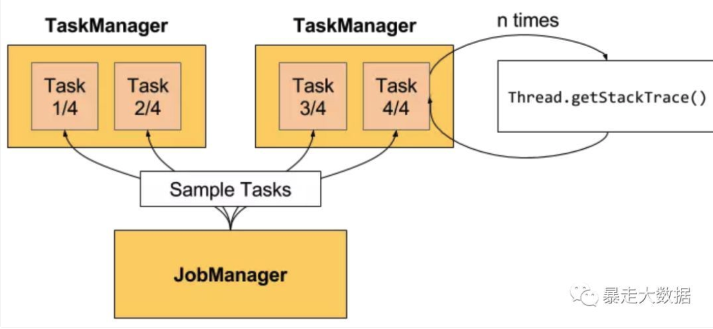
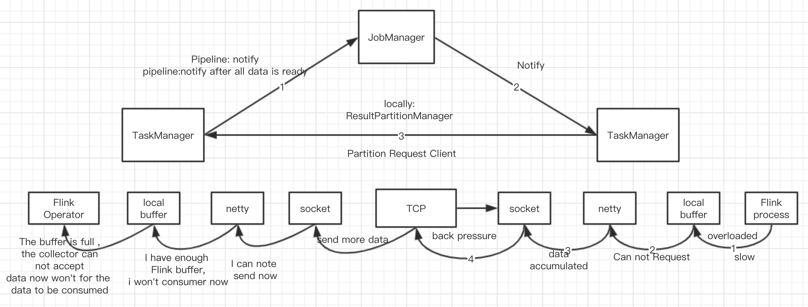

# Flink背压
## Flink Back Pressure（背压）是怎么实现的？有什么绝妙之处？
- 背压场景描述
- 背压实现
- 对比Spark Streaming

### 背压场景描述
看一个简单的例子。假设数据流 pipeline（抽象为 Source，Streaming job 和 Sink）在稳定状态下以每秒500万个元素的速度处理数据，如下所示正常情况（一个黑色条代表100万个元素，下图表示系统1秒内的快照）：

如果 Source 发送数据的速度在某个时刻达到了峰值，每秒生成的数据达到了双倍，下游的处理能力不变：

消息处理速度 < 消息的发送速度，消息拥堵，系统运行不畅。如何处理这种情况？

#### 什么是Back Pressure
在Flink Job 生成数据的速度比下游算子消费的速度快，在WebUI将看到任务的背压警告(如High级别)

以一个简单的 Source -> Sink 作业为例。如果能看到 Source 有警告，这意味着 Sink 消耗数据的速度比 Source 生成速度慢。Sink 正在向 Source 施加反压。
#### 导致Back Pressure的原因？
1. GC Stop the world导致传入数据堆积
2. 数据源在发送数据的速度上达到峰值

#### 如果没有正确处理背压？
可能导致资源耗尽，甚至在最坏的情况下丢失数据。

#### 如何处理背压
1. 可以去掉这些数据，但是对于许多流式引用程序来说，数据丢失是不可接收的。
2. 将拥堵的消息缓存起来，并告知消息发送者减缓消息发送的速度。消息缓存应该是持久的，因为在发生故障的情况。需要重放这些数据以房子数据丢失。

### 背压实现
#### 采样线程
背压监测是通过反复获取正在运行的任务的堆栈跟踪的样本来工作，JobManager对作业重复调用Thread.getStackTrace();

如果采样（samples）显示任务线程卡在某个内部方法调用中，则表示该任务存在背压。
默认情况下，JobManager 每50ms为每个任务触发100个堆栈跟踪，来确定背压。在Web界面中看到的比率表示在内部方法调用中有多少堆栈跟踪被阻塞，例如，0.01表示该方法中只有1个被卡住。状态和比率的对照如下：
OK：0 <= Ratio <= 0.10
LOW：0.10 <Ratio <= 0.5
HIGH：0.5 <Ratio <= 1

为了不使堆栈跟踪样本对 TaskManager 负载过高，每60秒会刷新采样数据。
#### 配置
可以使用以下配置 JobManager 的采样数：

- web.backpressure.refresh-interval，统计数据被废弃重新刷新的时间（默认值：60000，1分钟）。
- web.backpressure.num-samples，用于确定背压的堆栈跟踪样本数（默认值：100）。
- web.backpressure.delay-between-samples，堆栈跟踪样本之间的延迟以确定背压（默认值：50，50ms）。

***

### 原理

上游的task生产数据后，会写在本地的缓存，然后通知JM自己的数据写好了，JM通知下游的Task去拉取数据，下游的Task然后去上游的Task拉取数据，形成链条。

但是在何时通知JM呢？这里有一个设置，比如pipeline还是blocking，pipeline意味着上游哪怕生产一个数数据，也会去通知，blocking则需要缓存的插槽存满了才会去通知，默认是pipeline。

虽然生产数据的是Task，但是一个TaskManager中的所有Task共享一个NetworkEnvironment，下游的Task利用ResultPartitionManager主动去上游Task拉数据，底层利用的是Netty和TCP实现网络链路的传输。

**一直都在说Flink的背压是一种自然的方式，为什么是自然的了？**
从上面的图中：下面的链路中可以看到，当下游的process逻辑比较慢，无法及时处理数据时，它自己的local buffer中的消息就不能及时被消费，进而导致netty无法把数据放入local buffer，进而netty也不会去socket上读取新到达的数据，进而在tcp机制中，tcp也不会从上游的socket去读取新的数据，上游的netty也是一样的逻辑，它无法发送数据，也不能从上游localbuffer中消费数据，所以上游的localbuffer可能就满了，上游的operator或者process在处理数据之后进行collect.out的时候申请不能缓存，导致上游的process被阻塞，这样，在这个链路上就是现实了背压

如果还有相应的上游，则会一直反压上去，一直影响到source，导致source也放慢从外部消息源读取消息的速度。一旦瓶颈解除，网络链路畅通，则背压也会自然而然的解除。

