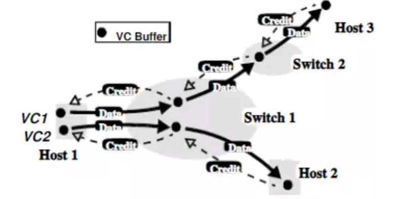

## Flink通信
Flink内部节点之间的通信是用Akka，比如JobManager和TaskManager之间的通信。而operator之间的数据传输是利用Netty.

Spark用netty通信框架代替了Akka，是不是Akka不好，其实他们各有优点。
Akka：它是基于协程的，性能不容置疑；基于scala的偏函数，易用性也没有话说，但是它毕竟只是RPC通信。
Netty：相比更加基础一点，可以为不同的应用层通信协议（RPC，FTP，HTTP等）提供支持

**实践是检验真理的唯一标准，目前尚未发现Flink使用akka遇到性能等问题。**

参考原理：
1.Akka介绍： https://blog.csdn.net/hxcaifly/article/details/84998240
2. Netty介绍： https://blog.csdn.net/hxcaifly/article/details/85336795
3. 协程和线程的区别： https://blog.csdn.net/jek123456/article/details/80449694

### 问题？
1. Flink提交运行程序涉及到哪些线程？
2. Flink slot是什么？
3. Job客户端是不是Flink内部部分，它的作用是什么？
4. Flink的通信机制是什么？
5. Actor系统包含哪些内容？

### Flink Credit Based 网络通信
随着网络规模和应用的快速增长，拥塞已经成为一个日益重要而突出的问题。尽管拥塞控制策略已经广泛应用，但是提高网络吞吐还是一个重要方向，本文介绍一种基于信用的流量控制方式（credit-based flow control）。

为了解决老的通信模型中，生成节点对消费节点的真实容量情况一无所知而导致数据积压的情况。Flink引入了Credit Based网络通信模型。简单的说，它的工作方式就是，在数据传输的过程中。消费节点主动告知生产节点其容量情况，也就是消费节点让生产节点发多少数据，生产节点才发多少数据。

#### 老的网络通信模型
##### 数据生产节点
- 数据写入端将数据写入到buffer中。
- 判断当前channel是否可写
- 判断buffer中是否有数据，有则通过该channel发送到消费端。

##### 数据消费节点
- 接收到数据包msg之后，首先向LocalBufferPool申请内存buffer.
- 申请buffer成功后将msg的内容拷贝到buffer,并释放msg。
- 如果申请内存失败，则监听LocalBufferPool中的内存情况（这样当有可用的内存时，会被通知到），并将channel的autoRead属性设置为false(导致发送端的channel变为不可写状态)，同时将当前的msg放到staged的集合中(staged集合用来存储哪些申请内存失败的msg)，当LocalBufferPool中的有可用的内存时会优先处理staged中的msg集合，staged中的msg处理完毕后才会将channel的autoRead属性设置为true;

##### 缺点
可以看见在老的网络模型中，数据生产节点只能通过检查当前的channel是否可写来决定自己是否要向消费端发送数据，它对下游数据消费端的真实容量一概不知，这就导致，当生成节点发现channel已经不可写的时候，有可能下游消费节点已经积压了很多数据(这些数据最终会被发在staged集合中)

#### Credit Based网络通信模型
为了解决老的通信模型中，生成节点对消费节点的真实容量情况一无所知而导致数据积压的情况。Flink引入了Credit Based网络通信模型。简单的说，它的工作方式就是，在数据传输的过程中。消费节点主动过告知生成节点它的容量情况，也就是消费节点让生产节点发多少数据，生产节点就发多少数据。

基于信用的流量的控制是实现逐链路中每个虚拟回路（virtual circuits）流量控制的有效方式，工作流程如下所示。

在通过连接发送数据之前，发送端需要接收接受端通过虚拟回路发送的信用值（credits），在不同时期，接收端发送信用额到发送端，说明接收端可用的缓冲区大小。当接收到信用额，发送端就按照信用额发送数据到接收端，每次发送端发送数据后，相应的信用额减少，这样可以有效减少失败重传造成网络阻塞。

##### 数据生产节点
- 数据写入端将数据写入到buffere中
- 判断当前的credit > 0，则将数据写出，并更新credit值。数据写出的时候会在msg上带上当前生产端的剩余数据量backlog
- 如果credit<=0 , 则不写

##### 数据消费节点
- 节点接收到msg包后，从msg包中拿出backlog值，根据该值判断是否需要从LocalBufferPool中申请新的内存块用于接收数据。
- 如果backlog >= 消费端当前缓存的buffer数，则像LocalBufferPool中申请新的内存块。然后再将申请到的内存块作为credit值的增量通过credit消息发送到数据生产端。
- 接着msg被接着处理，从消费端缓存的内存块中取出内存块buffer,并将msg拷贝到buffer中，释放msg。

以上便是Credit Based网络模型的大致过程，为了把主要的流程说清楚省略了很多的细节，包括Credit信息的同步、LocalBufferPool的内存控制等。感兴趣的同学看下下面这些相关的源码，毕竟看代码还是更加清楚些：

>- Credit Based 数据发送端
CreditBasedPartitionRequestClientHandler.java
Credit Based 数据接收端
CreditBasedSequenceNumberingViewReader
非Credit Based数据接受端
PartitionRequestClientHandler.java
LocalBufferPool相关
LocalBufferPool.java

### Flink中接收端反压以及Credit机制（源码分析）
https://www.cnblogs.com/ljygz/p/11807064.html

### Flink中发送端反压以及Credit机制（源码分析）

