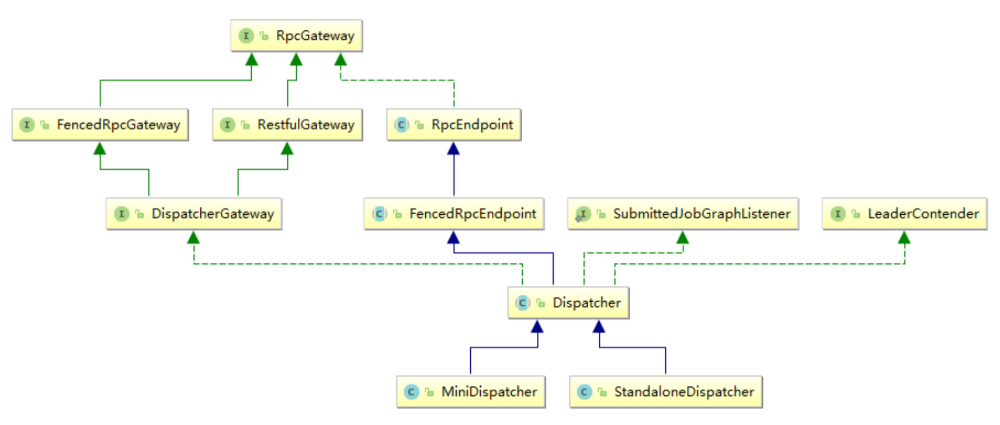
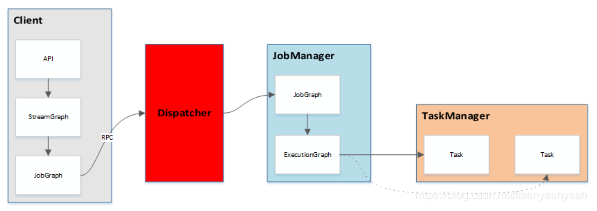

### StreamGraph、JobGraph及ExecutionGraph的关系
#### 概念：什么是Plan、Pipline、StreamGraph、JobGraph、ExcutionGraph？
##### pipeline
```java
/**
 * Common interface for Flink pipelines.
 */
@Internal
public interface Pipeline {}
```
##### plan
可以使用dataflow plan的形式表示Flink程序。dataflow是被data sinks引用,可以通过遍历data sinks获取data flow的所有已连接的运算符。
```java
/**
 * This class represents Flink programs, in the form of dataflow plans.
 *
 * <p>The dataflow is referenced by the data sinks, from which all connected
 * operators of the data flow can be reached via backwards traversal</p>.
 */
@Internal
public class Plan implements Visitable<Operator<?>>, Pipeline {}
```
##### streamGraph
streamgraph代表一个流的拓扑结构。
```java
/**
 * Class representing the streaming topology. It contains all the information
 * necessary to build the jobgraph for the execution.
 *
 */
@Internal
public class StreamGraph implements Pipeline {}
```

#### plan、pipeline与StreamGraph的关系？


#### miniCluster

```java
SocketWindowWord{}.env.execute()
-->StreamExecutionEnvironment{}.execute(jobName)
-- return execute(getStreamGraph(jobName));
-- -->LocalStreamEnvironment{}.execute()
-- -- return super.execute(streamGraph);
-- -- -->StreamExecutionEnvironment{}.execute(StreamGraph streamGraph)
-- -- -- final JobClient jobClient = executeAsync(streamGraph);
-- -- -- -->StreamExecutionEnvironment{}.executeAsync()
-- -- -- -- executorFactory.getExecutor(configuration).execute(streamGraph, configuration);
-- -- -- -- -->LocalExecutor{}.execute()
-- -- -- -- -- jobGraph = getJobGraph(pipeline, configuration);
-- -- -- -- -- miniCluster = startMiniCluster(jobGraph,configuration);
-- -- -- -- -- -->LocalExecutor.startMiniCluster()
-- -- -- -- -- -- miniCluster.start();
//启动集群，包括JobManager，进行Leader选举等等
-- -- -- -- -- -- -->miniCluster{}.start()
//1、创建RPC服务
-- -- -- -- -- -- -- commonRpcService = createRpcService(akkaRpcServiceConfig);
//2. 创建HA服务（线程池+zookeeper）
-- -- -- -- -- -- -- haServices=createHighAvailabilityServices(configuration, ioExecutor);
-- -- -- -- -- -- -- blobServer = new BlobServer(configuration, haServices.createBlobStore());
-- -- -- -- -- -- -- blobServer.start();
// 3.启动心跳服务
-- -- -- -- -- -- -- heartbeatServices = HeartbeatServices.fromConfiguration(configuration);
// 4.启动TaskManager
-- -- -- -- -- -- -- startTaskManagers();
// 5.资源分发服务启动
setupDispatcherResourceManagerComponents(configuration, dispatcherResourceManagreComponentRpcServiceFactory, metricQueryServiceRetriever);
// 6.领导者选举
-- -- -- -- -- -- -- resourceManagerLeaderRetriever

LocalExecutor{}.execute()
-- -- -- -- -- clusterClient=new MiniClusterClient(configuration, miniCluster);
//提交任务到JobMaster
-- -- -- -- -- jobIdFuture = clusterClient.submitJob(jobGraph);
-- -- -- -- -- -->MiniCluster{}.sumitJob()
//在这里，最终把job提交给jobMaster
-- -- -- -- -- -- dispatcherGateway.submitJob(jobGraph, rpcTimeout)
-- -- -- -- -- -- -->DispatcherGateway().submit()
```

在上面的逻辑中最终job通过Dispatcher发送给了JobMaster，这里JobMaster是一个接收job，然后指派JobMaster去启动任务的类，我们可以看看它的类结构，有两个实现。在本地环境下启动的是MiniDispatcher，在集群上提交任务时，集群上启动的是StandaloneDispatcher。具体的UML图如下：




### 3、Flink Job提交流程（Dispatch之后）
接下来主要介绍Dispatcher之后是如何将job提交并执行起来的，会先分析下Dispatcher这个类的作用，然后着重分析下ExecutionGraph的生成，最后介绍Dispatcher之后的整个提交流程。

#### 3.1、Dispatcher
Dispatcher服务提供REST接口来接收client的job提交，他负责启动JobManager和提交job，同时运行WebUI。Dipatcher的作用可在下图中提现：


Dipatcher是在ApplicationMaster起来以后创建的，ApplicationMaster的主类为YarnJobClusterEntrypont(per-job模式)或YarnSessionClusterEntrypoint（session模式）最后通过DefaultDispatcherResourceManagerComponentFactory的create方法来创建并启动

```java
//DefaultDispatcherResourceManagerComponentFactory.java
    @Override
    public DispatcherResourceManagerComponent create(
            Configuration configuration, ...) {
    LeaderRetrievalService dispatcherLeaderRetrievalService = null;
    LeaderRetrievalService resourceManagerRetrievalService = null;
    WebMonitorEndpoint<?> webMonitorEndpoint = null;
    ResourceManager<?> resourceManager = null;
    ResourceManagerMetricGroup resourceManagerMetricGroup = null;
    DispatcherRunner dispatcherRunner = null;

    //创建webMonitorEndpoint并启动
    //创建resourceManager并启动

    //创建dispatcher并启动
    //Per-Job模式创建MiniDispatcher，Session模式创建StandaloneDispatcher
    log.debug("Starting Dispatcher.");
    dispatcherRunner = dispatcherRunnerFactory.createDispatcherRunner(
        highAvailabilityServices.getDispatcherLeaderElectionService(),
        fatalErrorHandler,
        new HaServicesJobGraphStoreFactory(highAvailabilityServices),
        ioExecutor,
        rpcService,
        partialDispatcherServices);
}
```
```java

```

YarnSessionClusterEntrypoint可以理解为Flink在Yarn上的ApplicationMaster,同时也是JobMaster。他们分属两个线程，之间的交互通过Akka的消息驱动的模式来实现任务调度与资源分配的分离，而对应的JobManager与ResourceManager也有相应的子模块组成。


### 如何生成StreamGraph
```json
{"nodes":
    [
        {"id":1,"type":"Source: Socket Stream","pact":"Data Source","contents":"Source: Socket Stream","parallelism":1},
        {"id":2,"type":"Flat Map","pact":"Operator","contents":"Flat Map","parallelism":1,"predecessors":
            [{"id":1,"ship_strategy":"FORWARD","side":"second"}]
        },
        {"id":4,"type":"TriggerWindow(SlidingProcessingTimeWindows(5000, 1000), ReducingStateDescriptor{serializer=org.apache.flink.api.java.typeutils.runtime.PojoSerializer@e982bfcb, reduceFunction=com.mogujie.function.test.flink.SocketWindowWordCount$1@272ed83b}, ProcessingTimeTrigger(), WindowedStream.reduce(WindowedStream.java:241))","pact":"Operator","contents":"TriggerWindow(SlidingProcessingTimeWindows(5000, 1000), ReducingStateDescriptor{serializer=org.apache.flink.api.java.typeutils.runtime.PojoSerializer@e982bfcb, reduceFunction=com.mogujie.function.test.flink.SocketWindowWordCount$1@272ed83b}, ProcessingTimeTrigger(), WindowedStream.reduce(WindowedStream.java:241))","parallelism":1,"predecessors":
            [{"id":2,"ship_strategy":"HASH","side":"second"}]
        },
        {"id":5,"type":"Sink: Unnamed","pact":"Data Sink","contents":"Sink: Unnamed","parallelism":1,"predecessors":
            [{"id":4,"ship_strategy":"FORWARD","side":"second"}]
        }
    ]
}

```
flink run -c com.pianpianboy.TestWordCount /Users/liaomengjie/workspace/myCode/5flink/Flink11/target/Flink11-1.0-SNAPSHOT.jar -hostname localhost -port 9090

### JobGraph的生成


