## YARN
- 1、简述mapReduce1工作机制
- 2、简述YARN(mapReduce2)工作机制
- 3、简述YARN在application master 向resource manager申请资源的过程
- 4、比较mapreduce1和YARN(mapreduce2)
- 5、简述YARN和Resource Manager总体结构
- 6、简述YARN中资源调度器(在resource manager中)
- 7、简述YARN中内存和CPU的资源管理(调度)和资源隔离机制。
- 8、简述YARN中的Container概念
- 9、YARN中的各个部分运行故障如何处理？（作业运行失败可能的原因）
- 10、YARN中常见问题已经解决方案
- 11、YARN中的Resource Manager的高可用实现（主备切换的底层实现）
- 12、YARN中ResourceManager的高可用当中"脑裂"问题的解决
- 13、实验
- 14、Flink的中yarn的架构图
- 15、Yarn和Zookeeper之间是什么关系？它们都是管理节点，那它们的应用场景有何区别？


### 1、简述MapReduce1工作机制
开始今天的分享之前先来说个小故事，小时候看三国，认为最潇洒的就是诸葛亮，所谓运筹帷幄决胜千里，所谓神机妙算足智多谋，但是诸葛亮是个事必躬亲的人，事无巨细，不懂得放权，活活给累死的，活活给累死的，活活给累死的，重要的事说 3 遍。结论是：管的宽，挂的快。

#### 1.1 Yarn产生的背景
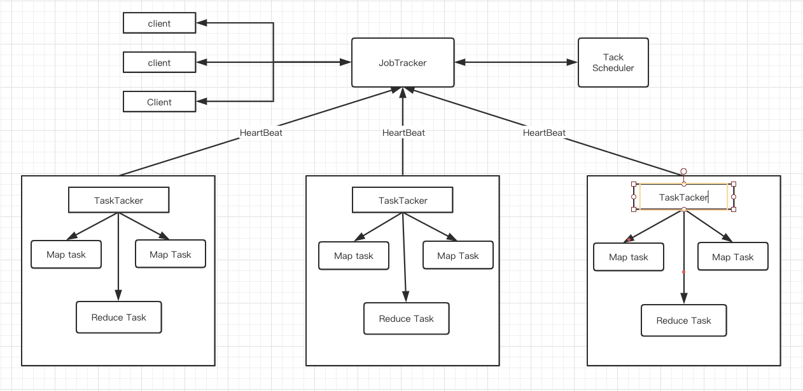

在没有YARN之前，MapReduce1架构图

如果所示：Master/Slave架构，1个JobTracker带多个TaskTracker，JobTracker是整个架构的核心，我们根据图来看下JobTracker到底做了什么事：

1. JobTracker接收客户端提交的Job
2. 根据Job提供的参数向NameNode请求获取这些文件数据存放的DataNode的列表地址，这意味着要和HDFS MetaData Server通讯；
3. JobTracker要确定job的执行计划：确定执行Job的Map Reduce的task数量，并分配到离数据块最近的节点上，JobTacker需要确定哪些机器是活的，资源还剩多少；另外根据它们和数据的分布情况作出分配策略。
4. JobTracker提交所有的task到每个TaskTracker结点，TaskTacker会定时的向JobTracker发送心跳，若一定时间没有收到心跳，JobTracker就默认这个TaskTracker结点挂了要做资源回收，并把这个结点上task重新分配到其他节点上。
5. 监听 task 的执行情况，执行完成，JobTracker 会更新 job 的状态为完成，若是一定数量的 task 执行失败，这个 job 就会被标记为失败;
6. JobTracker 将发送 job 的运行状态信息给 Client 端;

综合来说，JobTracker 既当爹又当妈，既要管理资源又要做任务调度，这不得活活把自己给累死。

#### 1.2 MapReduce1存在的问题：
- 单点故障
- 结点压力太大
- 不支持除了MapReduce之外的处理框架
- 资源利用率低（资源是提前预分配好的要么执行MapTask要么执行reduceTask）
- 运维成本

再来说说诸葛亮，他要是懂的简政放权，也不至于英年早逝，太悲催了。我们再来看看隋唐时期的三省六部制，皇帝逍遥快活还能把国力发展的很鼎盛，唐朝存活了289年。那是为什么呢？因为他们只负责统筹协调，具体事情有下面的每个机构来做。

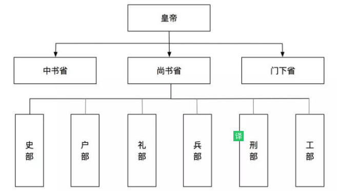

下一代MapReduce框架的基本设计思想就是将JobTracker的两个主要功能，即 **资源管理**和 **作业控制（包括作业监控，容错）**拆分成两个独立的进程，如下图所示资源管理进程与应用程序相关模块，其每个作业控制进程只负责管理一个作业。这样通过将原有的JobTracker中与应用程序相关和无关的模块分开，不仅减轻了JobTracker的负载，也使得Hadoop支持其他的计算框架。


### 2、简述YARN(mapReduce2)工作机制

#### 2.1、YARN基本架构
从资源管理角度看，下一代MapReduce框架实际上衍生出了一个资源统一管理平台YARN，YARN的基本思想就是将 **资源管理**和 **作业调度/监控** 的功能分解为单独的守护进程。这个包括2个部分：

- 一个是全局的资源调度ResourceManager（RM）
- 针对每个应用程序的ApplicationMaster(AM)

应用程序可以只是一个工作，也可以是一个DAG(有向无环图)工作。它使得Hadoop不再局限与仅支持MapReduce一种计算模型，而是可无限融入多种计算框架，且对这些框架进行统一管理和调度。

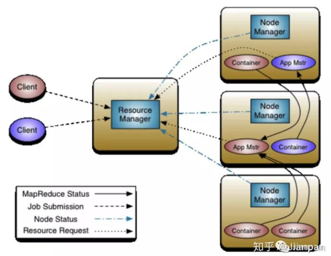

如图ResourceManager(RM)和NodeManager(NM)组成了整个数据计算框架，在整个系统中，所有应用程序所需的资源都由RM说了算，RM在这拥有至高无上的权利。NM是每台机器分配资源的代理人，NM负责监听资源的使用情况包括（CPU,内存，磁盘，网络），并实时向RM汇报。

每个应用程序的ApplicationMaster(AM)实际上是一个特别的框架，AM的任务是负责向RM申请所需资源，获取资源后跟NM一起合作执行并监督任务的完成情况。我们来分别详细的介绍一下各个模块的功能作用：

##### ResourceManager：
全局的资源管理者，负责集群的资源的统一管理和分配调度：

1. 处理客户端的请求
2. 启动监控ApplicationMaster
3. 监控Nodemanager
4. 资源分配调度

##### NodeManager:
整个集群中有多个，负责自己本身节点的资源管理使用：

1. 定时向RM 汇报本结点的资源情况
2. 单个结点上的资源任务管理
3. 执行NodeManager的命令：启动Container
4. 协助ApplicationMaster处理任务
5. 管理着抽象的资源容器，这些容器代表着一个应用程序针对每个节点上的资源

##### ApplicationMaster:
管理应用程序在yarn上的每个实例：

1. 每个应用程序对应的一个：MR、Spark,负责应用程序的管理
2. 为应用程序向RM申请资源（core、memory）,分配给内部task
3. 需要与NM通信：启动/停止task,task是运行在container里面，AM也是运行在container里面

##### Container:
YARN中的资源抽象，封装了该结点上的多维度资源：

1. 封装了CPU、Memory等资源的一个容器
2. 是一个任务运行环境的抽象，且该任务只能使用该container中描述的资源。


#### 1.5 Yarn的执行流程
1. 客户端向yarn提交作业，首先找RM分配资源；
2. RM接收到了作业以后，会与对应的NM建立通信；
3. RM要求NM创建一个Container来运行ApplicationMaster实例；
4. ApplicationMaster会向RM注册并申请所需的资源，这样Client就可以通过RM获知作业运行情况；
5. RM分配ApplicationMaster所需资源，ApplicationMaster对应的NM上启动Contianer；
6. Container启动后开始执行任务，ApplicationMaster监控各个任务的执行情况反馈给RM;
7. 其中ApplicationMaster是可插拔的，可以替换为不同的应用程序。

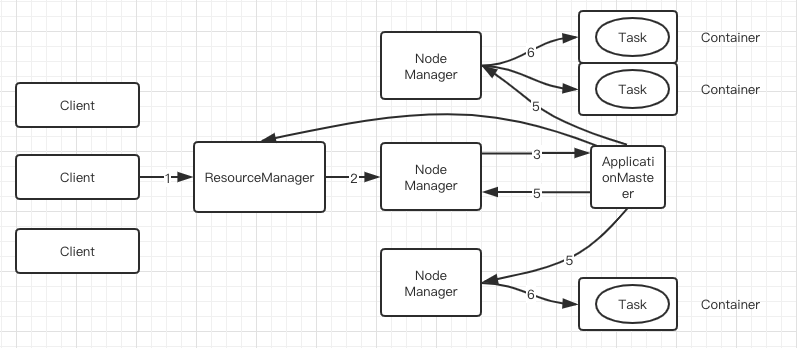

### 3、简述YARN在application master 向resource manager申请资源的过程
以Hadoop为例子：

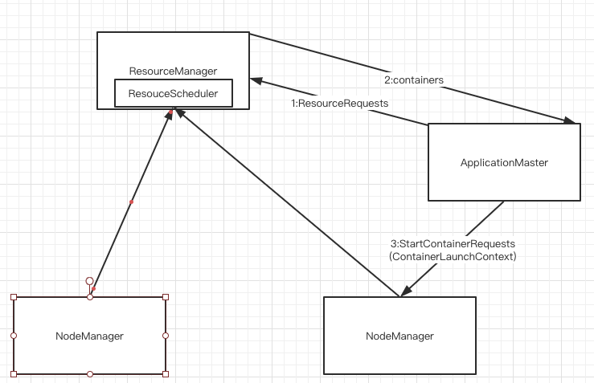

资源计算：

1、ApplicationMaster获得任务的切片信息后，创建相应数量的Map和Reduce任务，这些任务会被封装成resource Request列表，每个列表代表一个资源请求单元，resource Request在实现上就是一个可序列化反序列化的Java对象，包含些申请的资源信息：是否资源本地松弛，资源优先级，资源量等。

资源申请：

2、AppMaster向resource Manager(RM)申请资源，发送resourceRequest列表，ResourceManaager返回分配资源描述的container信息，这个container不是RM立即返回的，而是ApplicationMaster通过心跳自动去拉取的，container（java对象）中包含资源节点信息、资源量等，**每个container运行u一个任务。**

运行任务：

3、AppMaster获得container后将其与任务信息封装成startContainerRequest对象，每个startContainerRequest对象对应一个Ccontainer和任务，然后AppMaster发送给对象给NodeManager启动容器运行任务。

### 4、比较mapreduce1和YARN(mapreduce2)

#### 4.1、那么YARN框架相对于老的MapReduce框架有什么优势呢？
YARN作为一个资源管理系统，其最重要的两个功能是 **资源调度**和 **资源隔离**，通过RM实现资源调度，隔离则由各个NM实现。

资源调度是指的是RM可以将某个NM上的资源分配给任务，而资源隔离则是NM按照任务需要提供相应的资源，保证这些资源的独占性，为任务运行提供保证。具体来说就是老的框架中JobTracker很大的一个负担就是要监控job中task的运行情况，现在这部分有ApplicationMaster来完成。

补充一点：ResourceManager有两个主要组件：Scheduler和ApplicationsManager。ApplicationManager用来监控ApplicationMaster的运行情况，如果出现过问题会在其他机器上重启。

hadoop1.0 版本只支持 MapReduce 计算，而2.0多了 yarn 这个集群资源管理框架，这样的好处就是不同的计算框架（Spark/MapReduce/Storm/Flink）可以共享一个hdfs集群上的数据，享受整体的资源调度，按需分配，进而提高集群资源的利用率。这就好比yarn成为了 hadoop 的操作系统，只要你符合我的标准，就可以安装不同的软件。


### 6、简述YARN中的资源调度器（在Resource Manager中）
#### 6.1、YARN是对应用进行资源分配，那应用具体指的什么？

- (1) Mapreduce采用的模型是一个 **用户作业**对应一个应用。
- (2) Spark采用的是作业的每个工作流或每个用户的对话对应一个应用。效率比第一种高。

#### 6.2、FIFO调度器
先进先出队列，先为第一个应用请求资源，第一个满足后再依次为队列下一个提供服务。不适合共享集群。

#### 6.3、容器调度器(Capacity)
什么是Capacity调度器？

capacity调度器说的通俗一点，可以理解成一个个的资源对列。这个资源队列是用户自己去分配的。比如我大体上把整个集群分成了AB两个队列，A队列给A项目组的人来使用。B队列给B项目组来使用。但是A项目组下面又有两个方向，那么还可以继续分，比如专门做BI的和实时分析的。那么队列就可以参考下面的树形结构：
```java
root
------a[60%]
      |---a.bi[40%]
      |---a.realtime[60%]
------b[40%]
```

a队列占用整个资源的60%，b队列占用整个资源的40%，a队列里面又分为了两个子对列，一样也是2：3分配。

虽然有了这样的资源分配，但是并不是说a提交了任务，它就只能使用60%的资源，那40%就空闲着。只要资源实在空闲状态，那么a就可以使用100%的资源。但是一旦b提交了任务，a就需要在释放资源后，把资源还给b队列，直到ab平衡在3:2的比例。

粗粒度上资源是按照上面的方式进行，在每个队列的内部，还是按照FIFO的原则来分配资源的。

capacity调度器具有以下的几个特性：

- 层次化的队列设计，这种层次化的队列设计保证了子队列可以使用父队列设置的全部资源。这样通过层次化的管理，更容易合理分配和限制资源的使用。
- 容量保证，队列上都会设置一个资源的占比，这样可以保证每个队列都不会占用整个集群的资源。
安全，每个队列又严格的访问控制。用户只能向自己的队列里面提交任务，而且不能修改或者访问其他队列的任务。
- 弹性分配，空闲的资源可以被分配给任何队列。当多个队列出现争用的时候，则会按照比例进行平衡。
- 多租户租用，通过队列的容量限制，多个用户就可以共享同一个集群，同事保证每个队列分配到自己的容量，提高利用率。
- 操作性，yarn支持动态修改调整容量、权限等的分配，可以在运行时直接修改。还提供给管理员界面，来显示当前的队列状况。管理员可以在运行时，添加一个队列；但是不能删除一个队列。管理员还可以在运行时暂停某个队列，这样可以保证当前的队列在执行过程中，集群不会接收其他的任务。如果一个队列被设置成了stopped，那么就不能向他或者子队列上提交任务了。
- 基于资源的调度，协调不同资源需求的应用程序，比如内存、CPU、磁盘等等。

#### 6.4、公平调度器(Fair)
**强调多用户** 公平地使用资源，并且会动态调整应用程序的资源分配。比如：当一个大Job提交时，只有这一个job在运行时，此时这个应用将获得所有的集群资源；

当第二个job提交时，公平调度器会从第一个job资源中分配一半给第二个job，可能会存在延时，因为要等待第一个job的资源释放。

#### 6.5、调度器的选择
在Yarn中有三种调度器可以选择：FIFO Scheduler ，Capacity Scheduler，FairScheduler。

FIFO Scheduler把应用按提交的顺序排成一个队列，这是一个先进先出队列，在进行资源分配的时候，先给队列中最头上的应用进行分配资源，待最头上的应用需求满足后再给下一个分配，以此类推。

FIFO Scheduler是最简单也是最容易理解的调度器，也不需要任何配置，但它并不适用于共享集群。大的应用可能会占用所有集群资源，这就导致其它应用被阻塞。在共享集群中，更适合采用Capacity Scheduler或Fair Scheduler，这两个调度器都允许大任务和小任务在提交的同时获得一定的系统资源。

下面“Yarn调度器对比图”展示了这几个调度器的区别，从图中可以看出，在FIFO 调度器中，小任务会被大任务阻塞。

而对于Capacity调度器，有一个专门的队列用来运行小任务，但是为小任务专门设置一个队列会预先占用一定的集群资源，这就导致大任务的执行时间会落后于使用FIFO调度器时的时间。

在Fair调度器中，我们不需要预先占用一定的系统资源，Fair调度器会为所有运行的job动态的调整系统资源。如下图所示，当第一个大job提交时，只有这一个job在运行，此时它获得了所有集群资源；当第二个小任务提交后，Fair调度器会分配一半资源给这个小任务，让这两个任务公平的共享集群资源。

需要注意的是，在下图Fair调度器中，从第二个任务提交到获得资源会有一定的延迟，因为它需要等待第一个任务释放占用的Container。小任务执行完成之后也会释放自己占用的资源，大任务又获得了全部的系统资源。最终的效果就是Fair调度器即得到了高的资源利用率又能保证小任务及时完成。

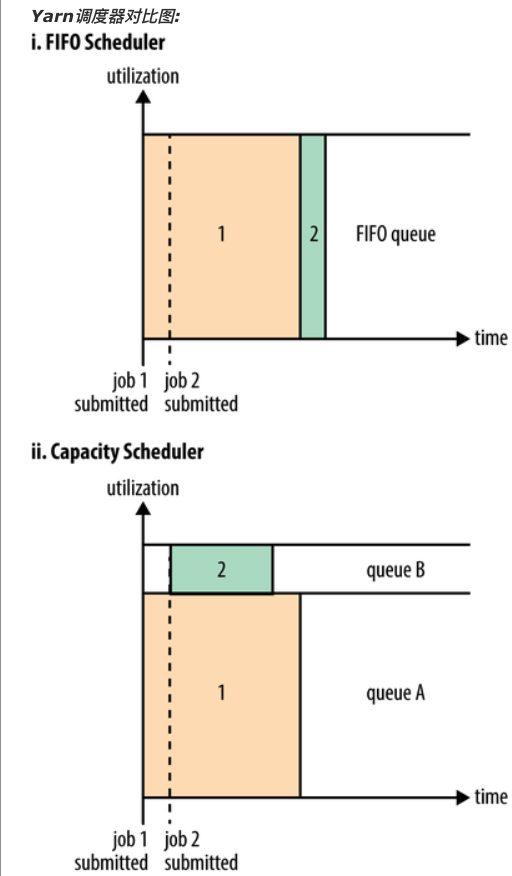

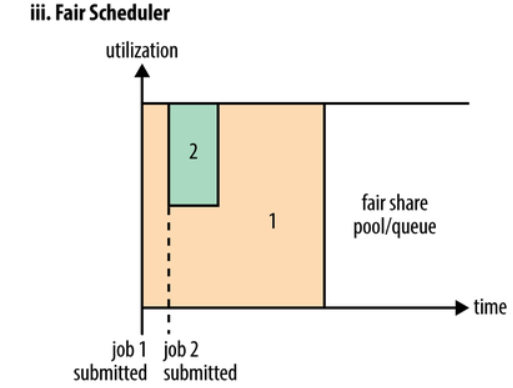

### 7、简述YARN中内存和CPU的资源管理器(调度)和资源隔离机制
#### 7.1、资源调度和资源隔离是YARN中最重要的两个功能。
ResourceManager负责资源调度分配，NodeManager负责资源供给和隔离。

资源调度就是ResourceManager为NodeManager上资源分配任务。

资源隔离就是NodeManager保证了资源的独占性，为任务提供了基础保障。

#### 7.2、资源管理实际上是事件处理器
根据6中外部事件，进行处理：

- **(1) NODE相关**
    + Node_Removed: 节点故障或移除，资源管理器收到该事件后从分配资源总量中移除相应的资源量。
    + Node_ADDED: 结点添加，资源管理器收到该事件后从分配资源重量中添加相应的资源量。
    + Node_Update: NodeManager会向ResourceManager进行心跳通信汇报各个container情况。如果有container得到释放，会发出资源管理器进行资源分配。

- **(2) Application相关**
    + Application_added、Application_removed 应用程序的创建和删除，ResourceManager通过特定的数据结构进行维护。

- **(3) Container_expirede**
    + ApplicationMaster容器过期(超时未使用)，会被重新分配。

#### 7.3、资源隔离机制
Hadoop Yarn的资源隔离是指为了运行着不同任务的"Container"提供可独立使用的计算资源，以避免它们之间相互干扰，目前支持两种类型的资源隔离：CPU和内存，对于这两种类型的资源，Yarn使用了不同的资源隔离方案。

对于CPU而言，它是一种"弹性"资源，使用量大小不会直接影响到应用程序的存亡，因此CPU的资源隔离方案才用了Linux Kernel提供的轻量级资源隔离技术Cgroup;对于内存而言，它是一种"限制性"资源，使用两大小直接决定着应用程序的存亡，Cgroup会严格限制应用程序的内存使用上限，一旦使用量超过预先定义的上限值，就会将应用程序"杀死"，因此无法使用Cgroup进行内存资源隔离，而是选择线程监控的方式。

需要解释一下：为什么应用程序的内存会超过预先定义的上限值？Java程序（Container）为什么需要内存资源隔离？

- **(1)、为什么应用程序的内存会超过预先定义的上限值**
这里的应用程序特指Yarn Container，它是Yarn NodeManager通过创建子进程的方式启动的；Java创建子进程时采用了“fork() + exec()”的方案，子进程启动瞬间，它的内存使用量与父进程是一致的，然后子进程的内存会恢复正常；也就是说，Container（子进程）的创建过程中可能会出现内存使用量超过预先定义的上限值的情况（取决于父进程，也就是NodeManager的内存使用量）；此时，如果使用Cgroup进行内存资源隔离，这个Container就可能会被“kill”。

- **(2)、为什么Java程序（container）需要内存资源隔离**
对于MapReduce而言，各个任务被运行在独立的Java虚拟机中，内存使用量可以通过“-Xms、-Xmx”进行设置，从而达到内存资源隔离的目的。然而，Yarn考虑到用户应用程序可能会创建子进程的情况，如Hadoop Pipes（或者Hadoop Streaming），编写的MapReduce应用程序中每个任务（Map Task、Reduce Task）至少 **由Java进程和C++进程** 两个进程组成，这难以通过创建单独的虚拟机达到资源隔离的效果，因此，即使是通过Java语言实现的Container仍需要使用内存资源隔离。

Yarn Container支持两种实现：DefaultContainerExecutor和LinuxContainerExecutor；其中DefaultContainerExecutor不支持CPU的资源隔离，LinuxContainerExecutor使用Cgroup的方式支持CPU的资源隔离，两者内存的资源隔离都是通过“线程监控”的方式实现的。


### 8、简述YARN中container概念
- (1)container是YARN资源的抽象，它封装了某个结点上的一定量的资源（CPU和内存），和Linux Container无关，仅仅是一个概念。（实现上，可以看成一个序列化的java对象）
- (2)container从运行的应用程序来看可以分为两类』
    + 由ResourceManager(向内部调度器)申请和启动container,来运行Appmaster
    + 由Appmaster向ResourceManager申请资源，并由Appmaster和nodeManager通信启动该container来执行各类任务。
- nodeManager 中的container来执行各类任务，需要提供内部执行的任务命令（比如Java等），以及该命令所需的环境变量和外部资源环境(jar包等)。


### 9、YARN中各部分运行故障如何处理？（作业运行失败可能的原因）
##### 9.1、任务运行失败 ，失败几种情况：
- (1)任务（例如map和reduce）中的用户代码抛出异常。
    + 任务JVM会向其父Application Master 发送错误报告，application master将此次任务标记为failed，并释放容器以便其他任务使用。
- (2)任务JVM突然退出
    + 可能由于JVM软件缺陷导致任务突然结束，结点管理器会检测到进程已经退出，并通知ApplicationMaster将此次任务标记为failed
- (3)任务被挂起
    + application master 一定事件内没有收到进度更新，便会将任务标记为failed,任务进程将被杀死。
    + application master如何处理？
        * application master被告知任务失败之后，会去重新调度该任务执行，如果任务尝试失败4次(这个值可以设定)，将不再重试。还可以设置允许任务失败的最大百分比，可以让作业输出一些也许有用的结果。

##### 9.2、application Master运行失败
applicationMaster会向resourceManager发送周期性心跳，当applicationMaster失败时，resourceManager进行回复尝试（默认2次，可设置）在另一个新的容器根据作业的历史来恢复applicationMaster，保证任务的运行状态，不必重新运行。

客户端和applicationMaster之间有通信，当ApplicationMaster失败之后，客户端会向resourceManager请求新的application Master地址。

##### 9.3、nodeManager运行失败
结点管理器如果失败，会停止向resourceManager发送心跳信息，resourceManager会将其从自己的节点池中移除，如果一个节点管理器失败了3次（可设置，可能是应用程序失败导致），将会被applicationMaster拉黑。

##### 9.4、ResourceManager运行失败（zookeeper和脑裂11和12）
可以使用zookeepeer实现resourceManager的高可用(HA)，避免出现resourceManager单点故障。resourceManager负责整个系统的资源和调度，内部维护了应用程序的ApplicationMaster信息、nodeManager信息、资源使用信息等，这些信息可以动态重构，所以与HDFS类似，resourceManager单点故障也是由 **主备切换**完成，但与HDFS不同的是，resourceManager时先切换，再从共享存储系统读取信息进行动态重构。

### 10、YARN中常见问题以及解决方案
- (1) 各个节点负载不均衡（有的节点忙，有的节点不忙），怎样进行各个节点的负载均衡？
    + 问题发生的原因是：一个心跳会尽可能多的分配任务，这样，优先发送心跳过来的节点将会把任务领光。但是，一般情况不会发生，因为任务的数量一定会比节点数目多，多疑节点都是忙碌的。

- (2) 某个节点上任务数目太多，资源利用率太高，怎么控制一个节点上的任务数目？
    + 一个几点运行的任务数目是由两个因素决定的：一是节点可使用的资源总量；二是每个任务所需要的资源。所以通过yarn-site.xml配置节点的资源重量。
- (3) 用户给任务设置的内存量为1000MB，为何最终分配的内存却是1024MB?
    + YARN内置了 **资源规整化算法**。规定了最小可申请的资源量，最大可申请的资源量和资源规整化因子。
    + 1）欲申请资源<=最小申请资源量，则欲申请资源量=最小申请资源量；
    + 2）最小申请资源量<=欲申请资源<=最小申请资源量,若欲申请资源量不是规整化因子的整数倍，则欲申请资源量为ceil(a/b)*b*，其中ceil向上取整数，a为欲申请资源量，b为规整化因子。
    + 欲申请资源>最小申请资源量，则会抛出异常，无法申请。
        * FIFO和Capacity Scheduler，规整化因子等于最小可申请资源量，不可单独配置。
        * Fair Scheduler：规整化因子默认为1024和1,可以通过参数设置。

### 11、Yarn中ResourceManager的可用实现(主备切换的底层实现)
利用zookeeper实现多个RM之间的主备切换，ActiveStandbyElector负责RM和zookeeper之间的的通信和交互。

主备切换底层实现：

- 1、创建锁节点
    + 所有RM启动时，会向Zookeeper竞争创建一个临时子节点(锁节点)，
    + Zookeeper会保护最终只有一个RM可以创建成功，成功的RM则为Active，其他为standby.
- 2、注册Watcher监听
    + 所有的standby的RM会向该锁节点注册Watcher的事件监听，获得子节点变更的事件通知。
- 3、主备切换
    + 当Active状态的RM出现故障时，Zookeeper上的锁节点，因为时临时的，所以为被删除掉，其他的Standby的RM会接受到事件通知，开始重新竞争创建锁节点，更改状态

### 12、YARN中Resource Manager的高可用当中"脑裂"问题的解决。
或者问：Zookeeper在yarn框架中如何实现避免脑裂的？

在yarn框架的ResourceManager中利用Zookeeper节点的ACL权限信息实现。

假设yarn集群中有两个resourceManager：不同的resourceManager之间通过竞争创建锁节点实现准备状态的确定。假设当前有两个resourceManager: m1和m2。当前m1为active，若此时其为假死，Zookeeper将会把m1的锁结点删除。m2会成为active（m2 对锁结点进行了Watcher），并创建自己的锁结点。在创建锁结点时必须携带自己的ACL信息。当m1恢复之后，发现当前锁结点不是自己创建的锁结点，将自动转化为standby状态。

### 14、Flink中yarn的架构图

#### 14.1、Flink的Standalone模式
图中Flink运行时相关组件

- **Client**: 任务提交，生成JobGraph
- **JobManager**: 调度Job，协调Task，通信，资源申请等
- **TaskManager**: 具体任务的执行，请求资源

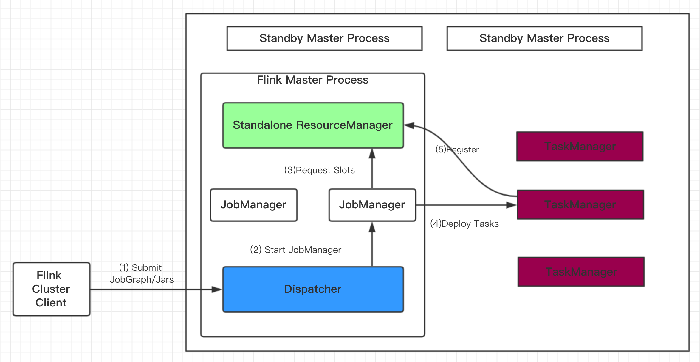

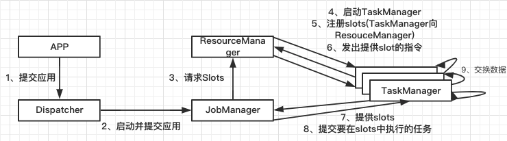

- App程序通过rest接口提交给Dispatcher（rest接口是跨平台，并且可以直接穿过防火墙，不需要考虑拦截）
- Dispatcher把JobManager进程启动，把应用交给JobManager
- JobManager拿到应用后，向ResourceManager申请资源(Slots)，ResourceManager会启动对应的TaskManager进程，TaskManager空闲的slots会向ResourceManager注册（就是图中5步骤）
- ResourceManager会根据JobManager申请的资源数量，向TaskManager发出指令（这些slots由你提供给JobManager）
- 接着，TaskManager可以直接和JobManager通信了（它们之间会有心跳包的连接），TaskManager向JobManager提供slots，JobManager向TaskManager分配在slots中执行的任务。
- 最后，在执行任务过程中，不同的TaskManager会有数据之间的交换。

#### 14.2、Flink的yarn模式
##### yarn架构原理-组件
- **ResourceManager(RM)**
    + 处理客户端请求、启动、监控App Master、监控NodeManager，资源的分配与调度
    + 包含Scheduler和ApplicationManager两个部分
- **ApplicationMaster（AM）**
    + 运行在Slave的Container容器中（第一个申请分配的容器），负责数据切分，申请资源和分配，任务监控和容错
    + 非常重要的组件，要运行Flink应用需要实现一个自己的AM
- **NodeManager(NM)**
    + 运行在Slave上，单节点资源管理，与AM/RM通信，汇报状态
- **Container**
    + 资源抽象，包括内存、CPU、磁盘、网络等资源

##### Yarn的架构原理-交互

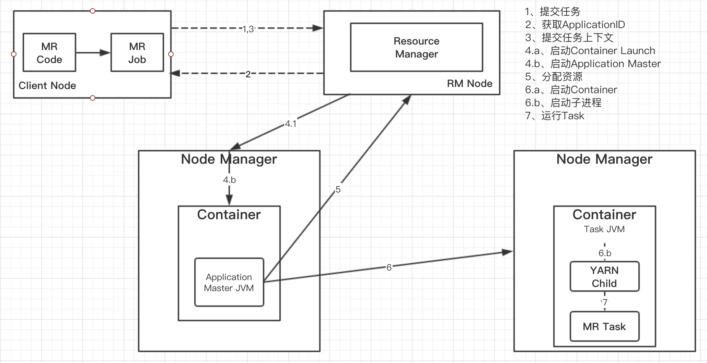

##### Flink on Yarn -Per Job

- 提交App之前，先上传Flink的Jar包和配置到HDFS，以便JobManager和TaskManager共享HDFS的数据。
- 客户端向ResourceManager提交job，ResourceManager接收到请求后，先分配container资源，然后通知NodeManager启动ApplicationMaster
- ApplicationMaster会加载HDFS的配置，启动对应的JobManager，然后JobManager会分析当前的作业图，将它转化为执行图（包含了梭鱼欧可以并发执行的任务），从而知道当前需要的具体资源。
- 接着，JobManager会向ResourceManager申请资源，ResourceManager接受到请求后，继续分配container资源，然后通知ApplicationMaster启动更多的TaskManager(先分配好container资源，再启动TaskManager)。container在启动TaskManager时也会从HDFS加载数据。
- 最后，TaskManager启动后，会向JobManager发送心跳包，JobManager向TaskMnaager分配任务。

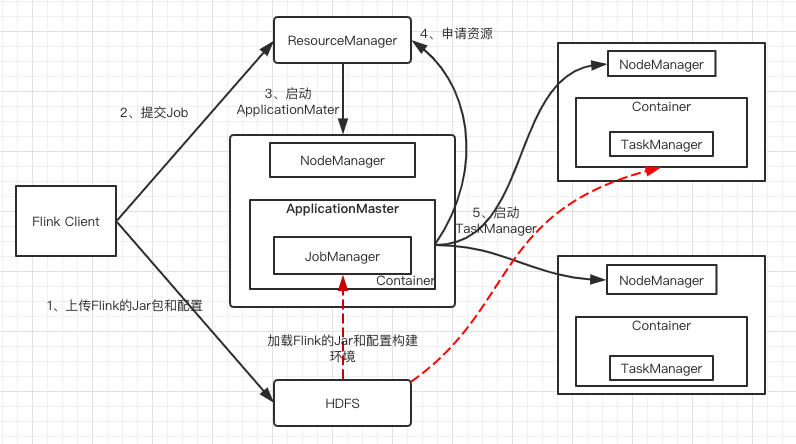

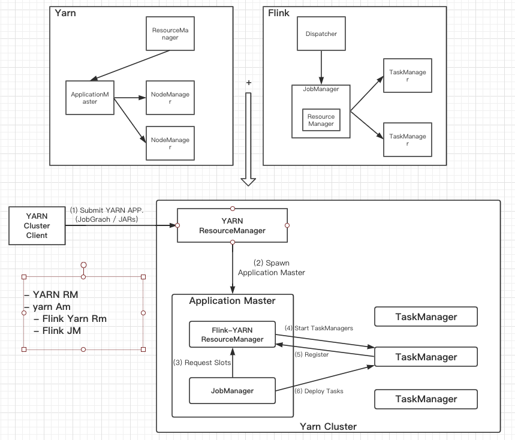

##### Flink on yarn -session

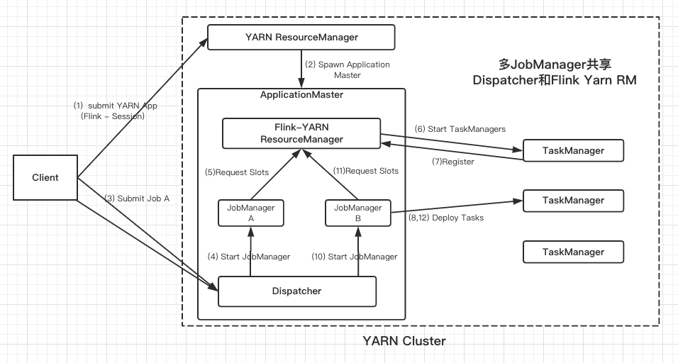

##### Flink and YARN 任务提交流程

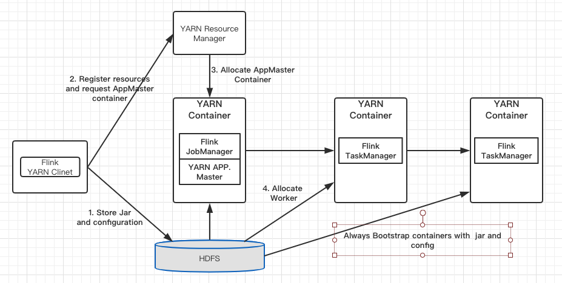

YARN客户端需要访问Hadoop配置来连接YARN资源管理器和HDFS。它使用下面的策略来确定Hadoop的配置

- YARN_CONF_DIR，HADOOP_CONF_DIR，HADOOP_CONF_PATH.其中一个变量被设置，就能读取配置
- 如果上面的策略失败（在正确的yarn 设置中不应该出来这种情况），客户端使用HADOOP_HOME环境变量。如果设置了，那么客户端就会尝试访问$HADOOP_HOME/tect/hadoop

具体流程：

- 当启动一个新的Flink YARN session时，客户端首先检查资源(container和memory)是否可用。然后上传一个包含Flink和配置的jar包到HDFS上。
- 客户端YARN container启动ApplicationMaster 由于客户端将配置和jar文件注册到容器，在特定机器上运行的YARN的NodeManager将负责准备container(下载文件)。一旦完成，ApplicationMaster就被启动了。JobManager和ApplicationMaster运行在同一个container上。一旦它们被成功启动，AM就知道了JobManager的地址（AM它自己所在的机器）。它就会成为TaskManager生成一个新的Flink配置文件（它们就可以连接到JobManager）。这个配置文件也被上传到HDFS上。此外，AM容器也提供了Flink的web服务接口。
- YARN所分配的所有端口都是临时端口，这允许用户并行执行多个Flink session。
最后，AM开始为Flink的任务TaskManager分配container，它将从HDFS加载jar文件和修改的配置文件。一旦这些步骤完成，Flink就准备好接口Job的提交了

##### 问题：Flink on Yarn: 一个yarn 的 nodeManger上可能会有多个TaskManager吗？
ink集群的多个taskmager有没有可能是在同一个Nodemanager的多个container里面启动的？ 还是说必须是在不同的Nodemanager上的container上启动的？

一个NodeManager上是可以有多个TaskManager的。每个container都会有一个


因为tmp目录下没有权限查看只能通过hadoop命令
hadoop fs -ls -R /tmp

客户端在提交job运行的时候 共享资源路径
/tmp/hadoop-yarn/staging/hadoop/.staging/job


### 15、Yarn和Zookeeper之间是什么关系？它们都是管理节点，那它们的应用场景有何区别？
分布式系统有很多问题 其中有两个

1. Coordination
2. Resource Management

Zookeeper偏重解决的是前者，Yarn偏重解决的是后者。

Zookeeper和Yarn是一起工作的，它们一起管理资源。

举例说明。在一个分布式系统上。现在有个事要办。我们要找这个系统办这个事，就要通知yarn。打个比方，yarn的master
node看看这个系统里有很多node，看看谁有空，谁有能力（cpu、内存、等）来干这个事。然后把任务分配给合适的node来办这个事。

这个时候系统面临一个危险。那就是在分布式系统中，failure成为常态。yarn
master node管理着很多个node，管理着它们哪一个出问题了。危险在于master自己坏了怎么办。

常见的分布式系统出问题的解决办法是我们总保持有一个待命的，到需要的时候顶上。yarn里的Resource
Manager也有待命的。当一个Resource Manager坏了，或者需要升级更新，另一个Resource Manager要接手。这时候麻烦来了，新的Resource Manager怎么知道哪个任务已经完成，哪个还没有，用户想执行的任务到什么状态了，一个任务所必须的先决条件任务是否已经完成。

这个情形中，Yarn自己成了Single point of failure。

新启动的ResourceManager成了这个分布式系统的另外一个大脑。两个大脑管理同一套资源，就可能有不一致的地方。

要解决这个问题，我们就要保存Yarn自身的各种状态，比如都收到了哪些任务，各个任务都执行到了什么状态，收到了哪些安全许可。这些东西保存在ResourceManager State Store里。

ResourceManager State Store自己怎么管理呢。好几种办法，存在内存，存在文件，或者另外一个更容易的办法就是Zookeeper了。

Zookeeper控制着什么时候，谁可以读写这个ResourceManager State Store。Zookeeper自己也是个cluster，它也是Fault
Tolerance（容错）的，我们就省去了自己管理这个资源的各种麻烦。 Zookeeper保存着它所管理的系统的各种状态，可以保证任何时候都只有一个版本的系统状态。即便是Yarn的Master坏了，重启了，正在升级，也不会出现冲突。

所以说起来，Yarn和Zookeeper的功能是不一样的，对于一套完整的系统，两者都需要使用。


