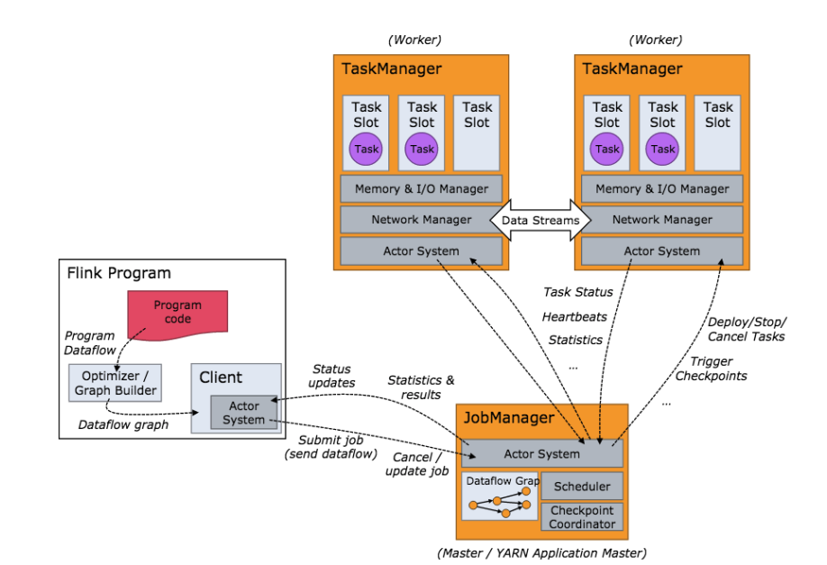
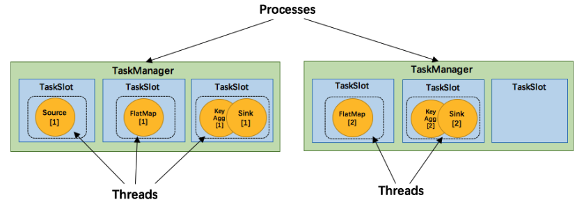
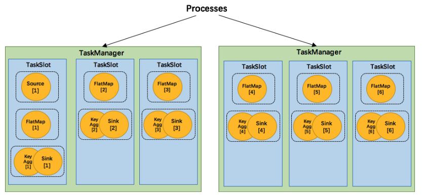

## 任务的调度与执行
关于Flink的任务执行架构，官网的两张图就是最好的说明：


Flink集群启动后，首先会启动一个JobManger和多个TaskManager。用户的代码会由JobClient提交给JobManager,JobManager再把来自不同用户的任务发给不同的TaskManager去执行，每个TaskManager管理着多个task,**task是执行计算的最小结构**，**TaskManager将心跳和统计信息汇报给JobManager**。

TaskManager之间以流的形式进行数据的传输。**上述除了task外的三者均为独立的JVM进程**。也就是JobClient、JobManager、TaskManager都是一个JVM进程。

要注意的是：TaskManager和job并非一一对应的关系。**flink调度的最小单元**是task而非TaskManager，也就是说，来自不同job的不同task可能运行于同一个TaskManager的不同线程上。

Flink调度的最小单元 与 Flink 资源的最小单元。

#### 计算资源的调度
Task Slot是一个TaskManager内资源分配的最小载体，代表了一个固定大小的资源子集，每个TaskManager会将其所占有的资源平分给它的slot。

通过调整task Slot的数量，用户可以定义task之间是如何相互隔离的。每个TaskManager有一个slot，也就意味着每个task运行在独立的JVM中，每个taskManager有多个slot的话，也就是说多个task运行在同一个JVM中。

而在同一个JVM进程中的task，可以共享TCP连接（基于多路复用）和心跳，可以减少数据的网络传输，也能共享一些数据结构，一定程度上减少每个task的消耗。

每个slot可以接收单个task，也可以接收多个连续task组成的pipeline，如下图所示，FlatMap函数占用一个taskslot，而keyAgg函数和sink函数共用一个taskSlot:



为了能达到共用slot的目的，除了可以以chain的方式pipeline算子，我们可以允许SlotSharingGroup,如下图所示：



我们可以把不能被chain成一条的连个操作如flatMap和keyBy sink放在一个TaskSlot里执行，这样做可以获得以下好处：

-

### JobManager执行job
JobManger负责接收Flink的作业，调度task，收集job的状态、管理taskManagers。被实现为一个akka actor。

#### JobManager组件
- BlobServer是一个用来管理二进制大文件的服务，比如保存用户上传jar文件，该服务会将其写到磁盘上。还有一些相关的类，如BlobCache，用于TaskManager向JobManager下载用户的jar文件。
- InstanceManager 用来管理当前存活的TaskManger的组件，记录了TaskManager的心跳信息。
- CompleteCheckpointStore，用来保存完成的checkpoint相关信息，持久化到内存中或者zookeeper上
- MemoryArchivist保存了已经提交到Flink的作业相关信息，如JobGraph等

#### JobManager的启动过程
先列出JobManager的启动核心代码

````java

```

###相关概念
- job
- jobManager
- task
- taskManager
- taskSlot