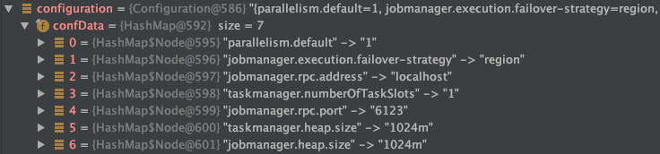
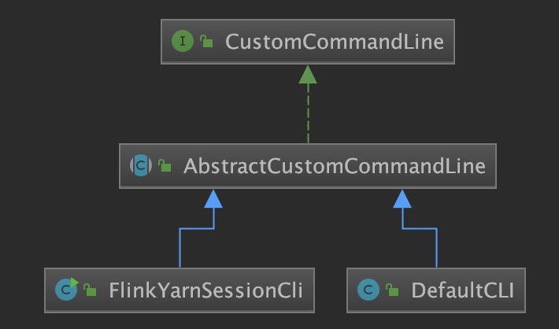

### Flink任务提交源码：入口类CliFrontend
- Flink基本组件和逻辑计划生成
- 核心组件介绍
- 客户端逻辑计划

### 核心组件介绍
#### 作业提交流程分析
单作业集群模式下，一个作业会启动一个JM，并依据用户的参数传递启动相应数量的TM，每个TM运行在yarn的一个container中；一个比较常见的flink on yarn的执行命令如下：
```java
./bin/flink run -m yarn-cluster -yn 2 -j flink-demo-1.0.0-with-dependencies.jar —ytm 1024 -yst 4 -yjm 1024 —yarnname flink_demo
```

查看执行脚本：
```java
/usr/local/Cellar/apache-flink/1.9.1/libexec/libexec vi flink
```
```java
exec $JAVA_RUN $JVM_ARGS "${log_setting[@]}" -classpath "`manglePathList "$CC_CLASSPATH:$INTERNAL_HADOOP_CLASSPATHS"`" org.apache.flink.client.cli.CliFrontend "$@"
```
flink在收到这样的一条命令之后会首先通过Cli获取flink的配置，并解析命令行参数，配置加载。

从上面的代码中可以看到ClientFrontend.java是flink提交作业的入口

入口类代码逻辑（从main()开始）：
```java
public static void main(final String[] args) {
    //打印基本的环境信息
    EnvironmentInformation.logEnvironmentInfo(LOG, "Command Line Client", args);
    // 1. find the configuration directory -- 获取配置文件目录： .../flink1.9.0/conf
    final String configurationDirectory = getConfigurationDirectoryFromEnv();
    // 2. load the global configuration -- 加载flink-conf.yaml中的全局配置转成Configuration对象
    final Configuration configuration = GlobalConfiguration.loadConfiguration(configurationDirectory);
    // 3. load the custom command lines -- 加载用户输入的命令行、获取命令行参数
    final List<CustomCommandLine<?>> customCommandLines = loadCustomCommandLines(
        configuration,
        configurationDirectory);

    try {
        //4. 生成一个CliFrontend对象
        final CliFrontend cli = new CliFrontend(
            configuration,
            customCommandLines);
        //6. 加载SecurityConfiguration类，是flink全局安全配置
        SecurityUtils.install(new SecurityConfiguration(cli.configuration));
        //7. 根据命令行参数进行配置，运行程序，获取程序执行的运行码
        //运行CliFronted的parseParameters方法，解析命令行参数，运行具体的action
        int retCode = SecurityUtils.getInstalledContext()
                .runSecured(() -> cli.parseParameters(args));
        //8. 获取执行返回值，关闭提交程序
        System.exit(retCode);
    }
}
```

##### Submits the job based on the arguments.
0. 打印基本的环境信息
1. find the configuration directory -- 获取配置文件目录： .../flink1.9.0/conf
2. load the global configuration --加载flink-conf.yaml中的全局配置转成Configuration对象
3. load the custom command lines -- 加载用户输入的命令行、获取命令行参数
4. 生成一个CliFrontend对象
6. 加载SecurityConfiguration类，是flink全局安全配置
7. 根据命令行参数进行配置，运行程序，获取程序执行的运行码
8. 获取执行返回值，关闭提交程序
主函数接收命令行传过来的参数，做了以下几个操作

#### 2、细节分析
#####2.1 打印基本环境信息
```java
/**
 * Logs information about the environment, like code revision, current user, Java version,
 * and JVM parameters.
 *
 * @param log The logger to log the information to.
 * @param componentName The component name to mention in the log.
 * @param commandLineArgs The arguments accompanying the starting the component.
 */
public static void logEnvironmentInfo(Logger log, String componentName, String[] commandLineArgs) {
    if (log.isInfoEnabled()) {
        // 得到代码git的最终提交id和日期
        RevisionInformation rev = getRevisionInformation();
        // 代码版本
        String version = getVersion();
        // JVM版本,利用JavaSDK自带的ManagementFactory类来获取。
        String jvmVersion = getJvmVersion();
        // JVM的启动参数，也是通过JavaSDK自带的ManagementFactory类来获取。
        String[] options = getJvmStartupOptionsArray();
        // JAVA_Home目录
        String javaHome = System.getenv("JAVA_HOME");
        // JVM的最大堆内存大小，单位Mb。
        long maxHeapMegabytes = getMaxJvmHeapMemory() >>> 20;

        // 打印基本信息
        log.info("--------------------------------------------------------------------------------");
        log.info(" Starting " + componentName + " (Version: " + version + ", "
                + "Rev:" + rev.commitId + ", " + "Date:" + rev.commitDate + ")");
        log.info(" OS current user: " + System.getProperty("user.name"));
        log.info(" Current Hadoop/Kerberos user: " + getHadoopUser());
        log.info(" JVM: " + jvmVersion);
        log.info(" Maximum heap size: " + maxHeapMegabytes + " MiBytes");
        log.info(" JAVA_HOME: " + (javaHome == null ? "(not set)" : javaHome));
        // hadoop的版本信息
        String hadoopVersionString = getHadoopVersionString();
        if (hadoopVersionString != null) {
            log.info(" Hadoop version: " + hadoopVersionString);
        } else {
            log.info(" No Hadoop Dependency available");
        }
        // 打印JVM运行 参数
        if (options.length == 0) {
            log.info(" JVM Options: (none)");
        }
        else {
            log.info(" JVM Options:");
            for (String s: options) {
                log.info("    " + s);
            }
        }
        // 任务程序启动参数
        if (commandLineArgs == null || commandLineArgs.length == 0) {
            log.info(" Program Arguments: (none)");
        }
        else {
            log.info(" Program Arguments:");
            for (String s: commandLineArgs) {
                log.info("    " + s);
            }
        }

        log.info(" Classpath: " + System.getProperty("java.class.path"));

        log.info("--------------------------------------------------------------------------------");
    }
}
```

##### 2.2、获取flink配置文件目录
Flink.sh的内容
```java
# Convert relative path to absolute path
bin=`dirname "$target"`

# get flink config
. "$bin"/config.sh

if [ "$FLINK_IDENT_STRING" = "" ]; then
        FLINK_IDENT_STRING="$USER"
fi

CC_CLASSPATH=`constructFlinkClassPath`

log=$FLINK_LOG_DIR/flink-$FLINK_IDENT_STRING-client-$HOSTNAME.log
log_setting=(-Dlog.file="$log" -Dlog4j.configuration=file:"$FLINK_CONF_DIR"/log4j-cli.properties -Dlogback.configurationFile=file:"$FLINK_CONF_DIR"/logback.xml)

# Add HADOOP_CLASSPATH to allow the usage of Hadoop file systems
exec $JAVA_RUN $JVM_ARGS "${log_setting[@]}" -classpath "`manglePathList "$CC_CLASSPATH:$INTERNAL_HADOOP_CLASSPATHS"`" org.apache.flink.client.cli.CliFrontend "$@"
```
调用getConfigurationDirectoryFromEnv方法，根据环境变量ENV_FLINK_CONF_DIR获取flink配置文件目录

```java
public static String getConfigurationDirectoryFromEnv() {
    //获取系统的环境变量ENV_FLINK_CONF_DIR,该目录是FLink的配置文件目录
    //在Flink提交脚本中会调用config.sh脚本，该脚本中会获取Flink的配置目录，并添加到系统环境变量中
    //这里获取到该目录后，判断该目录是否存在，如果存在则返回Flink配置文件目录路径。
    String location = System.getenv(ConfigConstants.ENV_FLINK_CONF_DIR);

    if (location != null) {
        if (new File(location).exists()) {
            return location;
        }
    }
}
```
##### 2.3、加载/解析flink-conf.yaml
```java
GlobalConfiguration.java
//调用GlobalConfiguration的loadConfiguration方法加载flink配置文件flink-conf.yaml中的配置，解析后转成Configuration对象
public static Configuration loadConfiguration(final String configDir) {
    return loadConfiguration(configDir, null);
}
```

```java
GlobalConfiguration.java
public static Configuration loadConfiguration(final String configDir, @Nullable final Configuration dynamicProperties) {
    final File confDirFile = new File(configDir);

    //1. 判断配置目录是否为空，不为空获取配置文件，就是Flink的配置文件flink-conf.yaml
    // get Flink yaml configuration file
    //FLINK_CONF_FILENAME = "flink-conf.yaml";
    final File yamlConfigFile = new File(confDirFile, FLINK_CONF_FILENAME);

    //2. 获取到文件后，调用loadYAMLResource方法，去解析yaml配置文件，并返回HashMap键值对形式的Configuraiont
    Configuration configuration = loadYAMLResource(yamlConfigFile);

    if (dynamicProperties != null) {
        configuration.addAll(dynamicProperties);
    }

    return enrichWithEnvironmentVariables(configuration);
}
```



##### 2.4、加载自定义命令行
调用loadCustomCommandLines方法，加载自定义命令行(包含yarn模式命令行和默认命令行两种)具体逻辑如下：
```java
public static List<CustomCommandLine<?>> loadCustomCommandLines(Configuration configuration, String configurationDirectory) {
    //1. 初始化一个容量为2的命令栏容器
    List<CustomCommandLine<?>> customCommandLines = new ArrayList<>(2);
    //2. YARN会话的命令行接口,所有选项参数都是以y/yarn前缀
    final String flinkYarnSessionCLI = "org.apache.flink.yarn.cli.FlinkYarnSessionCli";
    //3. 添加yarn模式命令行
    customCommandLines.add(
        loadCustomCommandLine(flinkYarnSessionCLI,
            configuration,
            configurationDirectory,
            "y",
            "yarn"));

    //4. 添加默认模式命令行
    customCommandLines.add(new DefaultCLI(configuration));
    return customCommandLines;
}
```

下面分别展开分析是怎么添加yarn模式命令行和默认模式命令行的，yarn模式命令客户端和默认普通模式客户端的类图关系如下：



DefaultCLI.java
```java
public class DefaultCLI extends AbstractCustomCommandLine<StandaloneClusterId> {}
```
FlinkYarnSessionCli.java
```java
public class FlinkYarnSessionCli extends AbstractCustomCommandLine<ApplicationId> {}
```
AbstractCustomCommandLine.java
```java
public abstract class AbstractCustomCommandLine<T> implements CustomCommandLine<T> {}
```
###### 添加yarn模式命令行
CliFrontend{}.main().loadCustomeCommandLines()->loadCustomeCommandLine()
```java
//通过反射构建命令行
private static CustomCommandLine<?> loadCustomCommandLine(String className, Object... params) {
    //1. 加载classpath里相关的类，这个加载的类实现了CustomCommandLine接口
    //org.apache.flink.yarn.cli.FlinkYarnSessionCli
    Class<? extends CustomCommandLine> customCliClass =
        Class.forName(className).asSubclass(CustomCommandLine.class);

    // 2. 从参数里构建出参数的Class类型
    // construct class types from the parameters
    Class<?>[] types = new Class<?>[params.length];
    for (int i = 0; i < params.length; i++) {
        Preconditions.checkNotNull(params[i], "Parameters for custom command-lines may not be null.");
        types[i] = params[i].getClass();
    }

    //3. 生成构造器org.apache.flink.yarn.cli$FlinkYarnSessionCli
    Constructor<? extends CustomCommandLine> constructor = customCliClass.getConstructor(types);

    //4. 构造器实例化，调用org.apache.flink.yarn.cli$FlinkYarnSessionCli的构造方法进行实例化
    return constructor.newInstance(params);
}
```
上述代码中最终会通过FlinkYarnSessionCli的构造器来实例化对象。
```java
//初始化一个FlinkYarnSessionCli
public FlinkYarnSessionCli(
        Configuration configuration, //全局的配置
        String configurationDirectory, //全局配置文件目录
        String shortPrefix,// 命令行参数的缩写前缀
        String longPrefix, // 命令行参数的展开前缀
        boolean acceptInteractiveInput) throws FlinkException {//acceptInteractiveInput为是否接收交互型输入
    //1. 初始化参数
    super(configuration);
    this.configurationDirectory = Preconditions.checkNotNull(configurationDirectory);
    this.acceptInteractiveInput = acceptInteractiveInput;
}
```

##### 2.5、初始化CliFrond对象
初始化CliFrontend对象
```java
public CliFrontend(
            Configuration configuration,
            List<CustomCommandLine<?>> customCommandLines) {
    //1. 初始化对象属性判断是否为空
    this.configuration = Preconditions.checkNotNull(configuration);
    this.customCommandLines = Preconditions.checkNotNull(customCommandLines);

    //3. 初始化文件系统
    FileSystem.initialize(configuration, PluginUtils.createPluginManagerFromRootFolder(configuration));

    this.customCommandLineOptions = new Options();

    //3. 给命令行对象添加选项
    for (CustomCommandLine<?> customCommandLine : customCommandLines) {
        customCommandLine.addGeneralOptions(customCommandLineOptions);
        customCommandLine.addRunOptions(customCommandLineOptions);
    }
    //4. 从全局配置里得到akka 客户端等待超时时间(akka.client.timeout)
    this.clientTimeout = AkkaUtils.getClientTimeout(this.configuration);
    //5.从全局配置里得到默认的系统并行度
    this.defaultParallelism = configuration.getInteger(CoreOptions.DEFAULT_PARALLELISM);
}
```
#####2.6 执行对应的action、回调，并返回状态
根据命令行参数进行Switch case 匹配，执行对应的action、回调，并返回状态码。
```java
CliFrontend{}.main(){
//运行CliFronted的parseParameters方法，解析命令行参数，运行具体的action
int retCode = SecurityUtils.getInstalledContext()
    .runSecured(() -> cli.parseParameters(args));//根据命令行参数进行Switch case匹配，执行对应的action,回调，并返回状态码
}
```
具体执行逻辑是cli.parseParameters(args)

```java
//分析命令行参数进行，并启动请求的操作
public int parseParameters(String[] args) {
    // check for action
    if (args.length < 1) {
        CliFrontendParser.printHelp(customCommandLines);
        System.out.println("Please specify an action.");
        return 1;
    }
    // get action 提取执行动作，比如run, list,cancel
    String action = args[0];
    // remove action from parameters 从参数中移出执行动作，空间换时间，线程安全
    final String[] params = Arrays.copyOfRange(args, 1, args.length);
    // do action
    switch (action) {
        case ACTION_RUN:
            run(params);
            return 0;
    }
}
```
上述的代码的作用就是去执行./flink run的逻辑。具体关于Job提交run()方法在下一篇中介绍。

##### 2.7 获取执行返回状态码，关闭程序
获取执行返回状态码，关闭提交程序


