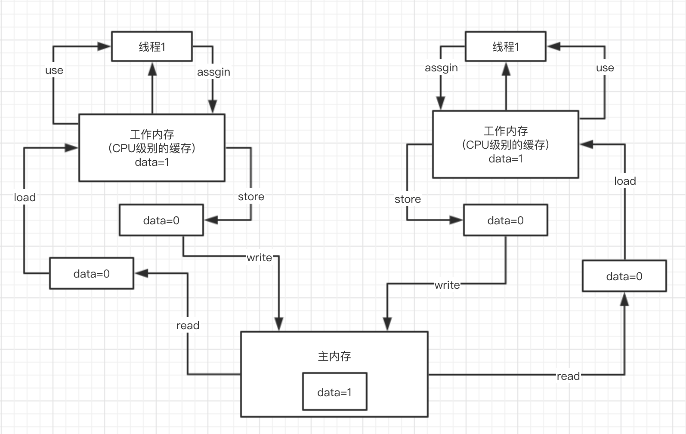

## JAVA内存模型相关（狸猫）
- 谈谈你对java内存模型的理解可以吗？
- 你知道Java内存模型中的原子性、有序性、可见性是什么吗？
- 能从Java底层角度聊聊volatile关键字的原理吗？
- 你知道指令重排已经happens-before原则是什么吗？
- volatile底层是如何基于内存屏障保证可见性和有序性的？

### 谈谈你对Java内存模型的理解可以吗？
例子
```java
public class HelloWorld{
    private int data =0;
    public void increment(){
        data++;
    }
}
HelloWorld helloWorld = new HelloWorld();//对象其实是在堆内存里，包含实例变量
//线程1
new Thread(){
    public void run(){
        helloWorld.increment();
    }
}.start();

//线程1
new Thread(){
    public void run(){
        helloWorld.increment();
    }
}.start();

```

java内存模型的 read load use assgin store write



### 你知道java内存模型中的原子性、有序性、可见性是什么吗？
面试中连环炮问题：Java内存模型-> 聊聊什么是原子性、什么是可见性、什么是有序性 -> 聊聊volatile关键字原理 -> 聊聊happens-before/内存屏障

原子性、可见性、有序性也就是在并发编程过程中，可能回产生的三类问题：
####（1）可见性
上面讲Java内存模型的时候，图中说的就是并发编程中可见性问题：

那么什么是可见性呢？下面说下什么是 **有可见性**，什么是 **没有可见性**，就可以说明白什么是可见性？
##### 没有可见性
- 主内存中有个data值=0，线程1是需要去写data，线程2是需要去读data的值。
- 线程1 和线程2 都会把主内存中的data的值0加载到自己的工作内存中。
- 正常情况下，线程1会把data改成1 然后assgin到自己的工作内存中，assgin完了之后store,最后write刷回到主内存中
- 虽然线程1将data的值刷回到主内存了，但是线程2会立马看到主内存中data的值么，不一定，在一定的时间范围内有可能线程2会继续执行Thread.sleep(100)
- 只有线程2所在的cpu嗅探到主内存的data值已经改变了，线程2才可能看到

以上过程就叫 **没有可见性**，线程1都已经修改了data的值，但是线程2却看不见

##### 有可见性（比如加volatile关键字后）
- 具备可见性就是：线程1更新data的值到主内存之后（assgin->store->write）,会将线程2的工作内存中缓存的data值失效（会将data这个值在其他线程的工作内存中缓存失效）。当工作内存中缓存的值失效后，**就会强制**要求线程2从主内存中读取data的值（即重新 read -> load  data的值到工作内存中）
- 然后线程2能看到最新的data值（线程2工作内存中的值为cpu中的值）

```java
new Thread(){
    public void run(){
        data++;
    }
}.start();
new Thread(){
    public void run(){
        while(data==0){
            Thread.sleep(100);
        }
    }
}.start();
```
####（2）原子性
原子性：data++,必须是独立执行的，没有人影响我的，一定是我自己执行成功之后，别人才能来执行下一个data++操作。

####（3）有序性
对于代码，同时还有一个问题是指令重排序，编译器和指令器，有的时候为了提高代码的执行效率，会将指令重排序，就比如下面的代码：
```java
flag = false;
//线程1
prepare();//准备资源
flag = true;

//线程2
while(!flag){
    Thread.sleep(1000);
}
execute();//基于准备好的资源执行操作
```
上述的代码在指令重排序之后，可能会出现让flag=true先执行了，会导致线程2直接跳过while等待，执行某段代码，结果prepare()方法还没有执行，资源还没有准备好，此时就会导致代码逻辑出现异常。

##### 具备有序性
具备有序性：不会发生指令重排序导致我们的代码异常；
##### 不具备有序性
不具备有序性：可能会发生一些指令重排，导致代码可能会出现一些问题。

### 能从Java底层角度聊聊volatile关键字的原理吗？
#####一般面试可能出现 问你 内存模型 -> 原子性、可见性、有序性 -> volatile关键字

#####也有可能直接问题：请说说volatile关键字？
这个时候 就需要主动从 **内存模型开始讲起**，接着 **将原子性、可见性、有序性的理解讲一讲**， **最后将volatile关键字的原理讲一讲**。因为要讲清楚volatile的原理，本身就需要讲清楚Java内存模型，java原子性、可见性、有序性。

volatile关键字是用来解决多线程场景下变量的可见性以及顺序性的。

**如何实现可见性呢？**如果在一个线程中修改了volatile修饰的变量的值，那么会让其他线程的工作内存中的变量值失效，在下一次需要用到该变量的时候，重新去主存中去加载最新的变量值。

**如何保证顺序性** happens-before规则->禁止指令重排


### 你知道指令重排以及happens-before原则是什么吗？
java中有一个Happens-before原则：规则制定了一些特殊情况，在这些情况下，不允许编译器、指令器对写的代码进行指令重排，必须保证代码的有序性。 如果没有满足上面的规则，那么就可能会出现指令重排。

happens-before可以理解为：前面一个操作的结果对后续操作是可见的。就像有心灵感应的两个人，虽然远隔千里，一个人心之所想，另一个人都能看得到。

编译器、指令器可能对代码进行重排序

- **程序次序规则中：**一个线程内，按照代码顺序，书写在前面的操作先行发生于书写在后面的操作
- **锁定规则：**一个unLock操作先行发生于后面对同一个锁的lock操作，比如说代码里面需先对一个lock.lock(),lock.unlock(),lock.lock()
- **Volatile变量规则：**对一个volatile变量的写操作先行发生于后面对这个volatile变量的读操作，volatile变量写，再是读，必须要保证是先写，再读
- **传递规则：**如果操作A先行发生于操作B，而操作B又先行发生于操作C，则可以得出操作A先行发生于操作C
- **线程启动规则：**Thread对象的start()方法先行发生于此线程的每个一个动作，thread.start()，thread.interrupt()
- **线程中断规则：**对线程interrupt()方法的调用先行发生于被中断线程的代码检测到中断事件的发生
- **线程终结规则：**线程中所有的操作都先行发生于线程的终止检测，我们可以通过Thread.join()方法结束、Thread.isAlive()的返回值手段检测到线程已经终止执行
- **对象终结规则：**一个对象的初始化完成先行发生于他的finalize()方法的开始

这8条原则是避免说出现乱七八糟扰乱秩序的指令重排，要求是这几个重要的场景下，比如是按照顺序来，但是8条规则之外，可以随意重排指令。
```java
volatile boolean flag = false;
//线程1
prepare();//准备资源
flag = true;

//线程2
while(!flag){
    Thread.sleep(1000);
}
execute();//基于准备好的资源执行操作
```
比如这个例子,如果用volatile来修饰flag变量，一定可以让prepare()指令在flag=true之前执行，这就禁止了指令重排。

因为volatile要求的是，volatile前面的代码一定不能指令重排到volatile变量操作后面，volatile后面的代码也不能指令重排到volatile前面。

指令重排序 -> happens-before -> volatile起到了避免指令重排序

### volatile底层是如何基于内存屏障保证可见性和有序性的？
连环炮：内存模型-> 原子性、可见性、有序性 -> volatile+可见性 -> volatile+有序性（指令重排+happens-before）-> volatile+原子性 -> volatile底层原理（内存屏障级别的原理）

volatile是不能保证原子性的，能够保证原子性的有：synchronized,lock,加锁

#### volatile底层原理，如何保证可见性？
##### lock指令：volatile保证可见性
对volatile修饰的变量，执行写操作的话，JVM会发送一条lock前缀指令给cpu，cpu在计算完之后，会立即将这个值写回主内存，同时因为有MESI缓存一致性协议，所以各个CPU都会对总线进行嗅探，自己本地缓存的数据是否被人修改。

如果发现其他线程修改了某个缓存数据，那么CPU就会将自己本地缓存的数据过期掉，然后讲这个CPU上执行的线程在读取的那个变量的时候，就会从主内存中重新加载最新的数据了。

**lock前缀指令+MESI缓存一致性协议**

#### volatile底层原理，如何实现保证有序性的呢？
##### 内存屏障：volatile禁止指令重排序
volatille是如何保证有序性的？加了volatile的变量，可以保证前后的一些代码不会被指令重排，这个是如何做到的呢？指令重排是怎么回事，volatile就不会指令重排，简单介绍一下，内存屏障机制是非常非常复杂的，如果要讲解的很深入
```java
Load1：
int localVar = this.variable
Load2：
int localVar = this.variable2
```
LoadLoad屏障：Load1；LoadLoad；Load2，确保Load1数据的装载先于Load2后所有装载指令，他的意思，Load1对应的代码和Load2对应的代码，是不能指令重排的
```java
Store1：
this.variable = 1
StoreStore屏障
Store2：
this.variable2 = 2
```
StoreStore屏障：Store1；StoreStore；Store2，确保Store1的数据一定刷回主存，对其他cpu可见，先于Store2以及后续指令

LoadStore屏障：Load1；LoadStore；Store2，确保Load1指令的数据装载，先于Store2以及后续指令

StoreLoad屏障：Store1；StoreLoad；Load2，确保Store1指令的数据一定刷回主存，对其他cpu可见，先于Load2以及后续指令的数据装载

#### volatile的作用是什么呢？
```java
volatile variable = 1
this.variable = 2 => store操作
int localVariable = this.variable => load操作
```
对于volatile修改变量的读写操作，都会加入内存屏障

每个volatile写操作前面，加StoreStore屏障，禁止上面的普通写和他重排；每个volatile写操作后面，加StoreLoad屏障，禁止跟下面的volatile读/写重排

每个volatile读操作后面，加LoadLoad屏障，禁止下面的普通读和voaltile读重排；每个volatile读操作后面，加LoadStore屏障，禁止下面的普通写和volatile读重排

并发这块，往深了讲，synchronized、volatile，底层都对应着一套复杂的cpu级别的硬件原理，大量的内存屏障的原理；lock API，concurrenthashmap，都是各种复杂的jdk级别的源码，技术深度是很深入的

