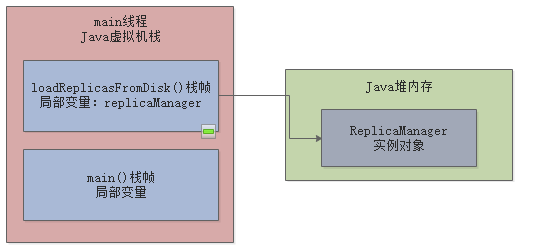

### JVM面试突击(shishan)
- 1、JVM中有哪几块内存区域？Java8之后对内存分代做了什么改进？
- 2、你知道JVM是如何运行起来的吗？我们的对象是如何分配的？
- 3、说说JVM在哪些情况下会触发垃圾回收？
    + 3.1、面试题目：什么情况下JVM内存中的一个对象会被垃圾回收？
    + 3.2、面试题目：解释一下什么是YoungGC和FullGC？
    + 3.3、面试题目：YoungGC和FullGC分别在什么情况下会发生？
    + 3.4、JVM运行原理和GC原理你真的搞懂了吗？
- 4、说说JVM的年轻代垃圾回收算法？对象什么时候转移到老年代？
- 5、说说老年代的垃圾回收算法？常用的垃圾回收器都有什么？
- 6、你们生产环境中的Tomcat是如何设置JVM参数的？如何检查JVM的运行情况？
- 7、你在实际项目中是否做过JVM GC优化，怎么做的？
- 8、你知道发生OOM之后，应该如何排查和处理线上系统的OOM问题？

### 1、JVM中有哪几块内存区域？Java8之后对内存分代做了什么改进？
堆内存（存放对象）、栈内存（线程栈）、元数据metaspace区（用来存放类）、直接内存、程序计数器。

在执行我们的一些对象的方法，执行代码的时候肯定会有很多的线程，tomcat里就有很多自己的工作线程，去执行我们写的代码，每个工作线程都会有自己的一块数据结构--栈内存，这个里面存放一些方法执行的信息比如局部变量。

java8以后的内存分代的改进，java8之前永久代里放了一些 **常量池+类信息**，java8之后讲 **常量池**移到了堆里面，***类信息***都存放都在metaspace（元数据区）

#### 什么是方法区、PermGen(永久代)、metaspace元数据区
- JDK6、JDK7 时，方法区 就是 PermGen（永久代）。
- JDK8 时，方法区就是 Metaspace（元空间）

由于方法区 主要存储类的相关信息，所以对于动态生成类的情况比较容易出现永久代的内存溢出。

### 2、你知道JVM是如何运行起来的吗？我们的对象是如何分配的？
在我们平时写的代码中，一定会有线程去执行我们写的代码，比如我们有一个类里面包含了一个main()方法，你去执行这个main()方法就会自动启动一个JVM进程，并默认就会有一个main线程，这个main线程就负责执行这个main方法的代码，进而创建各种对象。

在tomcat中，类都会加载到jvm里去，spring容器而言都会对我们的类进行实例化成bean，并会有tomcat的工作线程来执行我们的bean实例对象里面的方法和代码，进而也会创建其他的各种对象，实现业务逻辑。


执行完方法进行出栈


### 3、说说JVM在哪些情况下会触发垃圾回收？


#### 3.1、面试题目：什么情况下JVM内存中的一个对象会被垃圾回收？
##### 什么时候会触发垃圾回收？
平时我们系统运行创建的对象都是优先分配在新生代里的，如下图所示。


然后如果新生代里的对象越来越多，都快满了，此时会触发垃圾回收，把新生代没有人引用的对象给回收掉，释放内存空间。


##### 被哪些变量引用的对象是不能回收的？
首先第一个问题，一旦新生代块满了，那么垃圾回收的时候，**到底哪些对象能回收，哪些对象不能回收呢？**

**这个问题非常好解释，JVM中使用了一种可达性分析算法**，来判定哪些对象是可以被回收的，哪些对象是不可以被回收的。

这个算法的意思，就是说对每个对象，都分析一下都有谁在引用它，然后一层层往上去判断，看是否有一个GC Roots。

比如最常见的，就是下面的一种情况：
```java
public class kafka{
    public static void main(){
        loadReplicasFromDisk();
    }
    public static void loadReplicasFromDisk(){
        ReplicaManager replicaManager=new ReplicaManager();
    }
}
```
上面的代码其实就是一个方法中创建了一个对象，然后有一个局部变量引用了这个对象，这种情况是最常见的

此时如下图所示。"main()"方法的栈帧入栈，然后调用"loadReplicasFromDisk()"方法，栈帧入栈，接着让局部变量"replicaManager"引用堆内存里的"ReplicaManager"实例对象。



假设上图"ReplicaManager"对象被局部变量给引用了，那么此时一旦新生代块满了，发生垃圾回收，会去分析这个"ReplicaManager"对象的可达性。

这时，发现它时不能被回收的，因为它被人引用了，而且是被局部变量"replicaManager"引用的。

在JVM规范中，**局部变量就是可以作为GC Roots的**。

只要一个对象被局部变量引用了，那么就说明它有一个GC Roots,此时就不能被回收了。

另外一个比较常见的情况，其实就是类似下面的情况：
```java
public class Kafka{
    public static ReplicaManager replicaManager = new ReplicaManager();
}
```
对上面的代码进行分析，发现这个ReplicaManager对象被Kafka类的一个静态变量"replicaManager"高i引用了，其实在JVM规范中，**静态变量也可以看作是一种GCRoots**，此时只要一个对象被GC Roots引用了，就不会去回收它，上面代码的引用情况如下：


总结：被哪些变量引用的对象是不能回收的？——--只要对象被 **方法的局部变量，类的静态变量**引用了，就不会回收他。

##### java对象中的不同引用类型？
关于引用和垃圾回收的关系，这里必须在脑子里引入一个新的概念，那就是Java里有不同引用类型，分别是： **强引用、软引用、弱引用和虚引用**。

- 强引用: 就是最普通的代码，一个变量引用一个对象，**只要是强引用类型，那么垃圾回收的时候绝对不会去回收这个对象的**
```java
public class Kafak{
    public static ReplicaManager replicaManager = new ReplicaManager();
}
```
- 软引用：正常情况下垃圾回收时不会回收软引用对象的，但是如果进行垃圾回收后，发现内存空间还是不够存放新的对下你给，内存都快溢出来了，此时就会把这些软引用回收掉，哪怕它被变量引用了，但是因为是软引用，所以还是要回收的。
```java
public class Kafak{
    public static SoftReferency<ReplicaManager> replicaManager = new SoftReferency<ReplicaManager>(ReplicaManager());
}
```
- 弱引用: 这个其实很好理解，弱引用就跟没引用是类似的，如果发生垃圾回收，就会把这个对象回收掉
```java
public class Kafak{
    public static WeakReferency<ReplicaManager> replicaManager = new WeakReferency<ReplicaManager>(ReplicaManager());
}
```

- 虚引用: 基本很少使用
其实这里比较常用的，就是强引用和软引用，强引用就是代表绝对不能回收的对象，软引用就是说对象可有可无，如果内存实在不够了，可以回收它。


