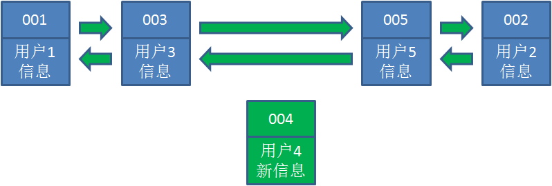
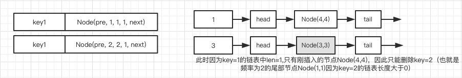

### LRU和LFU的实现
- 1、LRU的实现
    + 1.1、什么是哈希链表
    + 1.2、让我们以用户信息的需求为例，来演示一下LRU算法的基本思路：
    + 1.3、自己代码实现
    + 1.4、JAVA LinkedHashMap实现
    + 1.5、为什么要使用双向队列
    + 1.6、为什么要在cache中保存了Key还需要在Node的数据结构中使用Key，不用行不行
- 2、LFU的实现
    + 2.1 LFU的数据结构
    + 2.2、代码实现

### 1、LRU的实现
#### 1.1、什么是哈希链表
我们都知道，哈希表是由若干个Key-Value组成。在逻辑上，这些Key-Value是无所谓排列顺序的，谁先谁后都一样。


在哈希链表中，这些Key-value不再是彼此无关的存在，而是被一个链条串了起来，每一个Key-Value都具有它的前驱Key-Value、后继Key-Value，就像双向链表中的节点一样。

这样一来，**原本无序的哈希表拥有了固定的排列顺序。**

#### 1.2、让我们以用户信息的需求为例，来演示一下LRU算法的基本思路：
1. 假设我们使用哈希链表来缓存用户信息，目前缓存了4个用户，这4个用户是按照时间顺序依次从链表右端插入的。


2. 此时，业务方访问用户5，由于哈希链表中没有用户5的数据，我们从数据库中读取出来，插入到缓存当中。这时候，链表中最右端是最新访问到的用户5，最左端是最近最少访问的用户1。


3. 接下来，业务方访问用户2，哈希链表中存在用户2的数据，我们怎么做呢？我们把用户2从它的前驱节点和后继节点之间移除，重新插入到链表最右端。这时候，链表中最右端变成了最新访问到的用户2，最左端仍然是最近最少访问的用户1。


4. 接下来，业务方请求修改用户4的信息。同样道理，我们把用户4从原来的位置移动到链表最右侧，并把用户信息的值更新。这时候，链表中最右端是最新访问到的用户4，最左端仍然是最近最少访问的用户1。




5. 后来业务方换口味了，访问用户6，用户6在缓存里没有，需要插入到哈希链表。假设这时候缓存容量已经达到上限，必须先删除最近最少访问的数据，那么位于哈希链表最左端的用户1就会被删除掉，然后再把用户6插入到最右端。


以上，就是LRU算法的基本思路。

#### 1.3、自己代码实现
```java
class LRUCache {
    private int count;
    private int capacity;
    private Node head;
    private Node tail;
    HashMap<Integer,Node> map = new HashMap<Integer,Node>();

    public LRUCache(int capacity){
        this.capacity = capacity;
        this.count = 0;
        this.head = new Node(0,0);
        this.tail = new Node(0,0);

        head.next = tail;
        head.pre = null;
        tail.next = null;
        tail.pre = head;
    }

    public int get(int key){
        Node node = map.get(key);
        if(node==null)return -1;

        removeNode(node);
        addNodeToHead(node);
        return node.value;
    }

    public void put(int key,int value){
        Node node = map.get(key);
        //LRU中存在key这个值，则更新key，value，与get的逻辑很类似
        if(node!=null){
           node.value = value;
           removeNode(node);
           addNodeToHead(node);
        }else{//LRU不存在key这个值，
            Node newNode = new Node(key,value);
            //下面一步很容易遗忘
            addNodeToHead(newNode);
            map.put(key,newNode);
            count++;
            //如果容量超过了capacity需要从链表末尾移出node，同时需要从map中移出
            if(count>capacity) {
                int deleteKey= removeNode(tail.pre);
                //以下两步很重要，容易遗忘
                count--;
                map.remove(deleteKey);
            }
        }
    }


    public int removeNode(Node node){
        Node pre = node.pre;
        Node next = node.next;
        pre.next = next;
        next.pre = pre;
        return node.key;
    }

    public void addNodeToHead(Node node){
        Node  next = head.next;
        node.pre = head;
        head.next = node;
        node.next = next;
        next.pre = node;
    }


    public class Node{
        private Node pre;
        private Node next;
        private int key;
        private int value;
        public Node(int key,int value){
            this.key = key;
            this.value = value;
        }
    }
}
```

#### 1.4、JAVA LinkedHashMap实现
```java
class LRUCache {

    private int capacity;
    private LinkedHashMap<Integer,Integer> map;

    public LRUCache(int capacity) {
        this.capacity = capacity;
        this.map =  new LinkedHashMap<>();
    }


    public int get(int key) {
      if(map.containsKey(key)){
          int value = map.get(key);
          map.remove(key);
          map.put(key,value);
          return value;
      }else{
          return -1;
      }
    }

    public void put(int key, int value) {
       if(map.containsKey(key)){
           map.remove(key);
       }
       if(map.size() >= capacity){
           map.remove(map.keySet().iterator().next());
       }
      map.put(key,value);
    }
}
```

#### 1.5、为什么要使用双向队列
为了能够快速的删除链表中的一个元素，比如删除node这个节点，我们需要知道node的前一个节点和node的后一个节点，因此使用了双向链表

#### 1.6、为什么要在cache中保存了Key还需要在Node的数据结构中使用Key，不用行不行
因为在Map满了需要淘汰数据的时候（也就是删除map中的key node）的时候，需要node中的key去找到map中的值进行删除


### 2、LFU的实现
#### 2.1 LFU的数据结构
LFU的难点就在与要记录：首先要记录每个key被访问的次数，其次还要记录同访问次数的节点的先后顺序(使用链表--越靠近表头表示越新越靠近链尾表示越旧)。就是有相同的访问次数frequency，则删除比较旧的。

##### 要点：
- Save all key's frequency
- Tack the size of the all cache
- get(key)
    + key exist: frequency++;(from frequency DList to frequency++ DList)
    + not exist: return -1;
- put(key,value)
    + key exist:
        * modify node value
        * call get(key)
    + not exist:
        * add a new Node to the cache
        * compare size to capacity


#### 2.2、流程
1. cache.put(1, 1); cache.put(2, 2);


2. cache.get(1)


3. cache.put(3, 3);


4. cache.get(3);


5. cache.put(4, 4);


6. cache.get(3);



#### 2.2、代码实现
```java
class LFUCache {
    HashMap<Integer,Node> map;
    HashMap<Integer,DLList> freq;
    int count;
    int capacity;
    int maxFrequency;
    public LFUCache(int capacity){
        this.capacity = capacity;
        this.count = 0;
        this.maxFrequency = 0;
        map = new HashMap<>();
        freq = new HashMap<>();
    }


    public int get(int key) {
        Node node = map.get(key);
        if(node==null) return -1;

        int preCnt = node.cnt;
        DLList preDLList = freq.get(preCnt);
        preDLList.removeNode(node);

        int curCnt = preCnt+1;
        DLList curDLList = freq.getOrDefault(curCnt, new DLList());


        maxFrequency = Math.max(maxFrequency,curCnt);
        //此处必须是先cnt++在将node加入list
        node.cnt++;
        curDLList.addNode(node);

        freq.put(preCnt,preDLList);
        freq.put(curCnt,curDLList);
        return node.value;
    }

    public void put(int key, int value) {
        if(capacity==0) return ;
        Node node = map.get(key);
        if(node!=null){
            node.value =value;
            get(key);
            return;
        }

        Node newNode = new Node(key,value);
        DLList curDLList = freq.getOrDefault(1,new DLList());
        curDLList.addNode(newNode);
        count++;
        if(count>capacity){
            //删除末尾的节点
            if(curDLList.len>1){
                curDLList.removeTail();
            }else{
                for(int i=2;i<=maxFrequency;i++){
                    if(freq.get(i)!=null&&freq.get(i).len>0){
                        freq.get(i).removeTail();
                        break;
                    }
                }
            }
            count--;
        }

        //容易忘记将修改后的list放会HashMap freq
        freq.put(1,curDLList);
    }

    public class Node{
        private Node pre;
        private int key;
        private int value;
        private Node next;
        int cnt;

        public Node(int key,int value){
            this.cnt = 1;
            this.key = key;
            this.value = value;
        }
    }

    public class DLList{
        private Node head;
        private Node tail;
        int len;//当前链表的长度
        public DLList(){
            this.head = new Node(0,0);
            this.tail = new Node(0,0);
            this.len = 0;
            head.next = tail;
            tail.pre = head;
            head.pre = null;
            tail.next = null;
        }
        public void addNode(Node node){
            Node next = head.next;
            head.next = node;
            node.pre = head;
            node.next = next;
            next.pre = node;
            len++;
            map.put(node.key,node);
        }

        public void removeNode(Node node){
            Node pre = node.pre;
            Node next = node.next;
            pre.next = next;
            next.pre = pre;
            len--;
            map.remove(node.key);
        }
        public void removeTail(){
            Node node = tail.pre;
            removeNode(node);
        }
    }
}
```

