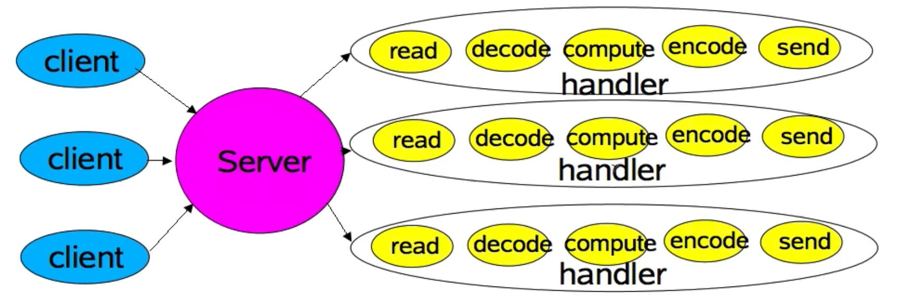
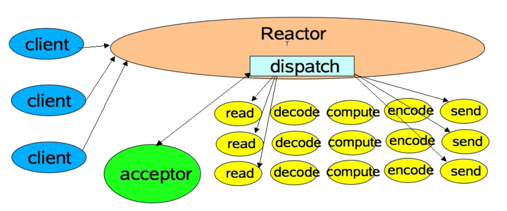
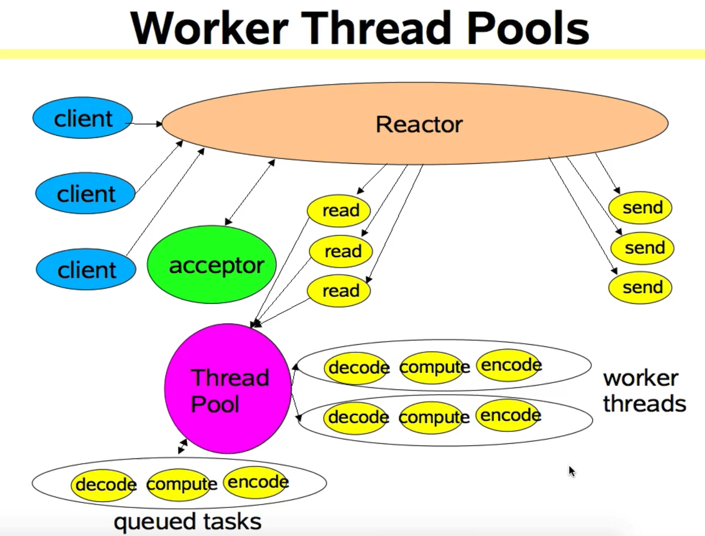
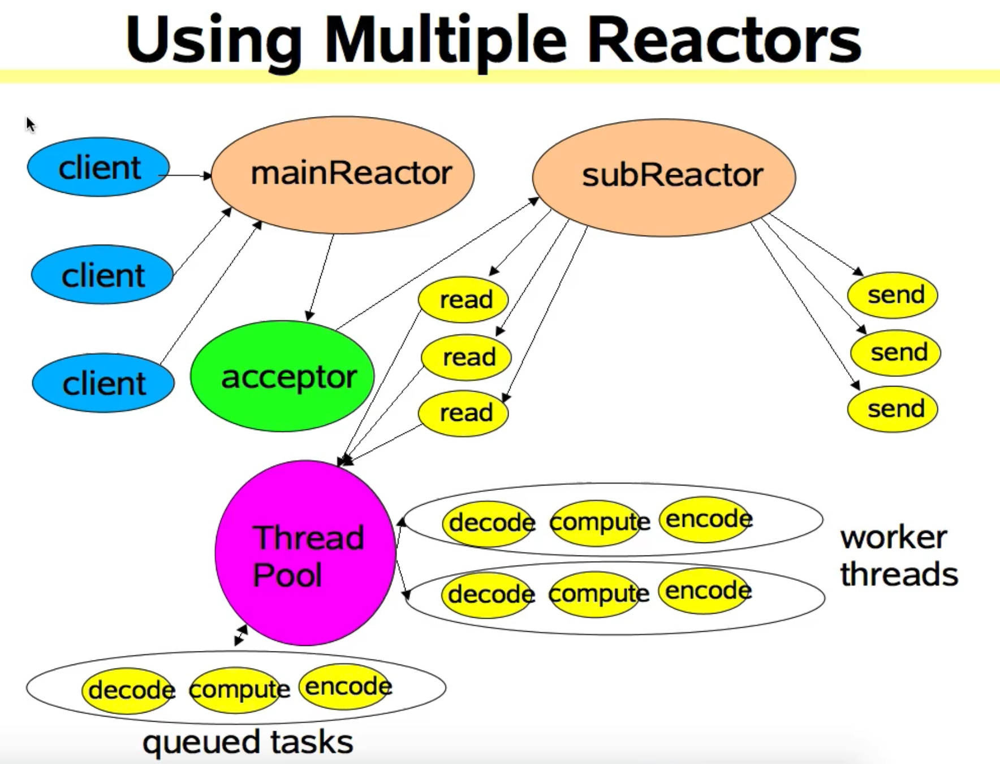
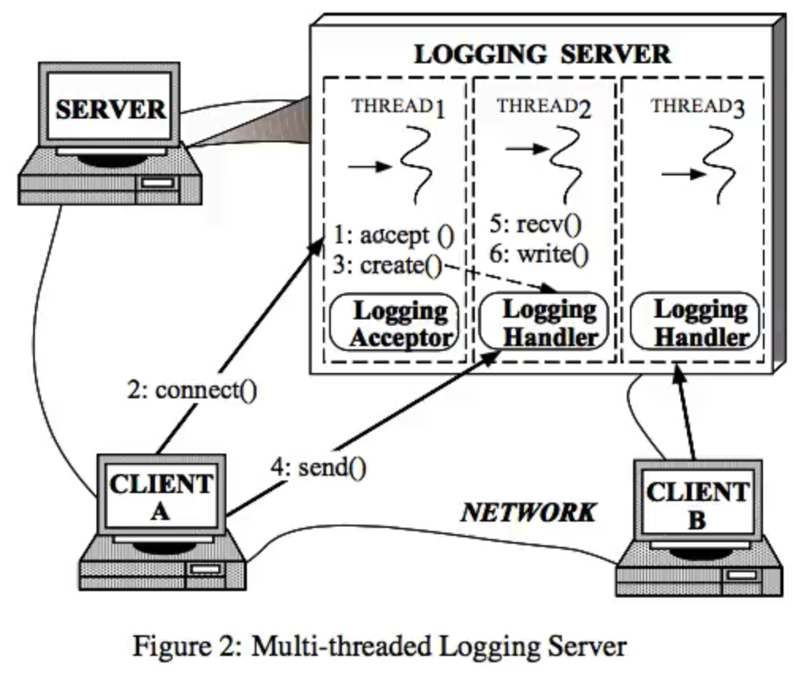
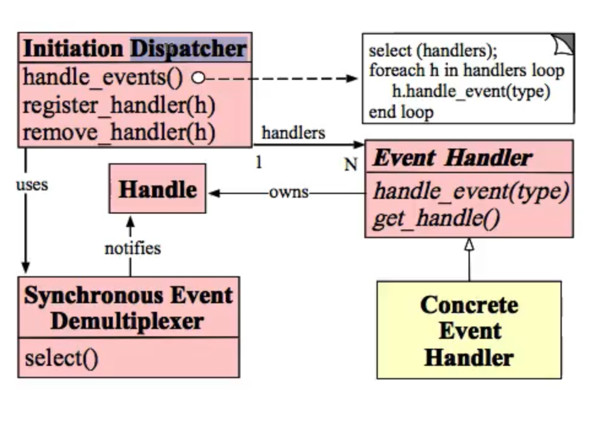
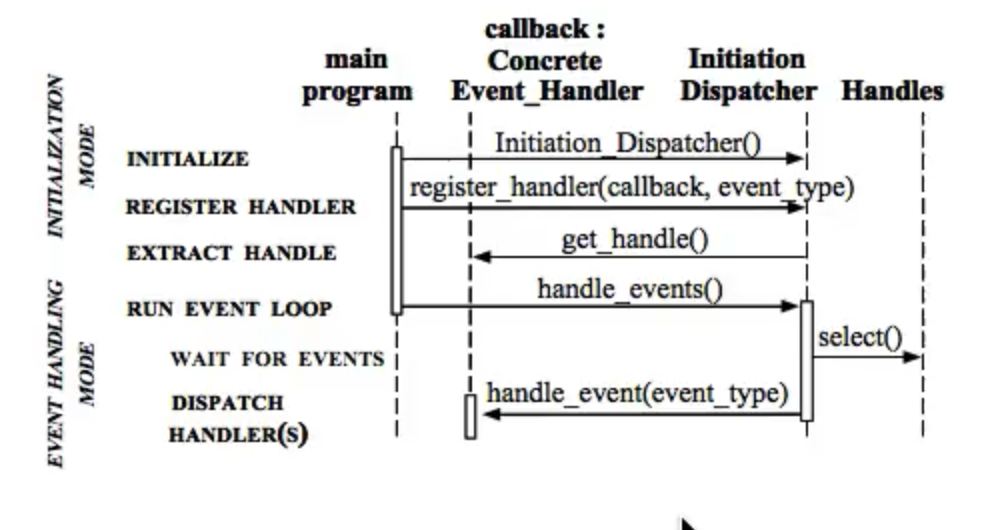
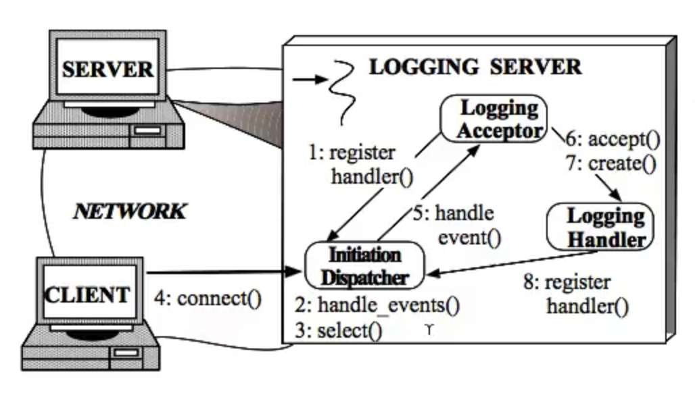
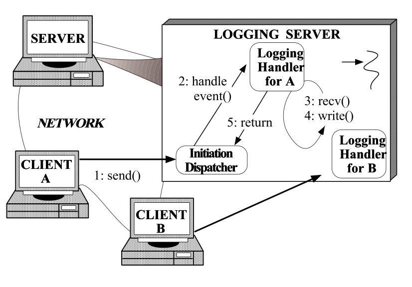

## NettyReactor模式
- 57、Reactor模式透彻理解及其在Netty中的应用
- 58、Reactor模式与Netty之间的关系详解

***
### Reactor模式透彻理解及其在Netty中的应用
Netty整体架构是Reactor模式的完整体现。

> 《Scaleble IO in Java 》--- Doug Lea,从阻塞式IO开始讲起，一直讲到Netty Reactor模式

- Scalable network Services
- Event-driven processing
- Reactor pattern
    + Basic version
    + Multithreaded versions
    + Other variants
- Walthrough of java.nio.nonblocking IO APIs

#### Network Services
- Web services, Distributed Objects,etc
- Most have same basic structure:
    + Read Request
    + Decode request
    + Process Service
    + Encode reply
    + Send reply
- But differ in nature and cost of each Step
    + XML parsing,File transfer, Web page generation, computatingal services。....

#### Classic Service Designs
- Each handler may be started in its own thread
- 图中每个handler都需要启动一个线程来处理，也就是serverSocket 每连接一个socket都会启动一个线程.


#### Classic ServerSocket Loop
```java
class Server implements Runnable{
    public void run(){
        try{
            ServerSocket ss = new ServerSocket(PORT);
            while(!Thread.interrupted()){
                new Thread(new Handler(ss.acept())).start();
                //or,single-threaded,or a thread pool
            }
        }catch(IOException ex){/**/}
    }
}

static class Handler implements Runnable{
    final Socket socket;
    Handler(Socket s){
        Socket = s;
    }
    public void run(){
        try{
            byte[] input = new byte[MAX_INPUT];
            socket.getInputStream.read(input);
            byte[] ouput = process(input);
            socket.getOutputStream.write(output);
        }catch(IOException ex){/**/}
    }
}
```
### Scalability Goals 可伸缩性的目标
- Graceful degradation under increasing load(more client) 当有更多的客户端的时候能够优雅的降低了负载（优雅的降级）
- Continuous inprovement with increasing resources(CPU ,memory,disk,bandwidth) d当资源在不断增加的时候能够持续改善性能
- Also meet avaliability and performance goals
    + Short latencies 更短的延迟
    + meeting peak demand 应对峰值
    + Tunable quality of service 高可用
- **Divide-and-conquer is usually the best approach for achieving any scalability goal， Divide-and-conquer就是分而治之**

### Divide and Conquer
- Divide processing into small tasks
    + Each task performs an action without blocking
    + 在上面的那种模式中 read、decode、compute、encode、send都在一个handler线程中
    + read、decode、compute、encode、send整个都是按照顺序执行,然而这里面会涉及到很多IO操作，IO我们知道和CPU的处理速度式完全不匹配的，如果让CPU等待IO操作完成，是对性能的一种极大的损耗。
    + 所以这里说将处理过程分解为很多小的任务，每个任务都是非阻塞的
- Execute each task when it is enabled 当每个任务可用的时候去执行每个任务
    + Here,an IO event usually serves as trigger
    + 通常IO事件都是作为一个触发器的
    + 即当一个IO操作完成之后就会产生一个事件
- Basic mechanisms supported in java.io
    + Non-blocking reads and writes 非阻塞的读和写
    + Dispatch tasks associated with sensed IO events 分发能感知到的IO事件的任务


### Event-driven Designs
- Usually more effcient than alternative 通常比其他方式更高效
    + Fewer resources 更少资源消耗
        * dont usully need a thread pre client, 并不需要对每个客户端产生一个线程
    + Less overhead
        * less context switching ,often less locking
    + but dispatching can be slower 但是分发能变得更慢的
        * 必须手动的将action绑定到事件上面

- Usually harder to program
    + Must break up into simple non-blocking action 必须分解为一些简单的非阻塞的动作
    + must keep track of logic state of service 异步的必须track

### Reactor 模式
- Reactor : response to IO events by dispatching the appropriate handler, 通过分发合适的handler，针对IO事件的响应，即：怎么对IO事件进行响应的，通过分发合适的处理器。
- Handlers: perform non-blocking actions
- Manage by bind handlers to event 通过将handlers绑定到事件进行管理

### Basic Reactor Design
#### Single threaded version


图中Reactor其实是一个线程对象，它做了什么事情：

- 他去检测和监听客户端向服务器发起的连接
- 当一个连接一旦建立好之后，或者事件被传进来之后，reactor会通过一种 **派发的方式**，将客户端发过来的数据，发给特定的线程对象（特定的处理器）。由特定的处理器对客户端发过来的数据进行处理

### Java.nio.Support
- Channels
    + Connections to files ,sockets etc that support non-blocking reads
- Buffers
    + Array-like objects that can be directly read or write by Channels
- Selectors
    + Tell which of a set of Channels have IO events
- SelectionKeys
    + Maintain IO event status and bindings,通过selectionKeys就能知道是那个Channel绑定了哪些事件

### Reactor 1 : Setup实现
Reactor就是一个线程对象，Netty中NIOEventLoop就是一个Reactor
```java
class Reactor implements Runnable{
    final Selector selector;
    final ServerSocketChannel serverSocketChannel;

    Reactor(int port){
        selector = Selector.open();
        serverSocketChannel = ServerSocketChannel.open();
        serverSocketChannel.socket().bind(new InetSocketAddress(port));
        serverSocketChannel.configureBlocking(false);
        SelectionKey sk = serverSocketChannel.register(selector,SelectionKey.OP_ACCEPT);
        sk.attach(new Acceptor());
    }
}
```
### Reactor 2:Dispatch Loop
```java
//class Reactor continued
public void run(){//normally in a new thread
    try{
        while(!Thread.interrrupted()){
            selector.select();//这时一个阻塞的方法
            Set selected = selector.selectedKeys();
            Iterator it = selected.iterator();
            while(it.hasNext()){
                dispatch((SelectionKey)(it.next()));
                selected.clear();
            }
        }
    }catch(IOException ex){/**/}
}

void dispatch(SelectionKey k){
    Runnable r = (Runnable)(k.attachment());
    if(r!=null){
        r.run();
    }
}
```

### Reactor3: Acceptor
```java
//class Reactor continued
class Accptor implements Runnable{
    //inner  class
    public void run(){
        try{
            SocketChannel c = serverSocketChannel.accept();
            if(c!=null){
                new Handler(selector,c);
            }
        }catch(IOException ex){/**/}
    }
}
```

### Reactor4: Handler setup
```java
    final class Handler implements Runnable{
        final SocketChannel socketChannel;
        final SelectionKey sk;

        Handler(Selector sel, SocketChannel c){
            scoket = c;
            c.configureBlocking(false);
            sk = socket.register(sel,0);
            sk.attch(this);
            sk.interestOps(SelectionKey.OP_READ);
            sel.wakeup();
        }
    }
```
### 58 Reactor模式与Netty之间关系详解
#### Mutithreaded Designs
- Worker Threads
    + Reactor should quickly trigger handlers
        * because Handler processing slows down Reactor Thread
    + 建议将非IO处理的过程交给其他线程去处理 Offload non-IO processing to other threads
- Mutiple Reactor Threads
    + Reactor threads can saturate doing IO
    + Distribute load to other reactors
        * load-balance to match CPU and IO rates

#### Worker Threads
- offload non-IO processing to speed up Reacotr thread, 将非IO处理移交出去提高Reactor的速度

#### Worker Thread Pools


#### Handler with Thread Pool
```java
class Handler implements Runnable{
    //uses util.concurrent thread pool
    static PooledExecutor pool = new PooledExecutor(...);
    static final int PROCESSING = 3;

    synchronized void read(){
        socke.read(input);
        if(inputISComplete()){
            state = POCESSING;
            pool.execute(new Processer());
        }
    }

    class Processer implements Runnable{
        public void run(){
            processAndHandOff();
        }
    }
}
```

#### Mutiple Reactor Threads
- Using Reactor Pools
```java
Selector[] selectors;//also create threads
int next = 0;
class Acceptor implements Runnable{
    public synchronized void run(){
        ...
        SocketChannel socketChannel = serverSocketChannel.accept();
        if(socketChannel!=null){
            new Handler(selectors[next],socketChannel);
            if(++next == selectors.length){
                next = 0;
            }
        }
    }
}
```


### 论文：An Object Behavioral Pattern for Demultiplexing and Dispatching Handles for Synchronous Events 多路处理和同步事件分发处理的一种对象行为模式
**Reactor Also Known as Dispatcher,Notifier。**

#### Muti-threaded Logging Server
- 1、第一步是Acceptor调用 accept()阻塞等待
- 2、client connect()
- 3、Acceptor Create() Logging Handler
- 4、Client send() data to Server
- 5、recv()+write()


#### The structure of the participants of the Reactor pattern is illustrate in the following OMT class diagram:

- Snchronous Event Demultipexer 同步事件分离器
    + 同步事件分离器 都是通过底层操作系统来实现
    + select() 就是通过操作系统实现的阻塞
    + Snchronous Event Demultipexer 中的select会在某个事件发生时候 notifies **Handle**
- Handle
    + 句柄/文件描述
    + **Event Handler** owns **Handle**
- Event Handler
    + 事件处理器 Concrete Event Handler实现了Event Handler
    + handle_event(type) 这个方法是属于某个事件或者说是属于某个Handle
    + 我们写的handler都是由Dispatcher来负责调用
- Initiation Dispatcher
    + Initiation Dispatcher就是一个Dispatcher,首先 Event Handler会向Initiation Dispatcher进行注册。
    + 接收注册之后的Initiation Dispatcher中会有:
        * handle_events()
        * register_handler(h)
        * remove_handler(h)
    + 最后根据事件调用handlers
- d



### Client Connects to a Reactive Logging Server

##### This Sequence of steps can be summarized as follows:
1. The logging server(1) registers the **Logging Acceptor** with the **Initiation Dispatcher** to handle connection requests;
2. The logging Server invokes the **handle events** method(2) of the **Initiation Dispatcher**。绑定OP_READ事件
3. The **Initiation Dispatcher** invokes the synchronous event demutiplexing **elect**(3) operation to wait for connection requests or logging data to arrive;
4. A client connects(4) to the logging server;
5. The **Logging Acceptor** is notified by the **Initiation Dispatcher**(5) of the  new connection request 实际上就是通知Logging Acceptor新的连接已经到来
6. The **Logging Acceptor** accepts(6) the new connection; 通过调用accept()方法调用
7. The **Logging Acceptor** creates(7) a **Logging Handler** to service the new client
8. **Logging Handler** registers(8) its socket handle(socket描述符) with the **Initation Dispatcher** and instructs the dispatcher to notify it when the socket becomes "ready for reading "

### Client Sends Logging Record to a Reactive Logging Server

##### This Sequence of steps can be summarized as follows:
1. The client sends(1) a logging record;
2. **Initiation Dispatcher** notifies(2) the associated **logging handler** when a client logging record is queued on its socket handle by OS;
3. The record is received(3) in a non-blocking manner (steps 2 and 3 repeat until the logging record has been received completely);
4. The **Logging Handler** process the logging record and writes(4)it to the standard output
5. The **Logging Handler returns (5) control to the Initiation Dispatcher/s event loop;

