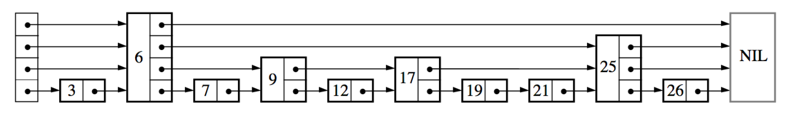
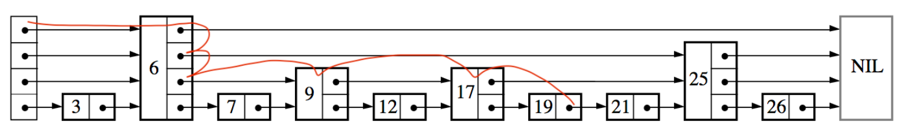

### SkipList跳表
- 1、数据结构
    + 1.1、简介
    + 1.2、跳表如何构建
    + 1.3、如何搜索
- 2、实现（java）

### 1、数据结构
#### 1.1、简介
跳表(SkipList)是一个查询/插入/删除复杂度都是O(logN)的数据结构。在查询上跟平衡树的复杂度一直，因此是替代平衡树的方案。在redis的zset中有使用。发现这个算法也解决了我一个问题。各种平衡树在业界的广泛应用，帮助我们快速查找，插入数据，但其思想的复杂也让大家不是那么容易接触。当时想直接对有序链表进行二分搜索，那岂不是很容做到相同复杂度且容易理解。不过链表并不能向数组支持随机访问，只能从头一个个遍历。跳表为节点设置了快速访问的指针，不同于一个个的遍历，可以跨越节点进行访问，这也是跳表名字的含义。

上面就是跳表的引子，下图就是它的数据结构



#### 1.2、跳表如何构建
当插入一个数据时，随机获得这个节点的高度，没错，就是随机！每涨一层的概率为p，这个认为设置，一般为0.25或者0.5,这样层数越高的节点就越少（这种结构跟平衡树有点像）。

```java
//理论来讲，一级索引中元素个数应该占原始数据的 50%，二级索引中元素个数占 25%，三级索引12.5% ，一直到最顶层。
// 因为这里每一层的晋升概率是 50%。对于每一个新插入的节点，都需要调用 randomLevel 生成一个合理的层数。
// 该 randomLevel 方法会随机生成 1~MAX_LEVEL 之间的数，且 ：
//        50%的概率返回 1
//        25%的概率返回 2
//      12.5%的概率返回 3 ...
```

#### 1.3、如何搜索
如上图所示，我们检索19这个值，遍历路径如下图所示



可以看到高层级的节点相当于一个快速通道，让搜索进行了节点的跳跃，而不是一个个的遍历。

### 2、代码实现（java）
```java
package skiplist;


/**
 * 跳表的一种实现方法。
 * 跳表中存储的是正整数，并且存储的是不重复的。
 *
 * Author：ZHENG
 */
public class SkipList {

  private static final float SKIPLIST_P = 0.5f;
  private static final int MAX_LEVEL = 16;

  private int levelCount = 1;

  private Node head = new Node();  // 带头链表

  public Node find(int value) {
    Node p = head;
    for (int i = levelCount - 1; i >= 0; --i) {
      while (p.forwards[i] != null && p.forwards[i].data < value) {
        p = p.forwards[i];
      }
    }

    if (p.forwards[0] != null && p.forwards[0].data == value) {
      return p.forwards[0];
    } else {
      return null;
    }
  }
    //插入一个新的节点
  public void insert(int value) {
    int level = randomLevel();
    Node newNode = new Node();
    newNode.data = value;
    newNode.maxLevel = level;
    //update用于保存 插入节点 的所有前序节点（遍历的收保存）
    Node update[] = new Node[level];
    for (int i = 0; i < level; ++i) {
      update[i] = head;
    }

    //每次查找都从头结点开始（单链表的遍历也是从头结点开始）
    Node p = head;
    for (int i = level - 1; i >= 0; --i) {
      while (p.forwards[i] != null && p.forwards[i].data < value) {
        p = p.forwards[i];
      }

      update[i] = p;// use update save node in search path
    }

    // in search path node next node become new node forwords(next)
    for (int i = 0; i < level; ++i) {
      newNode.forwards[i] = update[i].forwards[i];
      update[i].forwards[i] = newNode;
    }

    // update node hight
    if (levelCount < level) levelCount = level;
  }

  public void delete(int value) {
    Node[] update = new Node[levelCount];
    Node p = head;
    for (int i = levelCount - 1; i >= 0; --i) {
      while (p.forwards[i] != null && p.forwards[i].data < value) {
        p = p.forwards[i];
      }
      update[i] = p;
    }

    if (p.forwards[0] != null && p.forwards[0].data == value) {
      for (int i = levelCount - 1; i >= 0; --i) {
        if (update[i].forwards[i] != null && update[i].forwards[i].data == value) {
          update[i].forwards[i] = update[i].forwards[i].forwards[i];
        }
      }
    }

    while (levelCount>1&&head.forwards[levelCount]==null){
      levelCount--;
    }

  }

  // 理论来讲，一级索引中元素个数应该占原始数据的 50%，二级索引中元素个数占 25%，三级索引12.5% ，一直到最顶层。
  // 因为这里每一层的晋升概率是 50%。对于每一个新插入的节点，都需要调用 randomLevel 生成一个合理的层数。
  // 该 randomLevel 方法会随机生成 1~MAX_LEVEL 之间的数，且 ：
  //        50%的概率返回 1
  //        25%的概率返回 2
  //      12.5%的概率返回 3 ...
  private int randomLevel() {
    int level = 1;

    while (Math.random() < SKIPLIST_P && level < MAX_LEVEL)
      level += 1;
    return level;
  }

  public void printAll() {
    Node p = head;
    while (p.forwards[0] != null) {
      System.out.print(p.forwards[0] + " ");
      p = p.forwards[0];
    }
    System.out.println();
  }

  public class Node {
    private int data = -1;
    private Node forwards[] = new Node[MAX_LEVEL];
    private int maxLevel = 0;

    @Override
    public String toString() {
      StringBuilder builder = new StringBuilder();
      builder.append("{ data: ");
      builder.append(data);
      builder.append("; levels: ");
      builder.append(maxLevel);
      builder.append(" }");

      return builder.toString();
    }
  }

}
```