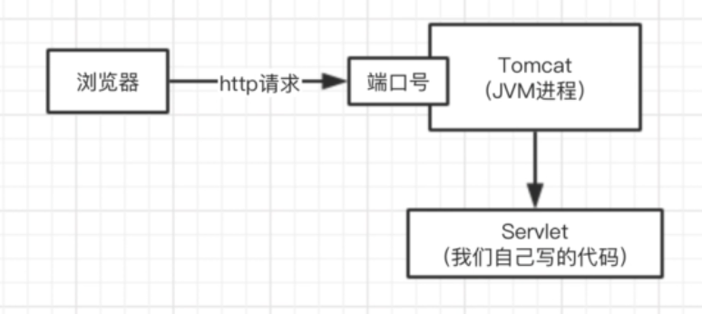
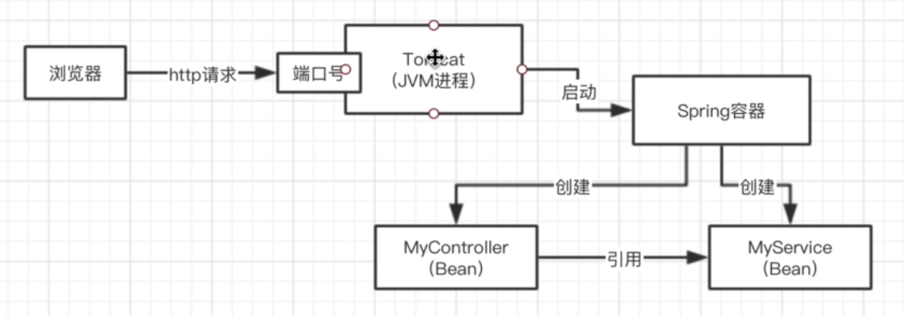
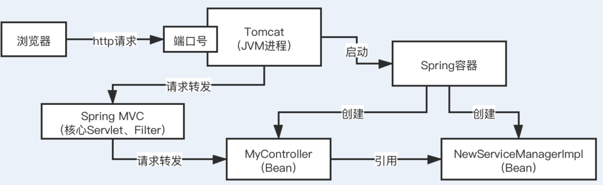
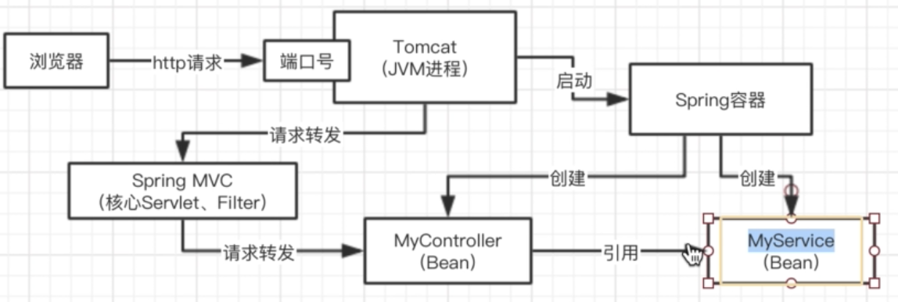

## Spring IOC及AOP
### 说说你对Spring的IOC机制和AOP机制的理解可以吗？
#### 假设没有Spring IOC的情况下我们应该如何写代码？
首先我们得有一个web服务器，比如tomcat，一旦tomcat启动之后，它就可以监听一个端口号http请求，然后可以把请求转交给你的Servlet,jsp,配合起来使用，servlet处理请求。

最原始的tomcat+servlet的编码原理：

```java
public class MyServlet{
    private MyService myService = new MyServiceImpl();
    public void doPost(HttpServletRequest request){
        //对请求一通处理
        //调用自己的也业务处理逻辑组件，去执行一些业务逻辑
        myService.doService(request);
    }
}

public interface MyService{

}

public class MyserviceImpl implements MyService{

}
```
#####那么问题来了：
比如在我们这个tomcat+servlet的这样的一个很low的系统里，有几十个地方，都是直接用Myservice myservice = new MyServiceImpl(); 直接创建、引用和依赖了一个MyServiceImpl这样的一个类的对象。

我们这个low系统里，就会有十几个地方，都跟MyServiceImpl类直接耦合在一起了。

但是问题是：如果我现在不向用MyserviceImpl了，我们希望用的是NewServiceManagerImpl，这个NewServiceManagerImpl也implements MyService这个接口，所有的实现逻辑都不同了，这个时候应该怎么办呢？

这个时候我们很麻烦，我们需要在很low的系统里，几十个地方，都去修改对应的MyServiceImpl这个类，切换为NewServiceManagerImpl这个类。 这样改动代码成本很大，改动完以后的测试的成本很大，改动的过程中可能很复杂，出现一些bug，此时很痛苦，归根结底，代码里，各种类之间完全耦合在一起，出现任何一丁点的变动，都需要改动大量的代码，重新测试，可能还会有bug

这个时候Spring为了解决上述的问题提出了Spring IOC框架--控制反转，依赖注入。使用xml文件进行配置，后面又进化为了 基于注解来进行自动依赖注入。
比如：
```java
@Controller
public class MyServlet{
    //private MyService myService = new MyServiceImpl();
    @Resource
    private MyService myService;//此时只需要加一个注解，不需要指明其具体实现类了

    public void doRequest(HttpServletRequest request){
        //对请求一通处理
        //调用自己的也业务处理逻辑组件，去执行一些业务逻辑
        myService.doService(request);
    }
}

public interface MyService{

}
@Service
public class MyserviceImpl implements MyService{

}

public class NewServiceManagerImpl implements MyService{

}
```
//我们只需要在这个工程通过Maven引入一些Spring框架的依赖，比如IOC的功能就可以了

tomcat+Spring容器图

上述图中tomcat在启动Spring容器的时候就会去扫描所有的代码，并将代码中带有spring注解的代码注入到Spring容器中

当收到请求后的处理逻辑：


### 总结
什么是Spring IOC呢？
首先Spring是一个容器，当spring容器启动后会根据xml配置或者注解，去实例化一些代码中的实例bean对象,然后根据xml配置或者注解，去对bean对象之间的引用关系，去进行依赖注入（即某个bean依赖了另外的一个bean）

SpringIOC的底层核心技术就是反射，他会通过反射的技术，直接根据你的类去自己构建对应的对象出来，用到的就是反射技术。

SpringIOC技术的贡献就是，使得系统的类与类之间彻底的解耦合了。

在这套比较高大上一点的系统里，有几十个类都是用了@Resource这个注解去标注 MyService myService，几十个地方都依赖了这个类，如果需要修改实现类为NewServiceManagerImpl，只需要将
@Service注解从MyserviceImpl类上移出，并在新增加的类NewServiceManagerImpl上增加@Service注解就可以了，因为MyserviceImpl和NewServiceManagerImpl类都实现了MyService接口。

具体Spring容器变化如下：


此时就由上图变为下图了


从没有Spring IOC时的一个痛点到然后用了Spring IOC之后是怎么用的，代码层面怎么写，用了之后Spring是怎么运作的，SpringIOC干了那些事，都讲解了下。

##### SpringIOC干了那些事？
- SpringIOC实例化所有的Bean对象
- 把bean与bean之间的依赖关系进行注入

##### SpringIOC底层的技术
就是反射技术，通过反射去创建类的bean对象

##### SpringIOC的最大作用是什么？
代码层面进行解耦，代码层面的大量变动不用去硬编码，直接改改配置就可以了，避免大量改动代码，避免大量的重复测试


