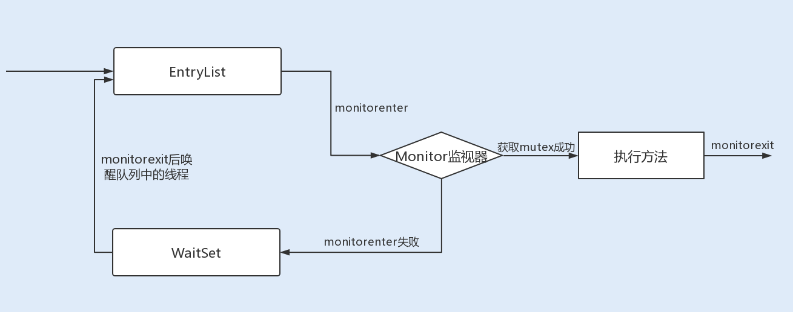
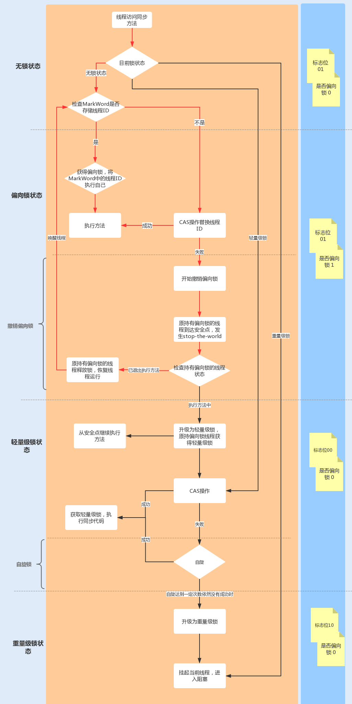

# Synchronized

## 1、Java性能调优实战中12讲Synchronized
## 2、Java并发编程实战
## 3、狸猫技术窝

## 1、Java性能调优实战中12讲Synchronized

### 开头
**在并发编程中，多个线程访问同一个共享资源时候，我们必须考虑如何如何维护数据的原子性**，在JDK1.5之前，Java是依靠Synchronized关键字实现锁功能来做到这点的。Synchronized是JVM实现的一种内置锁，锁的获取和释放是由JVM隐式实现的。

到了JDK1.5版本，并发包中新增了Lock接口来实现锁功能，他提供了与Synchronized关键字类似的同步功能，只是在使用时需要显示获取和释放做。

Lock同步锁时基于java实现的，而Synchronized是基于底层操作系统的Mutex Lock实现的，每次获取和释放操作都会带来用户态和内核态的切换，从而增加系统性能开销。因此在锁竞争激烈的情况下，synchronized同步锁在性能上就表现得非常糟糕，它也常被称为重量级锁。

### JDK1.6对Sychronized的优化
到了JDK1.6版本之后，Java对Synchronized同步锁做了充分的优化，甚至在某些场景下，它的性能已经超越了Lock同步锁，接下来就来看看Synchronize同步锁是通过了哪些优化，实现了性能的提升。

#### Synchronized 同步锁实现原理
通常Synchronized 实现同步锁的方式有两种，一种修饰方法，一种是修饰方法块。如下：

##### 通过源码分析
```java
//关键字在实例方法上，锁为当前实例
public synchronized void method1(){
//code
}
//关键字在代码块上，锁为括号里的对象
public void methdo2(){
    object o = new Object();
    synchronized(o){
        //code
    }
}
```
```java
执行如下命令
~/workspace/Data/JUC  javac -encoding UTF-8 SyncTest.java
~/workspace/Data/JUC  javap -v SyncTest.class
```
##### Synchronized修饰方法是怎么实现锁原理的？
JVM中的同步是基于进入和退出管程（Monitor）对象实现的。每个对象实例都会有一个Monitor,Monitor可以和对象一起创建、销毁。Monitor是由ObjectMonitor实现，而ObjectMonitor是由C++的ObjectMonitor.hpp文件实现。如下所示：

```c++
ObjectMonitor() {
   _header = NULL;
   _count = 0; // 记录个数
   _waiters = 0,
   _recursions = 0;
   _object = NULL;
   _owner = NULL;
   _WaitSet = NULL; // 处于 wait 状态的线程，会被加入到 _WaitSet
   _WaitSetLock = 0 ;
   _Responsible = NULL ;
   _succ = NULL ;
   _cxq = NULL ;
   FreeNext = NULL ;
   _EntryList = NULL ; // 处于等待锁 block 状态的线程，会被加入到该列表
   _SpinFreq = 0 ;
   _SpinClock = 0 ;
   OwnerIsThread = 0 ;
}
```

*** 当多个线程同时访问一段同步代码时，多个线程会先被存放在EntryList集合中，处于block状态的线程，都会被加入到该列表 *** 接下来当线程获取到对象的Monitor时候，Monitor是依靠底层操作系统的Mutex Lock来实现互斥的，线程申请Mutex成功，则持有该Mutex，其它线程将无法获取到该Mutex.

如果线程调用Wait()方法，就会释放当前Mutex，并且该线程会进入WaitSet集合，等待下一次被唤醒。如果当前线程顺利执行完方法，也将释放Mutex。


总结来说就是，同步锁在这种实现方法中，因为Monitor是依赖于底层的操作系统实现的，存在用户态和内核态之间的切换，所以增加了性能开销。


#### 锁升级
为了提升性能，JDK1.6 引入了偏向锁、轻量级锁、重量级锁概念，来减少锁竞争带来的上下文切换，而真实新增的Java对象头实现了锁升级的功能。

当java对象被Synchronized关键字修饰成为同步锁后，围绕这个锁的一系列升级操作都将和Java对象头有关。

#### Java对象头
在JDK1.6JVM中，对象实例在堆内存中被分为了三个部分：对象头、实例数据、对其填充。
其中java对象头由Mark Word、指向类的指针以及数组长度三部分组成。

Mark Word记录了对象和锁的有关信息。


锁升级功能主要依赖于Mark Word中的锁标志位和是否偏向锁标志位，Synchronized就是从偏向锁开始，随着竞争越来越激烈，偏向锁升级到轻量级锁，最终升级到重量级锁。
下面就沿着这条优化路径去看具体的内容suo

##### 1、偏向锁
- 介绍：偏向锁主要用来优化同一线程多次申请同一个锁的竞争。在某些情况下，大部分时间是同一个线程机制锁资源。例如，在创建一个线程并在线程中执行循环监听的场景下，或单线程操作一个线程安全集合时，同一线程每次都需要获取和释放锁，每次操作都会发生用户态与内核态的切换。
- 偏向锁的作用：当一个线程再次访问这个同步代码或方法时，该线程只需去对象头的Mark Word中判断下是否偏向锁指向它的ID，无需再进入Monitor去竞争对象。
- 偏向锁获取和释放流程：当对象被当做同步锁并有一个线程抢到了锁时，锁标志位还是01，『是否偏向锁』标志位设置位1，并且记录抢到锁的线程ID，表示进入偏向锁状态。
- stop the world：一旦出现其它线程竞争锁资源时，偏向锁就会被撤销。偏向锁的撤销需要等待全局安全点，暂停持有该锁的线程，同时检测该线程是否还在执行该方法，如果是，则升级锁，反之被其它线程抢占。


其中红线流程部分为偏向锁的获取和撤销流程：

因此，再高并发场景下，当大量线程同时竞争同一个锁资源时，偏向锁就会被撤销，发生stop the wordld后，开启偏向锁无疑会带来更大的性能开销，这个时候我们可以通过添加JVM参数关闭偏向锁来调优性能
-XX:-UserBiasedLocking //关闭偏向锁（默认打开）
或者-XX:+UseHeavyMonitors  // 设置重量级锁


##### 2、轻量级锁
当有另外一个线程竞争获取这个锁时，由于该锁已经是偏向锁，当发现对象头MarkWorkd中的线程ID不是自己的线程ID,就会进行CAS操作获取锁，如果获取成功，直接替换Mark Workd中的线程ID为自己的ID,该锁就会保持偏向锁状态，如果获取锁失败，代表当前锁有一定的竞争，偏向锁将升级为轻量级锁。

**轻量级锁适用于线程交替执行同步块的场景，绝大部分的锁再整个同步周期内都不存在长时间的竞争**

下图中红线部分为升级轻量级锁即操作流程：

![Demo]{images/qingliangji.png}

##### 3、自旋锁与重量级锁
轻量级锁CAS枪锁失败，线程将会被挂起进入阻塞状态。如果正在持有锁的线程在很短的时间内释放资源，那么进入阻塞状态的线程无疑又要申请锁资源。

JVM提供了一种自旋锁，可以通过自旋方式不断尝试获取该锁，从而避免了线程被挂起阻塞。这事基于大多数情况下，线程持有该锁的时间都不会太长，毕竟线程被挂起阻塞可能会得不偿失。

从JDK1.7开始，自旋锁默认启动，自旋次数由JVM设置决定，不建议设置重试次数过多，因为CAS重试操作意味着长时间占用CPU。

自旋锁重试之后如果抢锁依然失败，同步锁就会升级至重量级锁，锁标志位改为10，在这这个状态下，未抢到锁的线程都会进入Monitor，之后会被阻塞再_WaitSet队列中。

**重量级锁的优缺点及使用场景**

**在锁竞争不激烈且占用时间非常短的场景下，自旋锁可以提高系统性能**，一旦锁竞争激烈或者锁占用的时间过长，自旋锁将会导致大量的线程一直处于CAS重试状态，占用CPU资源，反而会增加系统性能开销，所所以自旋锁和重量级锁的使用都要结合实际场景。

在高负载、高并发的场景下，我们可以通过设置JVM参数来关闭自旋锁，优化系统性能，示例代码如下：

```java
-XX:-UseSpinning // 参数关闭自旋锁优化 (默认打开)
-XX:PreBlockSpin // 参数修改默认的自旋次数。JDK1.7 后，去掉此参数，由 jvm 控制
```

#### 动态编译实现锁消除/锁粗化
##### 锁消除
除了锁升级优化，java还使用了编译器对锁进行优化，JIT编译器在动态编译同步代码块的时候，会判断同步块使用的锁对象是否只能够被一个线程访问，而没有被发布到其他线程。
确认是的话，那么JIT编译器在编译这个同步块的时候不会生成synchronized所表示的锁的申请与释放的机器码。
##### 锁粗化
在JIT编译器动态编译时，如果发现几个相连的同步块使用同一个锁实例，那么JIT编译器将会把这几个同步块合并为一个大的同步块，从而避免一个线程『反复申请、释放同一个锁』所带来的性能开销。
#### 减小锁粒度
当我们锁对象是一个数组或者队列时，集中竞争一个对象的话会非常激烈，锁也会升级为重量级锁。**我们可以考虑将一个数组和队列拆分为多个对象，来降低锁竞争，提升并行度。**

最经典的减小锁粒度的案例就是 JDK1.8 之前实现的 ConcurrentHashMap 版本。我们知道，HashTable 是基于一个数组 + 链表实现的，所以在并发读写操作集合时，存在激烈的锁资源竞争，也因此性能会存在瓶颈。而 ConcurrentHashMap 就很很巧妙地使用了分段锁 Segment 来降低锁资源竞争，


### 总结
JVM在1.6中引入了分级锁机制来优化Synchronized，当一个线程获取锁时，首先对象锁将成为一个偏向锁，


