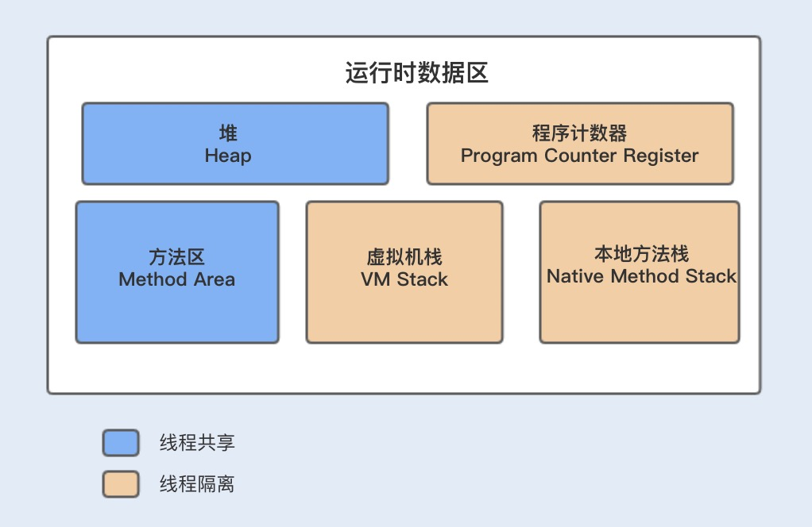
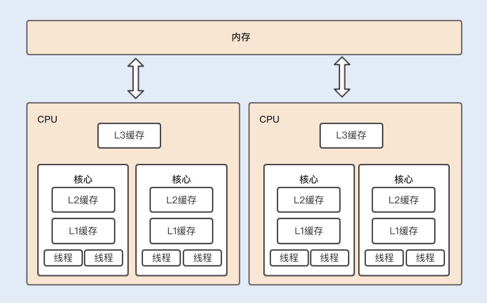
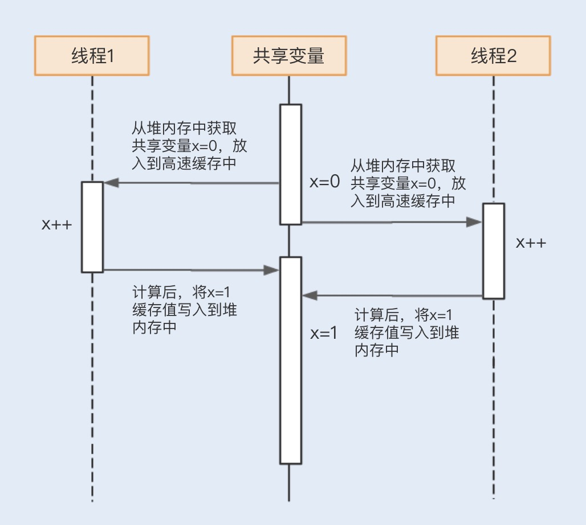
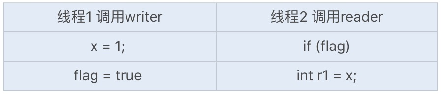
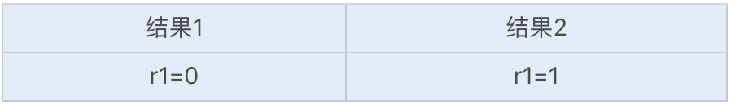
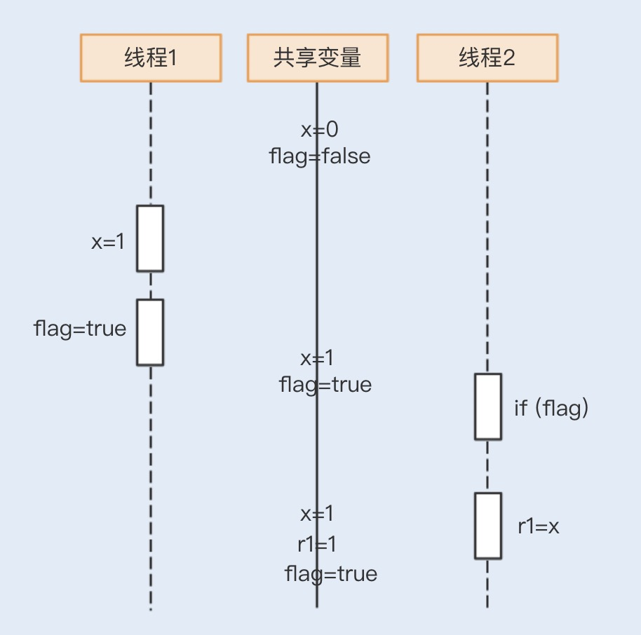
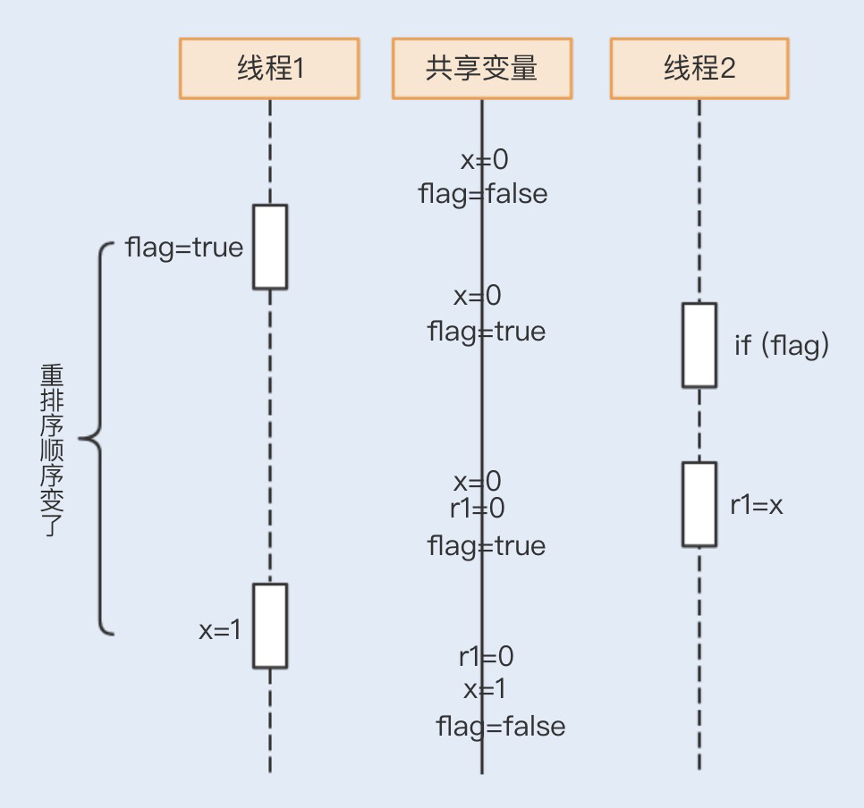
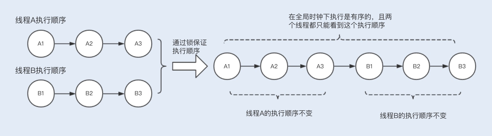
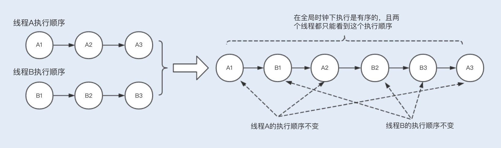

## 题目：什么是数据的强、弱一致性
- JAVA存储模型（内存模型）
- 重排序
- Happens-before规则

说到一致性，其实在系统的很多地方都存在数据一致性的相关问题。除了在并发编程中保证共享变量数据的一致性之外，还有数据库的ACID中的C(Consistency一致性)、分布式系统的CAP理论中的C(Consistency一致性)； 本文我们主要讨论 **"并发编程中共享变量的一致性"**

在并发编程中，**Java是通过共享内存来实现共享变量操作的，**所以在多线程编程中会涉及数据一致性的问题。

## Java内存模型
我们知道，Java采用共享内存模型来实现多线程之间的信息交换和数据同步。接下来先通过下图简单了解下内存模型，在程序运行时，局部变量将会存放在虚拟机栈中，而共享变量将会保存在堆内存中。


由于局部变量是跟随线程的创建而创建的，线程的销毁而销毁的，所以存放在栈中，由上图我们可知，java栈数据不是所有数据共享的，所以不需要关心其数据的一致性。

共享变量存储在堆内存和方法区中，由上图可知，堆内存和方法区的数据是线程共享的。而堆内存中的共享变量在被不同的线程操作时，会被加载到自己的工作内存中，也就是CPU中的高速缓存。

CPU缓存可以分为一级缓存(L1)、二级缓存(L2)和三级缓存(L3),每一级缓存中所存储的全部数据都是下一级缓存的一部分。当CPU要读取一个缓存数据时，首先会从一级缓存中查找；如果没有找到，再从二级缓存中查找；如果还是没有找到，就从三级缓存或主内存中查找。

如果是单核 CPU 运行多线程，多个线程同时访问进程中的共享数据，CPU 将共享变量加载到高速缓存后，不同线程在访问缓存数据的时候，都会映射到相同的缓存位置，这样即使发生线程的切换，缓存仍然不会失效。

如果是多核 CPU 运行多线程，每个核都有一个 L1 缓存，如果多个线程运行在不同的内核上访问共享变量时，每个内核的 L1 缓存将会缓存一份共享变量。

假设线程 A 操作 CPU 从堆内存中获取一个缓存数据，此时堆内存中的缓存数据值为 0，该缓存数据会被加载到 L1 缓存中，在操作后，缓存数据的值变为 1，然后刷新到堆内存中。

在正好刷新到堆内存中之前，又有另外一个线程 B 将堆内存中为 0 的缓存数据加载到了另外一个内核的 L1 缓存中，此时线程 A 将堆内存中的数据刷新到了 1，而线程 B 实际拿到的缓存数据的值为 0。

此时，内核缓存中的数据和堆内存中的数据就不一致了，且线程B在刷新缓存到堆内存中的时候也将覆盖线程A中修改的数据，这时就产生了数据不一致的问题。

```java
// 代码 1
public class Example {
    int x = 0;
    public void count() {
        x++;                     //1
        System.out.println(x)//2
    }
}
```
了解完内存模型之后，结合以上解释，我们就可以回过头来看看第一段代码中的运行结果是如何产生的了。看到这里，相信你可以理解图中 1,1 的运行结果了。


## 重排序
除此之外，在java内存模型中，还存在重排序的问题，如下代码：
```java
// 代码 1
public class Example {
    int x = 0;
    boolean flag = false;
    public void writer() {
        x = 1;                //1
        flag = true;          //2
    }
    public void reader() {
        if (flag) {           //3
             int r1 = x;      //4
             System.out.println(r1==x)
        }
    }
}
```

如果两个线程同时运行，线程2中的变量的值可能出现以下两种可能：



r1=1的运行结果，如下图所示：

那么r1=0又是怎么获取的呢？我们再来看一个时序图：


<font color=red>在不影响运算结果的前提下，编译器有可能会改变过顺序代码的指令执行顺序，特别是在一些可以优化的场景。</font>

在 JVM 中，重排序是十分重要的一环，特别是在并发编程中。可 JVM 要是能对它们进行任意排序的话，也可能会给并发编程带来一系列的问题，其中就包括了一致性的问题。

## Happens-before 规则
为了解决这个问题，Java提出了Happens-before规则来规范线程的执行顺序：

- 程序次数规则：在单线程中，代码的执行是有序的，虽然可能会存在运行指令的重排序，但最终执行的结果和顺序执行的结果是一致的；
- 锁定规则：一个锁处于被一个线程锁定占用状态，那么只有当这个线程释放锁之后，其它线程才能再次获取锁操作。
- volatile变量规则：如果一个线程正在写volatile变量，其它线程读取改变量会发生在写入之后。
- 线程启动规则：Thread 对象的 start() 方法先行发生于此线程的其它每一个动作；
- 线程终结规则：线程中的所有操作都先行发生于对此线程的终止检测；
- 对象终结规则：一个对象的初始化完成先行发生于它的 finalize() 方法的开始；
- 传递性：如果操作A happens-before操作B，操作B happens-before操作C，那么操作A happens-before 操作C;
- 线程中断规则：对线程 interrupt() 方法的调用先行发生于被中断线程的代码检测到中断事件的发生。

## 结合这些规则，我们可以将一致性分为以下几个级别：
**严格一致性（强一致性）：** 所有读写操作都按照全局时钟下的顺序执行，且任何时刻线程读取到的缓存数据都是一样的，Hashtable就是严格一致性；

**顺序一致性：** 多个线程的整体执行可能是无序的，但对于单个线程而言执行是有序的，要保证任何一次读都能读到最近一次写入的数据，volatile 可以阻止指令重排序，所以修饰的变量的程序属于顺序一致性；

**弱一致性：** 不能保证任何一次读都能读到最近一次写入的数据，但能保证最终可以读到写入的数据，单个写锁 + 无锁读，就是弱一致性的一种实现。

