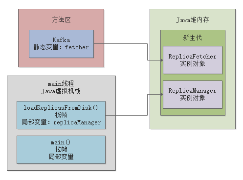
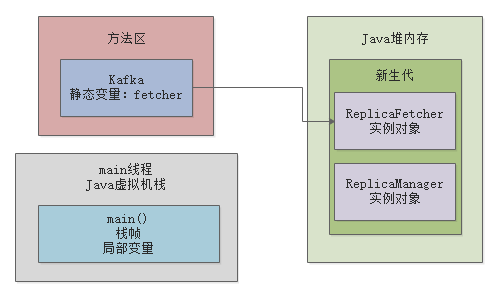
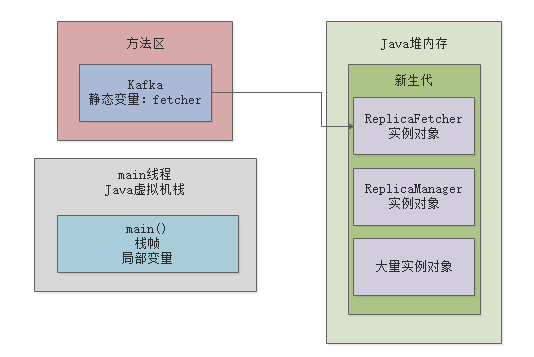
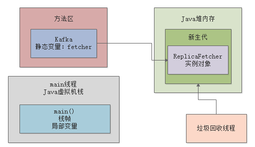
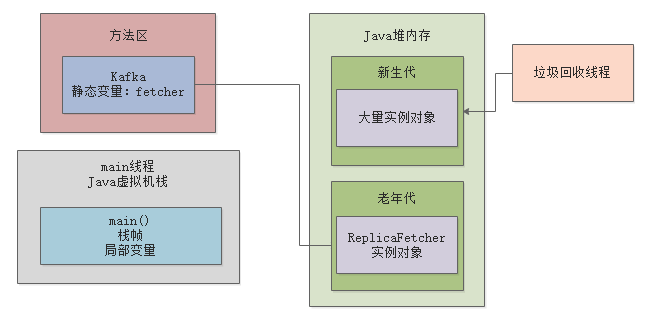

## 你的对象在JVM内存中如何分配？如何流转的？
- 大部分正常的对象优先在新生代分配内存
- 到底什么情况下会触发新生代的垃圾回收？
- 长期存活的对象会躲过多少次来及回收？
- 老年代会来及回收吗？
- 关于新生代和老年代的对象分配，这就完了吗？
- 总结
***

### 大部分正常的对象优先在新生代分配内存
平时代码里创建出来的对象，一般就是两种：

- 一种是短期存活的，分配在Java堆内存之后，迅速使用万就会被垃圾回收
- 另外一种是长期存活的，需要一直生存在Java堆内存里，让程序后续不停的去使用

接下来本文主要讲解下：对象到底什么时候进入新生代？然后什么情况下会进入老年代？

<font color=red> **大部分的正常对象，都是优先在新生代分配内存的**</font>
```java
public class Kafka{
    private static ReplicasFetcher fetcher = new ReplicasFetcher();

    private static void loadReplicasFromDisk(){
        ReplicaManager replicaManager = new ReplicaManager();
        replicaManager.load();
    }
    private static void fetchReplicasFromRemote(){
        fetcher.fetch();
    }

    public static void main(String[] args){
        loadReplicasFromDisk();

        while(true){
            fetchReplicasFromRemote();
            Thread.sleep(1000);
        }
    }
}
```
从上述代码我们知道，类静态变量 fetcher 引用的那个ReplicasFetcher对象，是会长期存活在内存里的。

但是哪怕是这种对象，其实刚开始你通过"new ReplicasFetcher()"代码来实例化一个对象时，他也是分配在新生代里的。

包括在“loadReplicasFromDisk()”方法中创建的“ReplicaManager”实例对象，也都是一样分配在新生代里的

对上述代码用一张图表示：


### 到底什么情况下会触发新生代的垃圾回收？
现在咱们来假设一个场景，大家应该都知道，一旦loadReplicasFromDisk()方法执行完毕之后，这个方法的栈帧出栈，会导致没有任何局部变量引用那个ReplicaManager实例对象了。

此时可能会如下图所示：


<font color = red>那么此时就一定会立即发生垃圾回收，去回收掉Java堆内存里那个没人使用的“ReplicaManager”实例对象吗？</font>

NO! 大家别想的那么简单了，实际上垃圾回收他也得有点触发的条件

其中一个比较常见的场景可能是这样的，假设我们写的代码中创建了N多对象，然后导致Java堆内存里囤积了大量的对象。

然后这些对象都是之前有人引用，比如各种各样的方法中的局部变量，但是现在也都没人引用了。

如下图所示：


这个时候，如果新生代我们预先分配的内存空间，几乎都被全部对象给占满了！此时假设我们代码继续运行，他需要在新生代里去分配一个对象，怎么办？发现新生代里内存空间都不够了！

这个时候，就会触发一次新生代内存空间的垃圾回收，新生代内存空间的垃圾回收，也称之为“Minor GC”，有的时候我们也叫“Young GC”，他会尝试把新生代里那些没有人引用的垃圾对象，都给回收掉。

比如上图中，那个“ReplicaManager”实例对象，其实就是没有人引用的垃圾对象

此时就会当机立断，把“ReplicaManager”实例对象给回收掉，腾出更多的内存空间，然后放一个新的对象到新生代里去。

包括上图中那大量的实例对象，其实也都没人引用，在这个新生代垃圾回收的过程中，就会把这些垃圾对象也都回收掉。

其实话说回来，大家自己仔细回忆一下，我们在代码中创建的大部分对象，其实都是这种使用之后立马就可以回收掉的生存周期极短的对象，是不是？

**可能我们会在新生代里分配大量的对象，但是使用完之后立马就没有人引用了，此时新生代差不多满了**

**然后要分配新的对象的时候，发现新生代内存空间不足，就会触发一次垃圾回收，然后就把所有垃圾对象给干掉，腾出大量的内存空间。**


### 长期存活的对象会躲过多次垃圾回收
接着我们来看下一个问题，上图中大家都注意到了“ReplicaFetcher”实例对象，他是一个长期被“Kafka”类的静态变量“fetcher”引用的长期存活的对象。

所以虽然你的新生代可能随着系统的运行，不停的创建对象，然后让新生代变满，接着垃圾回收一次，大量对象被回收掉

但是你的这个“ReplicaFetcher”对象，他确是一直会存活在新生代里的。

因为他一直被“Kafka”类的静态变量给引用了，所以他不会被回收。

**那么此时JVM就有一条规定了： 如果一个实例对象在新生代中，成功在15次垃圾回收之后，还是没有被回收掉，就说明他已经15岁了**，这是对象的年龄，每垃圾回收一次，如果一个对象没被回收掉，他的年龄就会增加1。

所以如果上图中的那个“ReplicaFetcher”对象在新生代中成功躲过10多次垃圾回收，成为一个“老年人”，那么就会被认为是会长期存活在内存里的对象。

然后他会被转移到Java堆内存的老年代中去，顾名思义，老年代就是放这些年龄很大的对象。


### 老年代会垃圾回收吗？
接着下一个问题就是，老年代里的那些对象会被垃圾回收吗？

**答案时肯定的，因为老年代里的对象也可能随着代码的运行，不再被任何人引用，就需要被垃圾回收。**

大家可以思考一下，如果随着类似上面的情况，越来越多的对象进入老年代，一旦老年代也满了，是不是就要对老年代垃圾回收了？

没错，这是肯定的，

### 总结
关于新生代老年代对象分配，海鱼很多其他的复杂机制，比如：

- 新生代垃圾回收之后，因为存活对象太多，导致大量对象直接进入老年代
- 特别大的对象直接不经过新生代进入老年代
- 动态年龄判断机制
- 空间担保机制

也是

- 新生代如果对象满了，会触发Minor GC回收掉没有人引用的垃圾对象
- 如果有对象躲过了十多次垃圾回收，就会放入老年代里
- 如果老年代也满了，那么也会触发垃圾回收，把老年代里没人引用的垃圾对象清理掉


