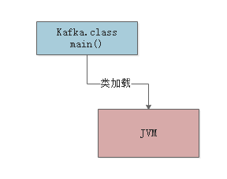
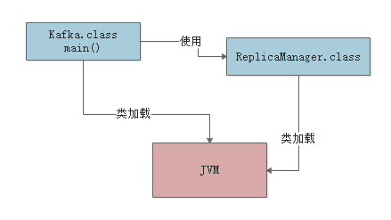
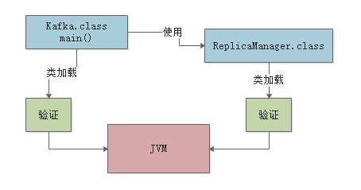
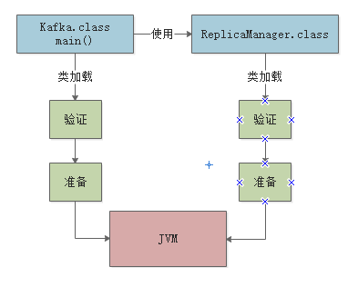
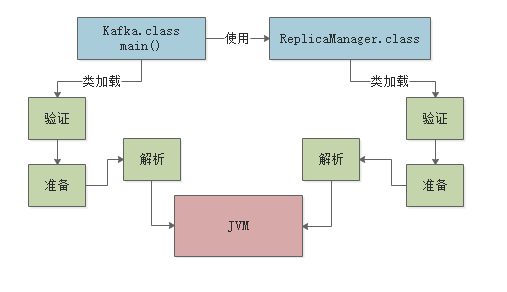
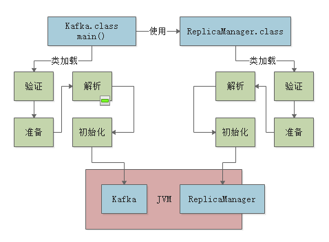
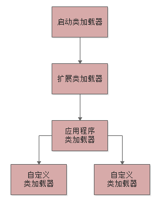
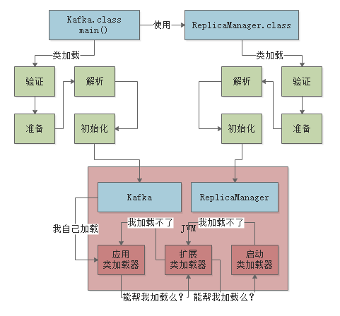

## 类加载器和双亲委派模型

### 003、类的加载
#### JVM在什么情况下会加载一个类？
其实类加载过程非常的琐碎复杂，但是对于我们平时从工作中实用角度来说，主要是把握他的核心工作原理就可以。

一个类从加载到使用，一般会经历下面的这个过程：

**加载->验证->准备->解析->初始化->使用->卸载**

所以首先要搞明白的第一个问题，就是JVM在执行我们写好的代码的过程中，一般什么情况下会加载一个类呢？也就是说，啥时候会从".class"字节码文件中加载这个类到JVM内存里来。

<font color=red>其实答案非常简单：**就是在你的代码中用到这个类的时候**</font>

举个简单的栗子，比如下面你有一个类（Kafka.class）,里面有一个main()方法作为主入口。
那么一旦你的JVM进程启动之后，它一定会先把你的这个类(Kafka.class)加载到内存里，然后从"main()"方法的入口代码开始执行。
```java
public class Kafka{
    public static void main(){

    }
}
```


```java
public class Kafka{
    public static void main(){
        ReplicaManager replicaManager = new ReplicaManager();
    }
}
```
这时可能大家就想了，你的代码中明显需要使用ReplicaManager这个类去实例化一个对象，此时必须得把ReplicaManager.class这个字节码文件中的这个类加载到内存里来啊！

所以这个时候就会触发JVM通过类加载器，从ReplicaManager.class字节码文件中加载对应的类到内存里来使用，这样代码才能跑起来。

我们来看下面的图：


总结下：首先你的代码中包含"main()"方法的主类一定会在JVM进程启动之后被加载到内存，开始执行你的main()方法中的代码接着遇到需要使用了别的类，比如"ReplicaManager"，此时就会从对应的".class"字节码文件加载对一个的类到内存里来。

#### 2.3、从实用角度出发，来看看验证、准备和初始化的过程
其实上面的类加载时机的问题，对于很多由经验的同学来说都不是什么问题。

从实用角度出来，过一下另外三个概念：
##### 2.4、验证、准备、解析
###### 2.4.1、验证阶段
简单来说，这一步就是根据Java虚拟机规范，来校验你加载进来的.class文件中的内容，是否符合制定的规范。

这个相信很好理解，假如说，你的“.class”文件被人篡改了，里面的字节码压根儿不符合规范，那么JVM是没法去执行这个字节码的！

所以把.class加载到内存里之后，必须先验证以下，校验他必须完全符合JVM，后续才能交给JVM来运行。

下面用一张图，展示这个过程：


###### 2.4.2、准备阶段
这个阶段其实也很好理解，咱们都知道，我们写好的那些类，其实都有一些类变量

比如下面的这个"ReplicaManager"类：

```java
public class ReplicaManager{
    public static int flushInterval;
}
```
假设你有这么一个"ReplicaManager"类，他的ReplicaManager.class文件内容刚刚被加载到内存之后，会进行验证，确认这个字节码文件的内容是规范的。

接着就会进行准备工作。

这个准备工作，其实就是给这个"ReplicaManager"类分配一定的内存空间。

然后给他里面的 **类变量** （也就是static修饰的变量）分配内存空间，来一个默认的初始值。

比如上面的示例里，就会给flushInterval这个类变量分配内存空间，给一个"0"这个初始值。

这个过程，如下图所示：



###### 2.4.3、解析阶段
这个阶段的事，实际上就是把 **符号引用替换为直接引用** 的过程。



###### 2.4.4、三个阶段的小结
其实这三个阶段里，最核心的大家务必关注的，就是 **"准备阶段"**

因为这个阶段是给加载进来的类分配好了内存空间，类变量也分配好了内存空间，并且给了默认的初始值。

#### 2.5、核心阶段：初始化
前面说过，在准备阶段，就会把我们的"ReplicaManager"类给分配好内存空间

另外它的一个类变量（Static变量）"flushInterval"也给一个默认的初始值"0",那么接下来，在初始化阶段，就会正式执行我们的类初始化的代码了。

**那么什么是类的初始化的代码呢？** 我们来看看下面这段代码：
```java
public class ReplicaManager{
    public static int flushInterval = Configuration.getInt("replica.flush.interval");
}
```
大家可以看到，对于flushInterval这个类变量，我们是打算通过 Configuration.getInt("replica.flush.interval")这段代码来获取一个值，并且赋值给他的。

但是在 **准备阶段会执行这个赋值逻辑吗？**

**NO!** 在准备阶段，仅仅是给flushInterval类变量开辟一个内存空间，然后给个初始值"0"罢了。

那么这段赋值的代码什么时候执行呢？ 答案是在" **初始化**"阶段来执行。

在这个阶段，就会执行类的初始化代码，比如上面的  Configuration.getInt("replica.flush.interval")  代码就会在这里执行，完成一个配置项的读取，然后赋值给这个类变量“flushInterval”。

另外比如下图的static静态代码块，也会在这个阶段来执行。

类似下面的代码语义，可以理解为类初始化的时候，调用“loadReplicaFromDish()”方法从磁盘中加载数据副本，并且放在静态变量“replicas”中：
```java
public class ReplicaManager{
    public static int flushInterval = Configuration.getInt("replica.flush.interval");

    public static Map<String,Replica>replicas;

    static{
        loadReplicaFromDish();
    }

    public static void loadReplicaFromDish(){
        this.replicas = new HashMap<string,Replica>();
    }
}
```
那么搞明白了类的初始化是什么，就得来看看类的初始化规则了。

<font color=red> **什么时候会初始化一个类？**</font>
一般有以下这些时机：

- 比如"new ReplicaManager()"来实例化类的对象了，此时就会触发类的加载到初始化的全过程，把这个类准备好，然后再实例化一个对象出来；
- 包含main()方法的主类，必须立马初始化的。
- 如果初始化一个类的时候，发现父类还没有初始化，那么必须先初始化它的父类。比如
```java
public class ReplicaManager extends AbstractDataManager{
    public static int flushInterval = Configuration.getInt("replica.flush.interval");

    public static Map<String,Replica>replicas;

    static{
        loadReplicaFromDish();
    }

    public static void loadReplicaFromDish(){
        this.replicas = new HashMap<string,Replica>();
    }
}
```
如果你要new ReplicaManager()初始化这个类的实例，那么会加载这个类，然后初始化这个类

但是初始化这个类之前，发现AbstractDataManager作为父类还没加载和初始化，那么必须先加载这个父类，并且初始化这个父类。

这个规则，大家必须得牢记，再来一张图，借助图片来进行理解：


#### 2.5、类加载器和双亲委派机制

##### 2.5.1、启动类加载器
**Boostrap ClassLoader, **他主要是负责加载我们再机器上安装的java目录下的核心类的

相信大家都知道，如果你要在一个机器上运行自己写好的Java系统，无论是windows笔记本，还是linux服务器，是不是都得装一下JDK？

那么在你的Java安装目录下，就有一个“lib”目录，大家可以自己去找找看，这里就有Java最核心的一些类库，支撑你的Java系统的运行。

所以一旦你的JVM启动，那么首先就会依托启动类加载器，去加载你的Java安装目录下的“lib”目录中的核心类库。

##### 2.5.2、扩展类加载器
Extension ClassLoader，这个类加载器其实也是类似的，就是你的Java安装目录下，有一个“lib\ext”目录

这里面有一些类，就是需要使用这个类加载器来加载的，支撑你的系统的运行。

那么你的JVM一旦启动，是不是也得从Java安装目录下，加载这个“lib\ext”目录中的类？

##### 2.5.3、应用类程序加载器
Application ClassLoader，这类加载器就负责去加载“ClassPath”环境变量所指定的路径中的类

其实你大致就理解为去加载你写好的Java代码吧，这个类加载器就负责加载你写好的那些类到内存里。

##### 2.5.4、自定义类加载器
除了上面那几种之外，还可以自定义类加载器，去根据你自己的需求加载你的类。

##### 2.5.5、双亲委派机制
JVM的类加载器是有亲子层级结构的，就是说启动类加载器是最上层的，扩展类加载器在第二层，第三层是应用程序类加载器，最后一层是自定义类加载器。

大家看下图：


然后，基于这个亲子层级结构，就有一个 **双亲委派的机制**

什么意思呢？

就是假设你的应用程序类加载器需要加载一个类，他首先会委派给自己的父类加载器去加载，最终传导到顶层的类加载器去加载

但是如果父类加载器在自己负责加载的范围内，没找到这个类，那么就会下推加载权利给自己的子类加载器。

听完了上面一大堆绕口令，是不是很迷茫？别着急，咱们用一个例子来说明一下。

比如你的JVM现在需要加载“ReplicaManager”类，此时应用程序类加载器会问问自己的爸爸，也就是扩展类加载器，你能加载到这个类吗？

然后扩展类加载器直接问自己的爸爸，启动类加载器，你能加载到这个类吗？

启动类加载器心想，我在Java安装目录下，没找到这个类啊，自己找去！

然后，就下推加载权利给扩展类加载器这个儿子，结果扩展类加载器找了半天，也没找到自己负责的目录中有这个类。

这时他很生气，说：明明就是你应用程序加载器自己负责的，你自己找去。

然后应用程序类加载器在自己负责的范围内，比如就是你写好的那个系统打包成的jar包吧，一下子发现，就在这里！然后就自己把这个类加载到内存里去了。

**这就是所谓的双亲委派模型：先找父亲去加载，不行的话再由儿子来加载。**

**这样的话，可以避免多层级的加载器结构重复加载某些类。**

最后，给大家来一张图图，感受一下类加载器的双亲委派模型。

