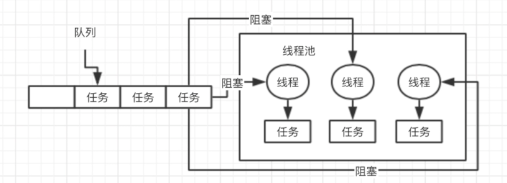

# 线程池

## 面试题：线程池的底层工作原理
原因： 频繁的创建线程、销毁线程，创建线程、销毁线程
使用：
```java
ExecutorService threadPool = Exectors.newFixedThreadPool(3);
threadPool.submit(new Callable(){
    public void call(){}
});
```

1. 首先提交任务，先看下线程池里的线程数量是否小于corePoolSize，也就是3，如果小于，直接创建一个线程出来执行你的任务
2. 如果执行完任务，这个线程不会被销毁，它会尝试从一个无界的LinkedBlockingQueue里获取新的任务，如果没有新的任务，此时就会阻塞住，等待新的任务到来。
3. 如果继续提交任务，上述流程反复执行，只要线程池的线程数量小于corePoolSize，都会直接创建新线程来执行这个任务。如果线程池中线程执行完任务就会尝试从无界队列中获取任务，直到线程池里由corePoolSize个线程。
4. 接着再次提交任务，会发现线程数量已经跟corePoolSize里一样大了，此时就会直接把任务放入队列中就可以了，线程会争抢获取任务执行的，如果所有的线程此时都在执行任务，那么无界队列里的任务可能会越来越多。

fixed,队列，LinkedBlockingQueue 无界阻塞队列


## 面试题：那你再说说线程池的核心参数是干什么的？平时我们该怎么用？
### 以newFixedThreadPool(3)为例
```java
//调用executors.newFixedThreadPool()之后的逻辑
return new ThreadPoolExecutor(nThreads,
    nThreads,
    0L,
    Timeunit.MILLISECONDS,
    new LinkedBlockingQueue());
```
创建一个线程池就是这个样子的：corePoolSize、maximumPoolSize、keepAliveTime、queue这几个东西，如果你不用fixed之类的线程池，自己完全可以通过这个构造函数就创建自己的线程池。

> corePoolSize:3
> maximumPoolSize: Integer.MAX_VALUE
> keepAliveTime:60s
> new ArrayBlockingQueue<Rnnable>(200)

#### 如果queue 为有界队列的情况 比如：new ArrayBlockingQueue<>(200)，那么假设corePoolSize个线程都在繁忙的工作，此时大量任务进入有界队列，队列满了，此时怎么办？
- 假如这个时候设置maximumPoolSize是比corePoolSize大的，此时会继续创建额外的线程放入线程池里，来处理这些任务，然后超过corePoolSize数量的线程，如果处理完一个任务也会尝试从队列里去获取任务来执行。
- 如果额外的线程都创建完了去处理任务，队列还是满的，此时如果还有新的任务来了怎么办？
    + 只能reject掉，它有集中reject策略，可以传入RejectedExecutionHandler
        * (1)AborPolicy
        * (2)DiscardPolicy
        * (3)DiscardOldestPolicy
        * (4)CallerRunsPolicy
        * (5)自定义
- 如果后续慢慢的队列里没有任务了，线程空闲了，超过corePoolSize的线程会自动释放掉，在keepAliveTime之后就会释放掉

根据上述原理去定制自己的线程池，考虑到corePoolSize的数量，队列类型，最大线程数量，拒绝策略，线程释放时间。

一般比较常用的是fixedThreadPool() ,因为它只会创建corePoolSize数量的核心线程（corePoolSize==maximumPoolSize）,使用无界队列，如果瞬时核心线程无法处理，新来的任务都会进入无界队列。

## 面试题：如果在线程中使用无界阻塞队列会发生什么问题？
变形面试题： **在远程服务异常的情况下，使用无界阻塞队列，是否会导致内存异常飙升？**

远程服务异常其实就是调用远程服务超时，然后就可能导致队列里积压的任务越来越多，因为一旦远程服务调用异常，核心线程每次处理任务都会等待超时，核心线程处理任务的速度就会很慢很慢，然后任务产生的速度又很快，这样就会到导致队列积压任务，而此时有采用的是无界队列，如果队列变得越来越大，此时会导致内存飙升起来，而且还可能会导致OOM内存溢出。

## 面试题：你知道如果线程池队列满了之后，会发生什么事情吗？
首先使用有界队列(比如ArrayBlockingQueue),可以避免内存溢出。

- 情况一
也就是当有界队列满了之后，可以创建无限制的线程，可能会因为线程数太多，系统奔溃掉。
```java
corePoolSize:10
maximumPoolSize:Integer.MAX_VALUE
ArrayBlockingQueue(200)
```
如果此时你可以无限制的不停的创建额外的线程出来，这样一台机器上，就会又上千个线程，甚至是上万个线程，但是每个线程都有自己的线程栈(线程栈都有自己的栈内存)，占用一定的内存资源，会导致内存资源耗尽，系统也会奔溃掉。

即使内存没有奔溃，也会导致你的机器的cpu load，cpu负载特别的高。

- 情况二
```java
corePoolSize:10
maximumPooSize:200
ArrayBlockingQueue(200)
```
对情况一的一个改进，如果ArrayBlockingQueue队列满了之后也最多只会创建200个线程。

**但是如果corePoolSize满了，ArrayBlockingQueue满了，maximumPoolSize也满了，就有可能导致很多任务被拒绝掉。** 那这样就会导致很多任务就没法执行了。

有界无界的对比

- 用无界队列就有可能导致内存耗尽；
- 如果使用有界队列，让他无限制的创建线程也会导致线程太多，cpu负载太高，也会把内存耗尽

使用场景：

- 瞬时会导致很多任务过来：这个时候可以考虑使用无界队列来处理。
- 如果说是任务会一瞬间就过来，但是不会无穷无尽的过来，过一会就消失了。应该不会导致无界队列里的内存越来越多，使用无界队列未尝不可
- 如果是任务瞬时过来有可能把内存给压垮，这个时候就只能使用有界队列，与此同时也可以把maximunPoolSize同时设置一下（注意不能设置为Integer.MAX_VALUE,无限制的创建线程），设置为一个相对较大的线程数，这样可以在瞬时任务比较多的情况，创建比较多的额外线程，来处理。如果是在撑不过去，可以设置下reject()策略。
- 定义一个reject策略，如果线程池无法执行更多的任务了，此时可以把这个任务信息持久化写入磁盘里去，后台专门启动一个线程，后续等待你的线程池的工作负载降低了，他可以慢慢的从磁盘里读取之前持久化的任务，重新提交到线程池里去执行。

## 如果现场机器突然宕机，线程池的阻塞队列中的请求怎么办？
必然会导致线程池里积压的任务实际上来说会丢失掉的。

如果说你要提交一个任务到线程池里去，在提交之前，先在数据库里插入这个任务的信息，更新他的状态：未提交、已提交，已完成。提交成功之后，更新它的状态是已提交状态

系统重启，启动一个后台线程去扫描数据库里的未提交和已提交状态的任务，可以把任务的信息读取出来，重新提交到线程池里去，继续进行执行。


