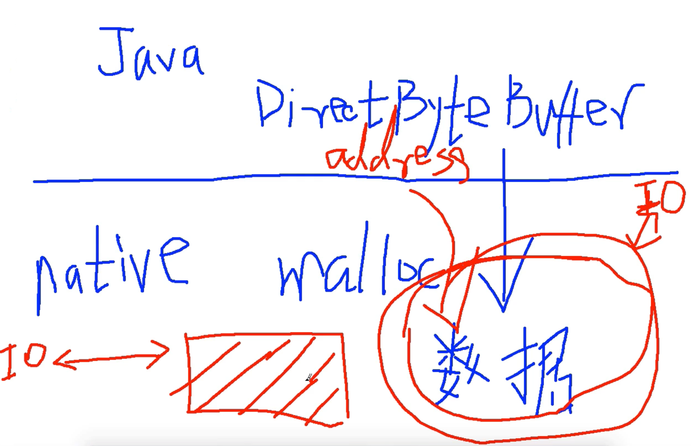

# 零拷贝

## 38、NIO堆外内存与零拷贝深入讲解
## 49、零拷贝深入剖析及用户空间与内核空间切换方式
## 50、零拷贝实例深度剖析
## 51、NIO零拷贝彻底分析与Gather操作在零拷贝中的作用详解

***
## 38、NIO堆外内存与零拷贝深入讲解
详情见例子：
```java
public class demo {
    public static void main(String[] args) {
        ByteBuffer.allocate(512);
        ByteBuffer.allocateDirect(512);
    }
}
```
**对于ByteBuffer分配堆（heap）内存 ByteBuffer.allocate()**
```java
public static ByteBuffer allocate(int capacity) {
        if (capacity < 0)
            throw new IllegalArgumentException();
        return new HeapByteBuffer(capacity, capacity);
}
//最终new HeapByteBuffer（），HeapByteBuffer是new出来的存在与JVM堆

HeapByteBuffer(int cap, int lim) {            // package-private
        super(-1, 0, lim, cap, new byte[cap], 0);
        /*
        hb = new byte[cap];
        offset = 0;
        */
    }
//最终调用Buffer的构造函数
    Buffer(int mark, int pos, int lim, int cap) {       // package-private
        if (cap < 0)
            throw new IllegalArgumentException("Negative capacity: " + cap);
        this.capacity = cap;
        limit(lim);
        position(pos);
        if (mark >= 0) {
            if (mark > pos)
                throw new IllegalArgumentException("mark > position: ("
                                                   + mark + " > " + pos + ")");
            this.mark = mark;
        }
    }
```
**对与ByteBuffer分配堆外内存ByteBuffer.allocateDirect()**
```java
/**
* ByteBuffer.allocateDirect() 会 new DirectByteBuffer()
* new出来的DirectByteBuffer是分配在堆内存上的
**/
public static ByteBuffer allocateDirect(int capacity) {
        return new DirectByteBuffer(capacity);
    }
//调用构造函数
//在构造函数中调用unsafe.setMemory()在堆外分配内存
DirectByteBuffer(int cap) {                   // package-private
        super(-1, 0, cap, cap);
        boolean pa = VM.isDirectMemoryPageAligned();
        int ps = Bits.pageSize();
        long size = Math.max(1L, (long)cap + (pa ? ps : 0));
        Bits.reserveMemory(size, cap);

        long base = 0;
        try {
            base = unsafe.allocateMemory(size);
        } catch (OutOfMemoryError x) {
            Bits.unreserveMemory(size, cap);
            throw x;
        }
        unsafe.setMemory(base, size, (byte) 0);
        if (pa && (base % ps != 0)) {
            // Round up to page boundary
            address = base + ps - (base & (ps - 1));
        } else {
            address = base;
        }
        cleaner = Cleaner.create(this, new Deallocator(base, size, cap));
        att = null;
    }
```

### 分配堆外内存DirectByteBuffer的过程及内容
- 先new一个对象 new DirectByteBuffer(),这个对象存在与JVM内存中
- 这个对象的构造函数会调用unsafe.setMemory()方法在堆外分配内存用于存放后续的数据，
- 这部分的内存是不在JVM的heap堆内存上的

> **那么问题来了：DirectByteBuffer这个对象怎么找到堆外内存的地址的呢？或者问在DirectByteBuffer这个对象哪个变量会引用分配在堆外内存的数据呢？**
> DirectByteBuffer extends MappedByteBuffer ,MappedByteBuffer extends ByteBuffer, ByteBuffer extends Buffer。
> 在Buffer抽象类中有一个变量 long address.
> 具体的继承逻辑常见下面代码

```java
class DirectByteBuffer
    extends MappedByteBuffer
    implements DirectBuffer
{
    ...
}
```
```java
//A direct byte buffer whose content is a memory-mapped region of a file.
public abstract class MappedByteBuffer
    extends ByteBuffer
{
}
```
```java
public abstract class ByteBuffer
    extends Buffer
    implements Comparable<ByteBuffer>
{}
```

```java
//A container for data of a specific primitive type.
public abstract class Buffer {
    /**
     * The characteristics of Spliterators that traverse and split elements
     * maintained in Buffers.
     */
    static final int SPLITERATOR_CHARACTERISTICS =
        Spliterator.SIZED | Spliterator.SUBSIZED | Spliterator.ORDERED;

    // Invariants: mark <= position <= limit <= capacity
    private int mark = -1;
    private int position = 0;
    private int limit;
    private int capacity;

    // Used only by direct buffers
    // NOTE: hoisted here for speed in JNI GetDirectBufferAddress
    long address;
}
```

HeapByteBuffer其实也可以叫非直接ByteBuffer, 因为堆外内存又叫DirectByteBuffer。

那么DirectByteBuffer为什么又叫直接缓冲区，因为DirectByteBuffer可以直接和操作系统打交道，即操作系统可以直接将这部分数据拷贝到IO设备，少了一次数据拷贝的过程。也叫零拷贝。

如果使用HeapByteBuffer，实际在进行IO操作的时候，比DirectByteBuffer多了一个数据拷贝的过程，会把JVM堆内存的中直接数组中的内容拷贝java内存结构之外的内存区域，这块区域可以直接和我们的IO设备进行交互

> 问题又来了：为什么操作系统不直接操作JVM堆内存上的直接数组(数据)呢？
> 操作系统并不是不能访问这块数据的，相反在内核态下，操作系统是能访问任何一块内存区域的。
> 问题又来了，既然可以访问，那么直接访问不就好了，为什么要拷贝一次呢？
> 因为和IO打交道，访问内容都是通过JNI的方式访问，访问内存区域的数据的前提就是，数据的内存地址是确定的，可能存在一种情况就是，当你正在访问这块内存区域的时候，发生了垃圾回收GC，YGC的垃圾算法，一般都是使用标记清除压缩算法，压缩就涉及到对象的移动，移动的目的就是为了获得完整连续的内存空间，能容纳一个大的java对象，如果JNI正在访问这块内存的话，发生GC，则整个数据都乱套了，很可能出现OutOfMemory这样的错误。
> 那么就有两个解决方案：一种就是让JNI访问的内存区域固定不动，这样就会影响到整个JVM GC
> 第二种就是将数据拷贝到堆外内存，这个拷贝过程是非常快的（相对于IO操作而言，纯内存操作是相当快的），这种拷贝性交比是很高的。
> 这块拷贝的内存区域什么时候会被释放呢？
> 操作系统使用完就会释放。


### 堆外内存什么时候会被释放呢？
因为address维护这堆外内存的引用，而DirectByteBuffer这个对象位于Java堆上面，当DirectByteBuffer被回收掉的时候，就会根据address找到堆外的内存区域，然后通过JNI的方式把堆外内存给回收掉。不会出现内存泄露。

**在DirectByteBuffer的构造函数中会生成一个cleaner对象**
```java
cleaner = Cleaner.create(this, new Deallocator(base, size, cap));
```

```java
private static class Deallocator
        implements Runnable
    {
        private static Unsafe unsafe = Unsafe.getUnsafe();
        private long address;
        private long size;
        private int capacity;

        private Deallocator(long address, long size, int capacity) {
            assert (address != 0);
            this.address = address;
            this.size = size;
            this.capacity = capacity;
        }

        public void run() {
            if (address == 0) {
                // Paranoia
                return;
            }
            unsafe.freeMemory(address);
            address = 0;
            Bits.unreserveMemory(size, capacity);
        }

    }
```

### 总结
DirectByteBuffer是存储在Java堆上的，就是一个标准的java对象，但是持有一个java堆外内存的一个应用--直接内存模型。

在直接内存模型出现之前，是有一种非直接内存模型，就是操作系统要使用java堆内存上的数据，需要将内存上的数据拷贝一份到堆外内存上用于操作系统和IO设备交互。

直接内存模型实现了zero-copy,零拷贝。


