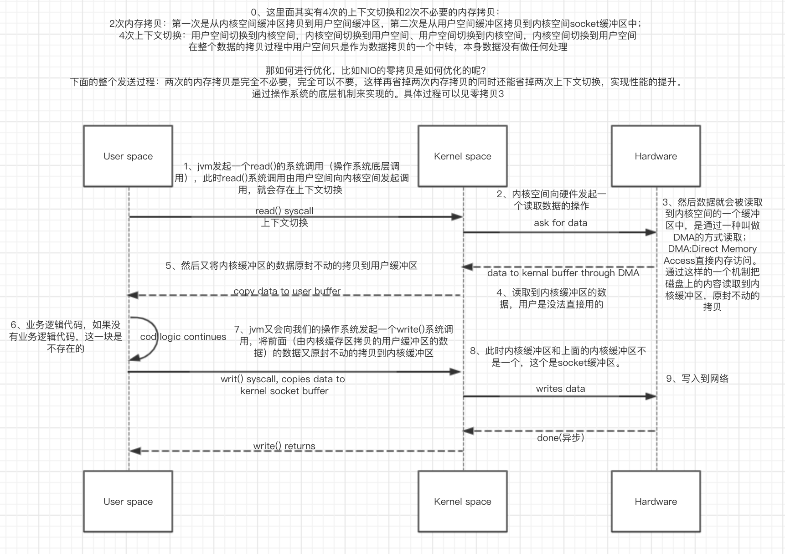
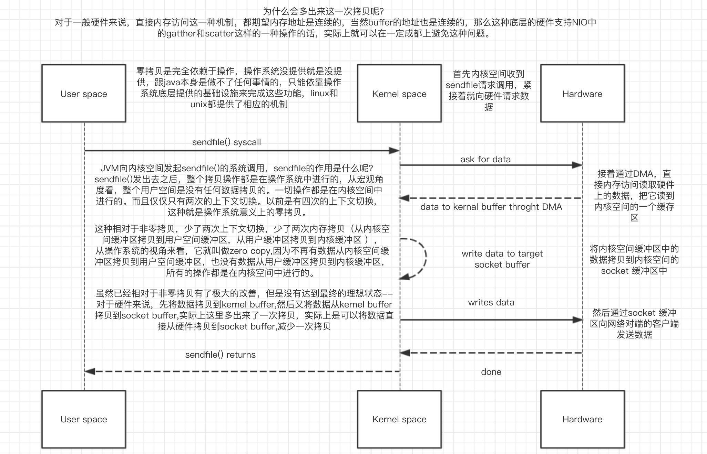
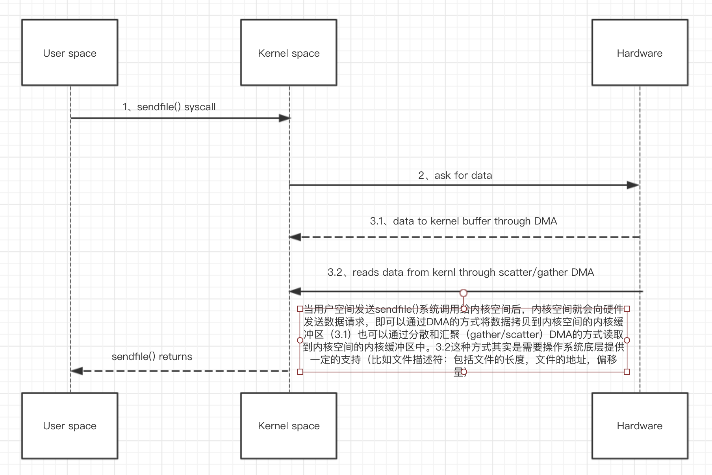
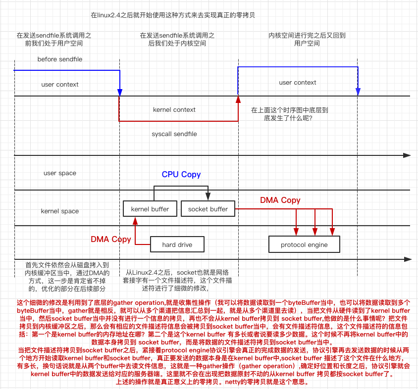

## 零拷贝
- 38、NIO堆外内存与零拷贝深入讲解
- 49、零拷贝深入剖析及用户空间与内核空间的切换方式
- 50、NIO零拷贝实例深度剖析
- 51、NIO零拷贝彻底分析与Gather操作在零拷贝中的作用详解
***

###1、NIO堆外内存与零拷贝深入讲解
详情见例子：
```java
public class demo {
    public static void main(String[] args) {
        ByteBuffer.allocate(512);
        ByteBuffer.allocateDirect(512);
    }
}
```
**对于ByteBuffer分配堆（heap）内存 ByteBuffer.allocate()**
```java
public static ByteBuffer allocate(int capacity) {
        if (capacity < 0)
            throw new IllegalArgumentException();
        return new HeapByteBuffer(capacity, capacity);
}
//最终new HeapByteBuffer（），HeapByteBuffer是new出来的存在与JVM堆

HeapByteBuffer(int cap, int lim) {            // package-private
        super(-1, 0, lim, cap, new byte[cap], 0);
        /*
        hb = new byte[cap];
        offset = 0;
        */
    }
//最终调用Buffer的构造函数
    Buffer(int mark, int pos, int lim, int cap) {       // package-private
        if (cap < 0)
            throw new IllegalArgumentException("Negative capacity: " + cap);
        this.capacity = cap;
        limit(lim);
        position(pos);
        if (mark >= 0) {
            if (mark > pos)
                throw new IllegalArgumentException("mark > position: ("
                                                   + mark + " > " + pos + ")");
            this.mark = mark;
        }
    }
```
**对与ByteBuffer分配堆外内存ByteBuffer.allocateDirect()**
```java
/**
* ByteBuffer.allocateDirect() 会 new DirectByteBuffer()
* new出来的DirectByteBuffer是分配在堆内存上的
**/
public static ByteBuffer allocateDirect(int capacity) {
        return new DirectByteBuffer(capacity);
    }
//调用构造函数
//在构造函数中调用unsafe.setMemory()在堆外分配内存
DirectByteBuffer(int cap) {                   // package-private
        super(-1, 0, cap, cap);
        boolean pa = VM.isDirectMemoryPageAligned();
        int ps = Bits.pageSize();
        long size = Math.max(1L, (long)cap + (pa ? ps : 0));
        Bits.reserveMemory(size, cap);

        long base = 0;
        try {
            base = unsafe.allocateMemory(size);
        } catch (OutOfMemoryError x) {
            Bits.unreserveMemory(size, cap);
            throw x;
        }
        unsafe.setMemory(base, size, (byte) 0);
        if (pa && (base % ps != 0)) {
            // Round up to page boundary
            address = base + ps - (base & (ps - 1));
        } else {
            address = base;
        }
        cleaner = Cleaner.create(this, new Deallocator(base, size, cap));
        att = null;
    }
```

#### 1.1、分配堆外内存DirectByteBuffer的过程及内容
- 先new一个对象 new DirectByteBuffer(),这个对象存在与JVM内存中
- 这个对象的构造函数会调用unsafe.setMemory()方法在堆外分配内存用于存放后续的数据，
- 这部分的内存是不在JVM的heap堆内存上的

> **那么问题来了：DirectByteBuffer这个对象怎么找到堆外内存的地址的呢？或者问在DirectByteBuffer这个对象哪个变量会引用分配在堆外内存的数据呢？**
> DirectByteBuffer extends MappedByteBuffer ,MappedByteBuffer extends ByteBuffer, ByteBuffer extends Buffer。
> 在Buffer抽象类中有一个变量 long address.
> 具体的继承逻辑常见下面代码

```java
class DirectByteBuffer
    extends MappedByteBuffer
    implements DirectBuffer
{
    ...
}
```
```java
//A direct byte buffer whose content is a memory-mapped region of a file.
public abstract class MappedByteBuffer
    extends ByteBuffer
{
}
```
```java
public abstract class ByteBuffer
    extends Buffer
    implements Comparable<ByteBuffer>
{}
```

```java
//A container for data of a specific primitive type.
public abstract class Buffer {
    /**
     * The characteristics of Spliterators that traverse and split elements
     * maintained in Buffers.
     */
    static final int SPLITERATOR_CHARACTERISTICS =
        Spliterator.SIZED | Spliterator.SUBSIZED | Spliterator.ORDERED;

    // Invariants: mark <= position <= limit <= capacity
    private int mark = -1;
    private int position = 0;
    private int limit;
    private int capacity;

    // Used only by direct buffers
    // NOTE: hoisted here for speed in JNI GetDirectBufferAddress
    long address;
}
```

HeapByteBuffer其实也可以叫非直接ByteBuffer, 因为堆外内存又叫DirectByteBuffer。

那么DirectByteBuffer为什么又叫直接缓冲区，因为DirectByteBuffer可以直接和操作系统打交道，即操作系统可以直接将这部分数据拷贝到IO设备，少了一次数据拷贝的过程。也叫零拷贝。

如果使用HeapByteBuffer，实际在进行IO操作的时候，比DirectByteBuffer多了一个数据拷贝的过程，会把JVM堆内存的中直接数组中的内容拷贝java内存结构之外的内存区域，这块区域可以直接和我们的IO设备进行交互

> 问题又来了：为什么操作系统不直接操作JVM堆内存上的直接数组(数据)呢？
> 操作系统并不是不能访问这块数据的，相反在内核态下，操作系统是能访问任何一块内存区域的。
> 问题又来了，既然可以访问，那么直接访问不就好了，为什么要拷贝一次呢？
> 因为和IO打交道，访问内容都是通过JNI的方式访问，访问内存区域的数据的前提就是，数据的内存地址是确定的，可能存在一种情况就是，当你正在访问这块内存区域的时候，发生了垃圾回收GC，YGC的垃圾算法，一般都是使用标记清除压缩算法，压缩就涉及到对象的移动，移动的目的就是为了获得完整连续的内存空间，能容纳一个大的java对象，如果JNI正在访问这块内存的话，发生GC，则整个数据都乱套了，很可能出现OutOfMemory这样的错误。
> 那么就有两个解决方案：一种就是让JNI访问的内存区域固定不动，这样就会影响到整个JVM GC
> 第二种就是将数据拷贝到堆外内存，这个拷贝过程是非常快的（相对于IO操作而言，纯内存操作是相当快的），这种拷贝性交比是很高的。
> 这块拷贝的内存区域什么时候会被释放呢？
> 操作系统使用完就会释放。

#### 1.2、堆外内存什么时候会被释放呢？
因为address维护这堆外内存的引用，而DirectByteBuffer这个对象位于Java堆上面，当DirectByteBuffer被回收掉的时候，就会根据address找到堆外的内存区域，然后通过JNI的方式把堆外内存给回收掉。不会出现内存泄露。

**在DirectByteBuffer的构造函数中会生成一个cleaner对象**
```java
cleaner = Cleaner.create(this, new Deallocator(base, size, cap));
```

```java
private static class Deallocator
        implements Runnable
    {
        private static Unsafe unsafe = Unsafe.getUnsafe();
        private long address;
        private long size;
        private int capacity;

        private Deallocator(long address, long size, int capacity) {
            assert (address != 0);
            this.address = address;
            this.size = size;
            this.capacity = capacity;
        }

        public void run() {
            if (address == 0) {
                // Paranoia
                return;
            }
            unsafe.freeMemory(address);
            address = 0;
            Bits.unreserveMemory(size, capacity);
        }

    }
```

#### 1.3总结
DirectByteBuffer是存储在Java堆上的，就是一个标准的java对象，但是持有一个java堆外内存的一个应用--直接内存模型。

在直接内存模型出现之前，是有一种非直接内存模型，就是操作系统要使用java堆内存上的数据，需要将内存上的数据拷贝一份到堆外内存上用于操作系统和IO设备交互。

直接内存模型实现了zero-copy,零拷贝。


### 2、零拷贝深入剖析及用户空间与内核空间的切换方式
**需求：对于将操作系统中的文件通过网络发送出去这种情况。操作系统底层到底会发生什么？**

linux操作系统分为两个空间：用户空间User space、内核空间Kernel space。但凡涉及到IO操作，都会调用底层系统的操作。底层都是一个native方法。

#### 2.1、非零拷贝过程如下图：


#### 2.2、NIO零拷贝过程如下图：


#### 2.3、改进后NIO零拷贝过程如下图：


#### 2.4、内存映射MappedByteBuffer改进NIO零拷贝
以上的零拷贝zerocopy都会存在一些问题，或者说是一些在实际开发过程中让我们感到困惑的地方，因为在整个用户空间向内核空间发送一个sendfile()系统调用之后，后续的所有操作都是在内核空间中进行的，只是结束之后才sendfile()才返回，中间这个整个过程用户是没有办法直接参与到这个过程当中的，相当于说这部分对于用户来说是一个黑盒，用户只知道发出一个调用，等待一个结果返回就结束了，那么用户空间是没有办法直接参与的。

那么这种情况下，那么在中间的某一个过程中用户需要直接参与怎么办？

**那这个时候就会用到之前将的内存映射缓存MappedByteBuffer**,内存映射的作用：就是将操作系统硬盘的文件把它的内容映射到我们的内存当中，修改内存就相当于会修改硬盘上的文件。其实是通过这种方式加以实现的。

**内存映射文件是如何做到这一点的？那么这种内存映射的方式可以通过代码的方式可以将文件的内容映射到内核的内存空间当中，然后可以直接的去访问它，访问它就好像是它在用户空间当中一样**，这样也可以减少不必要的内存拷贝，为什么？因为通常情况下，我们需要修改和访问一个文件，必须在用户空间上进行，但是现在呢，我将这个文件的内容映射到内核空间里，然后呢我可以让程序直接访问内核空间里的文件，就好像这个文件是在用户空间一样。只不过是操作系统底层提供了这样的支持。

**但是说这种内存映射就是一定性能最好的**，在java中就是通过MappedByteBuffer这个组件来帮助我们实现内存映射的。
java提供了一些零拷贝的API,比如tansfrom ,tansfoTo

### 3、NIO零拷贝实例深度剖析
**非零拷贝方式实现：**
```java
public class OldClient {
    public static void main(String[] args) throws IOException {
        Socket socket = new Socket("localhost", 8899);
        String fileName = "/Users/liaomengjie/Desktop/file.tgz";
        InputStream inputStream = new FileInputStream(fileName);

        DataOutputStream dataOutputStream = new DataOutputStream(socket.getOutputStream());

        byte[] buffer = new byte[4096];
        long readCount;
        long total = 0;
        long startTime = System.currentTimeMillis();

        while((readCount = inputStream.read(buffer)) >= 0){
            total += readCount;
            dataOutputStream.write(buffer);
        }
        System.out.println("发送总字节数："+total+",耗时："+(System.currentTimeMillis()-startTime));
        dataOutputStream.close();
    }
}
```
```java
public class OldServer {
    public static void main(String[] args) throws IOException {
        ServerSocket serverSocket = new ServerSocket(8899);

        while(true){
            //Listens for a connection to be made to this socket and accepts
            //     * it. The method blocks until a connection is made.
            Socket socket = serverSocket.accept();
            DataInputStream dataInputStrem = new DataInputStream(socket.getInputStream());

            byte[] byteArray = new byte[4096];
            while(true){
                int readCount = dataInputStrem.read(byteArray, 0, byteArray.length);

                if(-1 == readCount){
                    break;
                }
            }
        }
    }
}
```
**零拷贝的方式实现：**
```java
public class NewIOClient {
    public static void main(String[] args) throws IOException {
        SocketChannel socketChannel = SocketChannel.open();
        socketChannel.connect(new InetSocketAddress("localhost",8899));
        socketChannel.configureBlocking(true);

        String fileName = "";

        FileChannel fileChannel = new FileInputStream(fileName).getChannel();
        long startTime = System.currentTimeMillis();
        //* <p> This method is potentially much more efficient than a simple loop
        //     * that reads from this channel and writes to the target channel.  Many
        //     * operating systems can transfer bytes directly from the filesystem cache
        //     * to the target channel without actually copying them.  </p>
        long transferCount = fileChannel.transferTo(0, fileChannel.size(), socketChannel);
        System.out.println("发送总字节数："+transferCount+",耗时："+(System.currentTimeMillis()-startTime));
        fileChannel.close();
    }
}
```
```java
public class NewIoServer {
    public static void main(String[] args) throws IOException {
        InetSocketAddress address = new InetSocketAddress(8899);
        ServerSocketChannel serverSocketChannel = ServerSocketChannel.open();
        ServerSocket serverSocket = serverSocketChannel.socket();
        serverSocket.bind(address);

        ByteBuffer byteBuffer = ByteBuffer.allocate(4096);

        while(true){
            SocketChannel socketChannel = serverSocketChannel.accept();
            //为什么要设置位阻塞
            socketChannel.configureBlocking(true);
            int readCount =0 ;
            while(-1!=readCount){
                readCount = socketChannel.read(byteBuffer);
            }
            byteBuffer.rewind();
        }
    }
}
```
### 4、NIO零拷贝彻底分析与Gather操作在零拷贝中的作用详解
真正意义上的零拷贝，netty的零拷贝也是如此：


这个细微的修改是利用到了底层的gather operation,就是收集性操作（我可以将数据读取到一个byteBuffer当中，也可以将数据读取到多个byteBuffer当中，gather就是相反，就可以从多个渠道把信息汇总到一起，就是从多个渠道里去读），当把文件从硬件读到了kernel buffer当中，然后socket buffer当中并没有进行一个信息的拷贝，再也不会从kernel buffer拷贝到 socket buffer,他做的是什么事情呢？把文件拷贝到内核缓冲区之后，那么会有相应的文件描述符信息会被拷贝到socket buffer当中，会有文件描述符信息，这个文件描述符的信息包括：第一个是kernel buffer的内存地址在哪？第二个是这个kernel buffer 有多长或者说要读多少数据。这个时候不再将kernel buffer中的数据本身拷贝到 socket buffer，而是将数据的文件描述符拷贝到socket buffer当中。
当把文件描述符拷贝到socket buffer之后，紧接着protocol engine协议引擎会真正的完成数据的发送，协议引擎再去发送数据的时候从两个地方开始读取kernel buffer和socket buffer，真正要发送的数据本身是在kernel buffer中,socket buffer 描述了这个文件在什么地方，有多长，换句话说就是从两个buffer中去读文件信息，这就是一种gather操作（gather operation）,确定好位置和长度之后，协议引擎就会kernel buffer中的数据发送给对应的服务器端。这里就不会在出现把数据原封不动的从kernel buffer 拷贝都按socket buffer了。
上述的操作就是真正意义上的零拷贝。netty的零拷贝就是这个意思。


